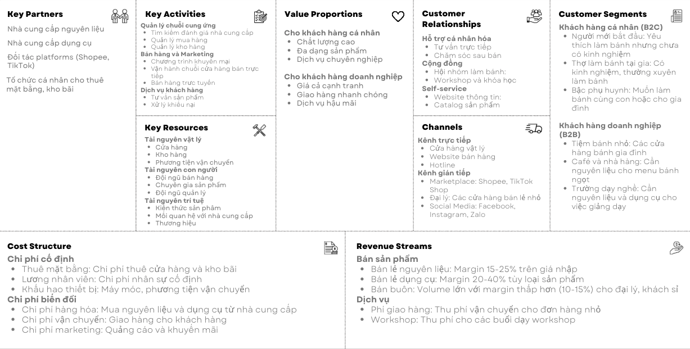

# 3.1. Mô hình nghiệp vụ

## Business Model Canvas (BMC) - Hiện trạng

### 1. Key Partners (Đối tác chính)

#### Nhà cung cấp nguyên liệu

- **Nhà cung cấp hàng mát và đông lạnh**: Các công ty phân phối hàng mát và đông lạnh (bơ sữa, kem whipping) trong nước và nhập khẩu
- **Nhà cung cấp nguyên liệu khô**: Các công ty phân phối nguyên liệu khô (bột mì, đường, gia vị) trong nước và nhập khẩu
- **Nhà cung cấp nguyên liệu nông nghiệp**: Trứng, hạt quả, một số nguyên liệu khác

#### Nhà cung cấp dụng cụ

- **Nhà phân phối dụng cụ làm bánh**: Công ty nhập khẩu và phân phối thiết bị nướng bánh (nồi nướng, lò nướng, bánh kẹo nướng)
- **Nhà sản xuất khuôn bánh**: Các xưởng sản xuất khuôn bánh trong nước
- **Nhà cung cấp bao bì**: Công ty sản xuất hộp, túi đựng bánh (hộp, túi, bao bì)

#### Đối tác logistics

- **Công ty vận chuyển**: Dịch vụ giao hàng trong và ngoài thành phố (công ty vận chuyển hàng mát và đông lạnh)
- **Kho bãi**: Dịch vụ thuê kho lưu trữ hàng hóa (kho bãi lớn, kho bãi nhỏ, kho bãi trung bình)

#### Tổ chức cá nhân cho thuê mặt bằng, kho bãi

### 2. Key Activities (Hoạt động chính)

#### Quản lý chuỗi cung ứng

- **Tìm kiếm và đánh giá nhà cung cấp**: Khảo sát, thương lượng hợp đồng
- **Quản lý mua hàng**: Đặt hàng, theo dõi giao hàng, kiểm tra chất lượng
- **Quản lý kho hàng**: Nhập kho, xuất kho, kiểm kê tồn kho

#### Bán hàng và Marketing

- **Tiếp thị sản phẩm**: Quảng cáo trên các kênh online và offline
- **Bán hàng trực tiếp**: Tương tác với khách hàng tại cửa hàng
- **Bán hàng trực tuyến**: Quản lý website, social media, e-commerce

#### Dịch vụ khách hàng

- **Tư vấn sản phẩm**: Hướng dẫn lựa chọn nguyên liệu và dụng cụ phù hợp
- **Hỗ trợ kỹ thuật**: Hướng dẫn sử dụng dụng cụ làm bánh
- **Xử lý khiếu nại**: Giải quyết vấn đề về chất lượng và dịch vụ

### 3. Key Resources (Tài nguyên chính)

#### Tài nguyên vật lý

- **Cửa hàng/Showroom**: Địa điểm trưng bày và bán hàng
- **Kho hàng**: Không gian lưu trữ nguyên liệu và dụng cụ
- **Phương tiện vận chuyển**: Xe tải, xe giao hàng

#### Tài nguyên con người

- **Đội ngũ bán hàng**: Nhân viên tư vấn và bán hàng
- **Chuyên gia sản phẩm**: Người có kiến thức chuyên môn về làm bánh
- **Đội ngũ quản lý**: Quản lý các hoạt động kinh doanh

#### Tài nguyên trí tuệ

- **Kiến thức về sản phẩm**: Hiểu biết sâu về nguyên liệu và dụng cụ làm bánh
- **Mối quan hệ khách hàng**: Database khách hàng và lịch sử mua hàng
- **Thương hiệu**: Uy tín và nhận diện thương hiệu

### 4. Value Propositions (Đề xuất giá trị)

#### Cho khách hàng cá nhân (Hobby Bakers)

- **Chất lượng cao**: Nguyên liệu tươi ngon, dụng cụ chính hãng
- **Đa dạng sản phẩm**: Đầy đủ nguyên liệu và dụng cụ cho mọi loại bánh
- **Tư vấn chuyên nghiệp**: Hướng dẫn chi tiết cách làm bánh và sử dụng dụng cụ

#### Cho khách hàng doanh nghiệp (Bakeries, Cafes)

- **Giá cả cạnh tranh**: Ưu đãi cho đơn hàng lớn và khách hàng thường xuyên
- **Giao hàng nhanh chóng**: Đảm bảo cung cấp kịp thời cho sản xuất
- **Dịch vụ hậu mãi**: Bảo hành dụng cụ, hỗ trợ kỹ thuật

### 5. Customer Relationships (Mối quan hệ khách hàng)

#### Hỗ trợ cá nhân hóa

- **Tư vấn trực tiếp**: Nhân viên hỗ trợ riêng cho từng khách hàng
- **Chăm sóc sau bán**: Theo dõi và hỗ trợ khách hàng sau khi mua

#### Cộng đồng

- **Hội nhóm làm bánh**: Tạo cộng đồng người yêu thích làm bánh
- **Workshop và khóa học**: Tổ chức các lớp học làm bánh

#### Self-service

- **Website thông tin**: Cung cấp thông tin sản phẩm và hướng dẫn
- **Catalog sản phẩm**: Danh mục chi tiết về nguyên liệu và dụng cụ

### 6. Channels (Kênh phân phối)

#### Kênh trực tiếp

- **Cửa hàng vật lý**: Showroom và điểm bán lẻ
- **Website bán hàng**: Nền tảng thương mại điện tử riêng
- **Hotline**: Đường dây nóng tư vấn và đặt hàng

#### Kênh gián tiếp

- **Marketplace**: Shopee, Lazada, Tiki
- **Đại lý**: Các cửa hàng bán lẻ nhỏ
- **Social Media**: Facebook, Instagram, Zalo

### 7. Customer Segments (Phân khúc khách hàng)

#### Khách hàng cá nhân (B2C)

- **Người mới bắt đầu**: Yêu thích làm bánh nhưng chưa có kinh nghiệm
- **Thợ làm bánh tại gia**: Có kinh nghiệm, thường xuyên làm bánh
- **Bậc phụ huynh**: Muốn làm bánh cùng con hoặc cho gia đình

#### Khách hàng doanh nghiệp (B2B)

- **Tiệm bánh nhỏ**: Các cửa hàng bánh gia đình
- **Café và nhà hàng**: Cần nguyên liệu cho menu bánh ngọt
- **Trường dạy nghề**: Cần nguyên liệu và dụng cụ cho việc giảng dạy

### 8. Cost Structure (Cơ cấu chi phí)

#### Chi phí cố định

- **Thuê mặt bằng**: Chi phí thuê cửa hàng và kho bãi
- **Lương nhân viên**: Chi phí nhân sự cố định
- **Khấu hao thiết bị**: Máy móc, phương tiện vận chuyển

#### Chi phí biến đổi

- **Chi phí hàng hóa**: Mua nguyên liệu và dụng cụ từ nhà cung cấp
- **Chi phí vận chuyển**: Giao hàng cho khách hàng
- **Chi phí marketing**: Quảng cáo và khuyến mãi

### 9. Revenue Streams (Nguồn doanh thu)

#### Bán sản phẩm

- **Bán lẻ nguyên liệu**: Margin 15-25% trên giá nhập
- **Bán lẻ dụng cụ**: Margin 20-40% tùy loại sản phẩm
- **Bán buôn**: Volume lớn với margin thấp hơn (10-15%) cho đại lý, khách sỉ

#### Dịch vụ

- **Phí giao hàng**: Thu phí vận chuyển cho đơn hàng nhỏ
- **Phí Workshop**: Thu phí cho các buổi dạy workshop

