# 3.2. Kiến trúc nghiệp vụ

## Cơ cấu tổ chức

### Sơ đồ tổ chức hiện tại

```mermaid
graph TD
    A[Giám đốc] --> B[Phó GĐ Nhân sự]
    A --> C[Phó GĐ Marketing & Kinh doanh]
    A --> D[Phó GĐ Vận hành Frontend]
    A --> E[Phó GĐ Vận hành Backend]
    A --> F[Phó GĐ Công nghệ]
    A --> G[Trưởng phòng Kiểm toán nội bộ]

    %% Khối Office
    B --> H[Phòng Nhân sự]
    H --> H1[NV Tuyển dụng]
    H --> H2[NV Đào tạo]

    C --> I[Phòng Marketing]
    I --> I1[NV Sáng tạo nội dung]

    E --> J[Phòng Mua hàng]
    J --> J1[NV Mua hàng]

    E --> K[Phòng Logistics]
    K --> K1[NV Điều phối hàng]

    A --> L[Phòng Kế toán]
    L --> L1[Kế toán trưởng]
    L --> L2[Kế toán thuế]
    L --> L3[Kế toán tổng hợp]

    G --> M[Phòng Kiểm toán]

    C --> N[Phòng R&D]
    N --> N1[NV Nghiên cứu sản phẩm]

    C --> O[Phòng Media]
    O --> O1[NV Thiết kế]

    F --> P[Phòng Công nghệ]
    P --> P1[NV Lập trình]
    P --> P2[NV Vận hành hệ thống]

    %% Khối Vận hành
    D --> Q[Khối Vận hành]
    Q --> Q1[NV Vận hành khu vực]
    Q --> Q2[NV Bán hàng]
    Q --> Q3[NV Hậu cần]
    Q --> Q4[Quản lý cửa hàng]

    %% Khối Kho
    E --> R[Khối Kho]
    R --> R1[NV Kho]
    R --> R2[Quản lý kho]
    R --> R3[NV Vận tải]

    %% Styling
    classDef giamDoc fill:#ff6b6b,stroke:#333,stroke-width:3px,color:#fff
    classDef phoGiamDoc fill:#4ecdc4,stroke:#333,stroke-width:2px,color:#fff
    classDef truongPhong fill:#45b7d1,stroke:#333,stroke-width:2px,color:#fff
    classDef nhanVien fill:#f9ca24,stroke:#333,stroke-width:1px,color:#333

    class A giamDoc
    class B,C,D,E,F,G phoGiamDoc
    class H,I,J,K,L,M,N,O,P,Q,R truongPhong
    class H1,H2,I1,J1,K1,L1,L2,L3,N1,O1,P1,P2,Q1,Q2,Q3,Q4,R1,R2,R3 nhanVien
```

### Mô tả vai trò và trách nhiệm

#### Cấp điều hành

- **Giám đốc**: Quyết định chiến lược, giám sát tổng thể
- **Phó giám đốc Nhân sự**: Quản lý nhân sự
- **Phó giám đốc Marketing & Kinh doanh**: Quản lý marketing và hoạt động kinh doanh bán sỉ
- **Phó giám đốc Vận hành Frontend**: Quản lý chất lượng cửa hàng, giám sát nhân viên bán hàng
- **Phó giám đốc Vận hành Backend**: Quản lý kho bãi, giao hàng, vận tải, hậu cần
- **Phó giám đốc Công nghệ**: Quản lý công nghệ
- **Trưởng phòng kiểm toán nội bộ**: Kiểm toán số liệu kho bãi, tài chính, giám sát hoạt động nội bộ

#### Cấp nhân viên

- Khối Office:
  - Phòng mua hàng: Nhân viên mua hàng
  - Phòng logistics: Nhân viên điều phối hàng
  - Phòng Nhân sự
    - Nhân viên tuyển dụng
    - Nhân viên đào tạo
  - Phòng Kế toán
    - Kế toán trưởng
    - Kế toán thuế
    - Kế toán tổng hợp
  - Phòng kiểm toán
  - Phòng Marketing
    - Nhân viên sáng tạo nội dung
  - Phòng R&D
    - Nhân viên nghiên cứu sản phẩm
  - Phòng Media: Nhân viên thiết kế
  - Phòng Công nghệ:
    - Nhân viên lập trình
    - Nhân viên vận hành hệ thống
- Khối vận hành:
  - Nhân viên vận hành khu vực
  - Nhân viên bán hàng
  - Nhân viên hậu cần
  - Quản lý cửa hàng
- Khối kho:
  - Nhân viên kho
  - Quản lý kho
  - Nhân viên vận tải

## Dịch vụ nghiệp vụ

### 1. Dịch vụ Marketing và Kinh doanh

#### BS001: Nghiên cứu thị trường và sản phẩm

- **Mô tả**: Nghiên cứu xu hướng thị trường, phát triển sản phẩm mới
- **Đầu vào**: Yêu cầu nghiên cứu, dữ liệu thị trường
- **Đầu ra**: Báo cáo nghiên cứu, đề xuất sản phẩm mới
- **Actor chính**: Nhân viên nghiên cứu sản phẩm
- **Actor hỗ trợ**: Phó GĐ Marketing & Kinh doanh


#### BS002: Sáng tạo nội dung Marketing

- **Mô tả**: Tạo nội dung quảng cáo, thiết kế marketing materials
- **Đầu vào**: Yêu cầu marketing, thông tin sản phẩm
- **Đầu ra**: Nội dung marketing, thiết kế quảng cáo
- **Actor chính**: Nhân viên sáng tạo nội dung, Nhân viên thiết kế
- **Actor hỗ trợ**: Phó GĐ Marketing & Kinh doanh

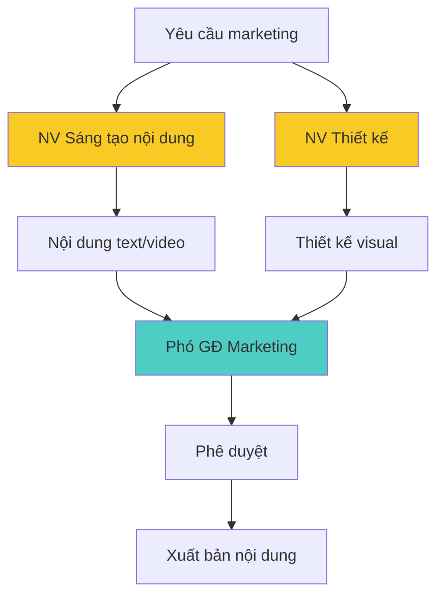

### 2. Dịch vụ Bán hàng và Khách hàng

#### BS003: Tư vấn sản phẩm

- **Mô tả**: Cung cấp thông tin và tư vấn về nguyên liệu, dụng cụ làm bánh
- **Đầu vào**: Yêu cầu tư vấn từ khách hàng
- **Đầu ra**: Thông tin sản phẩm và khuyến nghị
- **Actor chính**: Nhân viên bán hàng
- **Actor hỗ trợ**: Quản lý cửa hàng

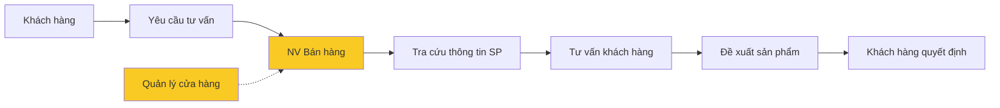

#### BS004: Xử lý đơn hàng

- **Mô tả**: Tiếp nhận và xử lý đơn đặt hàng từ khách hàng
- **Đầu vào**: Đơn đặt hàng
- **Đầu ra**: Xác nhận đơn hàng
- **Actor chính**: Nhân viên bán hàng
- **Actor hỗ trợ**: Quản lý cửa hàng, Nhân viên kho

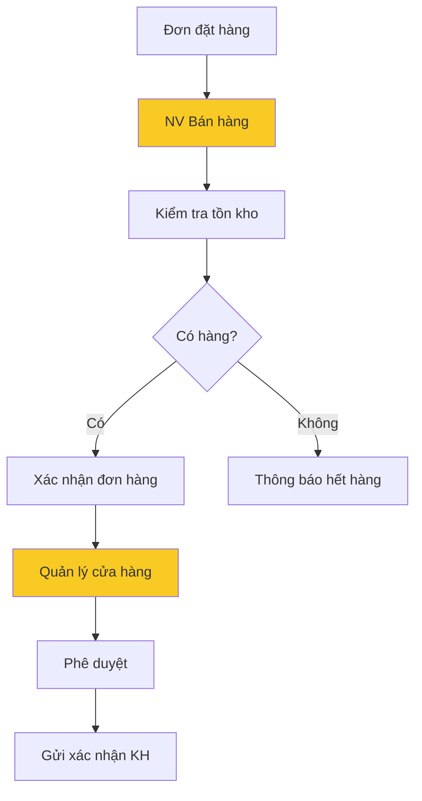

#### BS005: Thanh toán

- **Mô tả**: Xử lý thanh toán tiền mặt và chuyển khoản
- **Đầu vào**: Hóa đơn bán hàng, Yêu cầu thanh toán
- **Đầu ra**: Biên lai thanh toán
- **Actor chính**: Kế toán tổng hợp
- **Actor hỗ trợ**: Kế toán trưởng

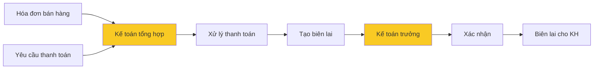

### 3. Dịch vụ Quản lý Kho và Logistics

#### BS006: Nhập kho

- **Mô tả**: Tiếp nhận hàng hóa từ nhà cung cấp
- **Đầu vào**: Hàng hóa và phiếu giao hàng
- **Đầu ra**: Phiếu nhập kho
- **Actor chính**: Nhân viên kho
- **Actor hỗ trợ**: Quản lý kho

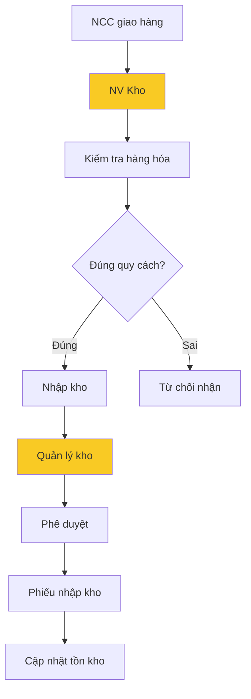

#### BS007: Xuất kho

- **Mô tả**: Xuất hàng theo đơn hàng khách hàng
- **Đầu vào**: Đơn hàng đã xác nhận
- **Đầu ra**: Phiếu xuất kho
- **Actor chính**: Nhân viên kho
- **Actor hỗ trợ**: Quản lý kho


#### BS008: Kiểm kê tồn kho

- **Mô tả**: Kiểm tra và cập nhật tình trạng hàng tồn kho
- **Đầu vào**: Danh sách hàng hóa
- **Đầu ra**: Báo cáo tồn kho
- **Actor chính**: Quản lý kho
- **Actor hỗ trợ**: Nhân viên kho, Trưởng phòng Kiểm toán nội bộ

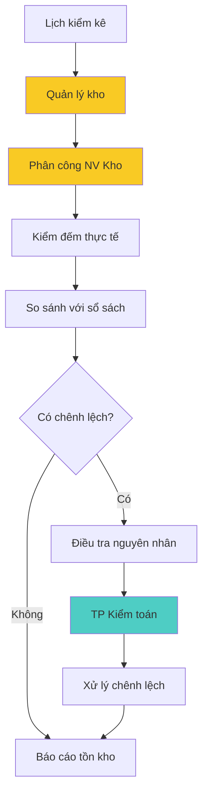

#### BS009: Vận tải và Giao hàng

- **Mô tả**: Vận chuyển hàng hóa đến khách hàng
- **Đầu vào**: Phiếu xuất kho, địa chỉ giao hàng
- **Đầu ra**: Xác nhận giao hàng thành công
- **Actor chính**: Nhân viên vận tải
- **Actor hỗ trợ**: Nhân viên điều phối hàng


### 4. Dịch vụ Mua hàng và Nhà cung cấp

#### BS010: Lựa chọn nhà cung cấp

- **Mô tả**: Tìm kiếm và đánh giá nhà cung cấp
- **Đầu vào**: Nhu cầu hàng hóa
- **Đầu ra**: Danh sách nhà cung cấp đủ điều kiện
- **Actor chính**: Nhân viên mua hàng
- **Actor hỗ trợ**: Phó GĐ Vận hành Backend

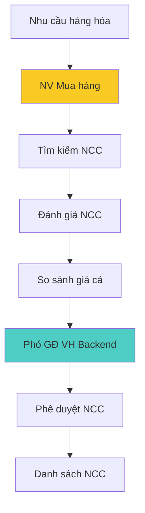

#### BS011: Đặt hàng nhà cung cấp

- **Mô tả**: Tạo và gửi đơn đặt hàng cho nhà cung cấp
- **Đầu vào**: Nhu cầu bổ sung hàng hóa
- **Đầu ra**: Đơn đặt hàng
- **Actor chính**: Nhân viên mua hàng
- **Actor hỗ trợ**: Phó GĐ Vận hành Backend


### 5. Dịch vụ Nhân sự

#### BS012: Tuyển dụng nhân viên

- **Mô tả**: Tuyển dụng nhân viên mới cho các vị trí
- **Đầu vào**: Nhu cầu tuyển dụng
- **Đầu ra**: Nhân viên mới được tuyển
- **Actor chính**: Nhân viên tuyển dụng
- **Actor hỗ trợ**: Phó GĐ Nhân sự

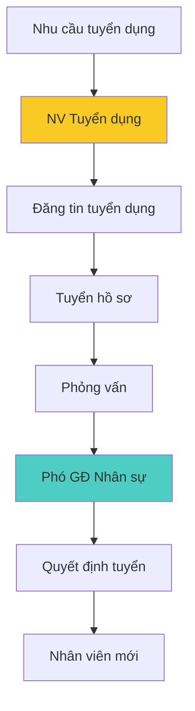

#### BS013: Đào tạo nhân viên

- **Mô tả**: Đào tạo kỹ năng cho nhân viên
- **Đầu vào**: Kế hoạch đào tạo
- **Đầu ra**: Nhân viên được đào tạo
- **Actor chính**: Nhân viên đào tạo
- **Actor hỗ trợ**: Phó GĐ Nhân sự


### 6. Dịch vụ Tài chính và Kế toán

#### BS014: Kế toán thuế

- **Mô tả**: Xử lý các vấn đề thuế và báo cáo thuế
- **Đầu vào**: Chứng từ thuế, hóa đơn
- **Đầu ra**: Báo cáo thuế, khai thuế
- **Actor chính**: Kế toán thuế
- **Actor hỗ trợ**: Kế toán trưởng

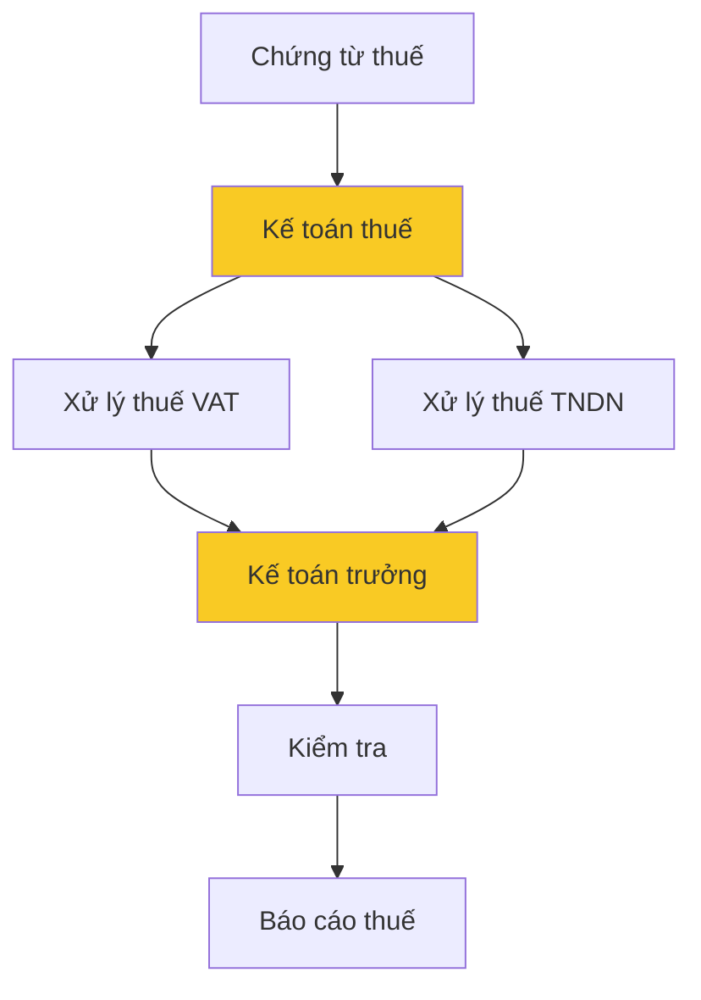

#### BS015: Kiểm toán nội bộ

- **Mô tả**: Kiểm toán số liệu kho bãi, tài chính, giám sát hoạt động
- **Đầu vào**: Yêu cầu kiểm toán
- **Đầu ra**: Báo cáo kiểm toán
- **Actor chính**: Trưởng phòng Kiểm toán nội bộ
- **Actor hỗ trợ**: Phòng Kiểm toán


### 7. Dịch vụ Công nghệ

#### BS016: Phát triển hệ thống

- **Mô tả**: Phát triển và bảo trì các hệ thống công nghệ
- **Đầu vào**: Yêu cầu phát triển hệ thống
- **Đầu ra**: Hệ thống hoàn chỉnh
- **Actor chính**: Nhân viên lập trình
- **Actor hỗ trợ**: Phó GĐ Công nghệ

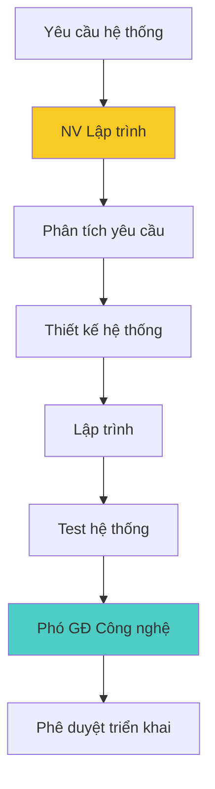

#### BS017: Vận hành hệ thống

- **Mô tả**: Vận hành và bảo trì hệ thống IT
- **Đầu vào**: Hệ thống đang hoạt động
- **Đầu ra**: Hệ thống ổn định
- **Actor chính**: Nhân viên vận hành hệ thống
- **Actor hỗ trợ**: Phó GĐ Công nghệ


## Biểu đồ phân rã chức năng

### Tổng quan chức năng theo bộ phận

```mermaid
graph TD
    A[Công ty Nguyên liệu Làm bánh] --> B[Khối Điều hành]
    A --> C[Khối Office]
    A --> D[Khối Vận hành]
    A --> E[Khối Kho]

    %% Khối Điều hành
    B --> B1[Quản lý chiến lược]
    B --> B2[Giám sát tổng thể]
    B --> B3[Phê duyệt quyết định]
    B --> B4[Quản lý rủi ro]

    %% Khối Office
    C --> C1[Marketing & Kinh doanh]
    C --> C2[Nhân sự]
    C --> C3[Tài chính & Kế toán]
    C --> C4[Công nghệ]
    C --> C5[Kiểm toán nội bộ]
    C --> C6[Mua hàng & Logistics]

    %% Khối Vận hành
    D --> D1[Bán hàng trực tiếp]
    D --> D2[Chăm sóc khách hàng]
    D --> D3[Quản lý cửa hàng]
    D --> D4[Hậu cần vận hành]

    %% Khối Kho
    E --> E1[Quản lý kho bãi]
    E --> E2[Vận tải giao hàng]
    E --> E3[Kiểm soát tồn kho]

    %% Styling
    classDef congTy fill:#ff6b6b,stroke:#333,stroke-width:3px,color:#fff
    classDef khoi fill:#4ecdc4,stroke:#333,stroke-width:2px,color:#fff
    classDef chucNang fill:#f9ca24,stroke:#333,stroke-width:1px,color:#333

    class A congTy
    class B,C,D,E khoi
    class B1,B2,B3,B4,C1,C2,C3,C4,C5,C6,D1,D2,D3,D4,E1,E2,E3 chucNang
```

### Phân rã chức năng chi tiết theo phòng ban

#### 1. Phòng Marketing & Kinh doanh

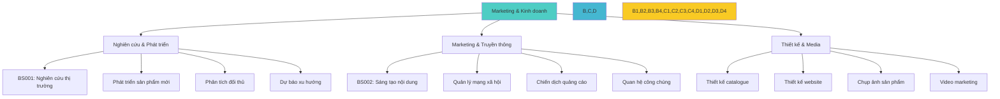

#### 2. Phòng Nhân sự

```mermaid
graph TD
    A[Nhân sự] --> B[Tuyển dụng]
    A --> C[Đào tạo & Phát triển]
    A --> D[Quản lý lao động]

    B --> B1[BS012: Tuyển dụng NV]
    B --> B2[Sàng lọc ứng viên]
    B --> B3[Phỏng vấn tuyển chọn]
    B --> B4[Onboarding nhân viên]

    C --> C1[BS013: Đào tạo NV]
    C --> C2[Đánh giá hiệu suất]
    C --> C3[Lập kế hoạch phát triển]
    C --> C4[Đào tạo kỹ năng mềm]

    D --> D1[Quản lý hợp đồng]
    D --> D2[Chấm công lương]
    D --> D3[Chế độ phúc lợi]
    D --> D4[Giải quyết tranh chấp]

    style A fill:#4ecdc4
    style B,C,D fill:#45b7d1
    style B1,B2,B3,B4,C1,C2,C3,C4,D1,D2,D3,D4 fill:#f9ca24
```

#### 3. Phòng Tài chính & Kế toán

```mermaid
graph TD
    A[Tài chính & Kế toán] --> B[Kế toán tổng hợp]
    A --> C[Kế toán thuế]
    A --> D[Quản lý tài chính]

    B --> B1[BS005: Thanh toán]
    B --> B2[Ghi sổ kế toán]
    B --> B3[Báo cáo tài chính]
    B --> B4[Đối chiếu công nợ]

    C --> C1[BS014: Kế toán thuế]
    C --> C2[Khai thuế VAT]
    C --> C3[Khai thuế TNDN]
    C --> C4[Quyết toán thuế]

    D --> D1[Quản lý ngân quỹ]
    D --> D2[Lập ngân sách]
    D --> D3[Phân tích tài chính]
    D --> D4[Kiểm soát chi phí]

    style A fill:#4ecdc4
    style B,C,D fill:#45b7d1
    style B1,B2,B3,B4,C1,C2,C3,C4,D1,D2,D3,D4 fill:#f9ca24
```

#### 4. Phòng Công nghệ

```mermaid
graph TD
    A[Công nghệ] --> B[Phát triển hệ thống]
    A --> C[Vận hành hệ thống]
    A --> D[Hỗ trợ kỹ thuật]

    B --> B1[BS016: Phát triển hệ thống]
    B --> B2[Thiết kế database]
    B --> B3[Lập trình ứng dụng]
    B --> B4[Testing & QA]

    C --> C1[BS017: Vận hành hệ thống]
    C --> C2[Monitoring hệ thống]
    C --> C3[Backup & Recovery]
    C --> C4[Bảo mật thông tin]

    D --> D1[Hỗ trợ user]
    D --> D2[Sửa chữa thiết bị]
    D --> D3[Cập nhật phần mềm]
    D --> D4[Đào tạo sử dụng]

    style A fill:#4ecdc4
    style B,C,D fill:#45b7d1
    style B1,B2,B3,B4,C1,C2,C3,C4,D1,D2,D3,D4 fill:#f9ca24
```

#### 5. Phòng Kiểm toán nội bộ

```mermaid
graph TD
    A[Kiểm toán nội bộ] --> B[Kiểm toán tài chính]
    A --> C[Kiểm toán vận hành]
    A --> D[Quản lý rủi ro]

    B --> B1[BS015: Kiểm toán nội bộ]
    B --> B2[Kiểm tra báo cáo TC]
    B --> B3[Đối chiếu số liệu]
    B --> B4[Phát hiện sai phạm]

    C --> C1[Kiểm tra quy trình]
    C --> C2[Đánh giá hiệu quả]
    C --> C3[Giám sát tuân thủ]
    C --> C4[Khuyến nghị cải thiện]

    D --> D1[Nhận diện rủi ro]
    D --> D2[Đánh giá tác động]
    D --> D3[Lập kế hoạch phòng ngừa]
    D --> D4[Báo cáo quản lý]

    style A fill:#4ecdc4
    style B,C,D fill:#45b7d1
    style B1,B2,B3,B4,C1,C2,C3,C4,D1,D2,D3,D4 fill:#f9ca24
```

#### 6. Phòng Mua hàng & Logistics

```mermaid
graph TD
    A[Mua hàng & Logistics] --> B[Mua hàng]
    A --> C[Điều phối hàng]
    A --> D[Quản lý NCC]

    B --> B1[BS010: Lựa chọn NCC]
    B --> B2[BS011: Đặt hàng NCC]
    B --> B3[Đàm phán hợp đồng]
    B --> B4[Theo dõi đơn hàng]

    C --> C1[BS009: Vận tải giao hàng]
    C --> C2[Lập kế hoạch giao hàng]
    C --> C3[Tối ưu tuyến đường]
    C --> C4[Theo dõi tiến độ]

    D --> D1[Đánh giá NCC]
    D --> D2[Quản lý hợp đồng]
    D --> D3[Giải quyết khiếu nại]
    D --> D4[Phát triển NCC mới]

    style A fill:#4ecdc4
    style B,C,D fill:#45b7d1
    style B1,B2,B3,B4,C1,C2,C3,C4,D1,D2,D3,D4 fill:#f9ca24
```

#### 7. Khối Vận hành (Frontend)

```mermaid
graph TD
    A[Vận hành Frontend] --> B[Bán hàng trực tiếp]
    A --> C[Quản lý cửa hàng]
    A --> D[Chăm sóc khách hàng]

    B --> B1[BS003: Tư vấn sản phẩm]
    B --> B2[BS004: Xử lý đơn hàng]
    B --> B3[Bán hàng tại quầy]
    B --> B4[Cross-selling]

    C --> C1[Quản lý nhân viên BH]
    C --> C2[Giám sát chất lượng]
    C --> C3[Quản lý tài sản CH]
    C --> C4[Báo cáo doanh thu]

    D --> D1[Tư vấn khách hàng]
    D --> D2[Xử lý khiếu nại]
    D --> D3[Chương trình khuyến mãi]
    D --> D4[Chăm sóc sau bán]

    style A fill:#4ecdc4
    style B,C,D fill:#45b7d1
    style B1,B2,B3,B4,C1,C2,C3,C4,D1,D2,D3,D4 fill:#f9ca24
```

#### 8. Khối Kho & Vận hành Backend

```mermaid
graph TD
    A[Kho & Vận hành Backend] --> B[Quản lý kho]
    A --> C[Vận tải]
    A --> D[Hậu cần]

    B --> B1[BS006: Nhập kho]
    B --> B2[BS007: Xuất kho]
    B --> B3[BS008: Kiểm kê tồn kho]
    B --> B4[Sắp xếp kho bãi]

    C --> C1[Giao hàng khách lẻ]
    C --> C2[Giao hàng doanh nghiệp]
    C --> C3[Vận chuyển liên tỉnh]
    C --> C4[Bảo trì phương tiện]

    D --> D1[Vệ sinh kho bãi]
    D --> D2[Bảo trì thiết bị]
    D --> D3[An ninh kho hàng]
    D --> D4[Quản lý nhiệt độ]

    style A fill:#4ecdc4
    style B,C,D fill:#45b7d1
    style B1,B2,B3,B4,C1,C2,C3,C4,D1,D2,D3,D4 fill:#f9ca24
```

### Ma trận chức năng - Bộ phận

| Chức năng                 | Marketing | Nhân sự | Tài chính | Công nghệ | Kiểm toán | Mua hàng | Vận hành | Kho |
| ------------------------- | --------- | ------- | --------- | --------- | --------- | -------- | -------- | --- |
| **Nghiên cứu thị trường** | ●         |         |           |           |           |          |          |     |
| **Tuyển dụng & đào tạo**  |           | ●       |           |           |           |          |          |     |
| **Quản lý tài chính**     |           |         | ●         |           | ◐         |          |          |     |
| **Phát triển hệ thống**   |           |         |           | ●         |           |          |          |     |
| **Kiểm toán & rủi ro**    |           |         | ◐         |           | ●         |          |          |     |
| **Mua hàng & logistics**  |           |         | ◐         |           | ◐         | ●        |          | ◐   |
| **Bán hàng & CSKH**       | ◐         |         | ◐         |           |           |          | ●        |     |
| **Quản lý kho**           |           |         | ◐         | ◐         | ◐         | ◐        |          | ●   |

**Chú thích**: ● = Chịu trách nhiệm chính, ◐ = Hỗ trợ/Phối hợp

### Ma trận tương tác giữa các bộ phận nghiệp vụ

| Bộ phận            | Marketing & KD                  | Nhân sự                          | Tài chính & KT                           | Công nghệ                        | Kiểm toán                   | Mua hàng                      | Vận hành                     | Kho                           |
| ------------------ | ------------------------------- | -------------------------------- | ---------------------------------------- | -------------------------------- | --------------------------- | ----------------------------- | ---------------------------- | ----------------------------- |
| **Marketing & KD** |                                 | Yêu cầu nhân sự cho Marketing    | Yêu cầu ngân sách Marketing, báo cáo ROI | Yêu cầu hệ thống CRM, website    | Cung cấp dữ liệu chiến dịch | Thông tin sản phẩm mới        | Yêu cầu thông tin khách hàng | Yêu cầu thông tin tồn kho     |
| **Nhân sự**        | Hỗ trợ tuyển dụng Marketing     |                                  | Yêu cầu ngân sách nhân sự, lương         | Yêu cầu hệ thống quản lý nhân sự | Báo cáo tuân thủ lao động   | Tuyển dụng nhân viên mua hàng | Đào tạo nhân viên bán hàng   | Đào tạo nhân viên kho         |
| **Tài chính & KT** | Báo cáo chi phí Marketing       | Xử lý lương và phúc lợi          |                                          | Yêu cầu hệ thống kế toán         | Cung cấp báo cáo tài chính  | Thanh toán nhà cung cấp       | Xử lý doanh thu bán hàng     | Quản lý chi phí kho           |
| **Công nghệ**      | Cung cấp hệ thống Marketing     | Cung cấp hệ thống HR             | Cung cấp hệ thống kế toán                |                                  | Hỗ trợ hệ thống audit       | Cung cấp hệ thống mua hàng    | Cung cấp hệ thống bán hàng   | Cung cấp hệ thống quản lý kho |
| **Kiểm toán**      | Kiểm tra hoạt động Marketing    | Kiểm tra tuân thủ nhân sự        | Kiểm toán báo cáo tài chính              | Đánh giá bảo mật hệ thống        |                             | Kiểm tra quy trình mua hàng   | Kiểm tra quy trình bán hàng  | Kiểm kê và đối chiếu kho      |
| **Mua hàng**       | Cung cấp thông tin nhà cung cấp | Yêu cầu đào tạo kỹ năng đàm phán | Yêu cầu phê duyệt ngân sách mua          | Yêu cầu hệ thống quản lý NCC     | Báo cáo mua hàng            |                               | Cung cấp thông tin giao hàng | Phối hợp nhập kho             |
| **Vận hành**       | Báo cáo nhu cầu khách hàng      | Yêu cầu tuyển nhân viên bán hàng | Báo cáo doanh thu hàng ngày              | Yêu cầu hệ thống POS             | Báo cáo hoạt động bán hàng  | Yêu cầu thông tin đơn hàng    |                              | Yêu cầu xuất kho              |
| **Kho**            | Báo cáo tồn kho sản phẩm        | Yêu cầu tuyển nhân viên kho      | Báo cáo giá trị tồn kho                  | Yêu cầu hệ thống quản lý kho     | Cung cấp báo cáo kiểm kê    | Thông báo nhu cầu nhập hàng   | Cung cấp hàng hóa            |                               |

#### Mô tả chi tiết các tương tác chính

##### **1. Marketing & KD ↔ Các bộ phận khác**

```mermaid
graph LR
    A[Marketing & KD] --> B[Nhân sự: Yêu cầu tuyển dụng]
    A --> C[Tài chính: Yêu cầu ngân sách]
    A --> D[Công nghệ: Yêu cầu CRM/Website]
    A --> E[Vận hành: Thông tin khách hàng]
    A --> F[Kho: Thông tin tồn kho]

    style A fill:#4ecdc4,stroke:#333,stroke-width:2px,color:#fff
    style B fill:#e8f4f8,stroke:#333,stroke-width:1px,color:#333
    style C fill:#e8f4f8,stroke:#333,stroke-width:1px,color:#333
    style D fill:#e8f4f8,stroke:#333,stroke-width:1px,color:#333
    style E fill:#e8f4f8,stroke:#333,stroke-width:1px,color:#333
    style F fill:#e8f4f8,stroke:#333,stroke-width:1px,color:#333
```

##### **2. Tài chính & KT ↔ Các bộ phận khác**

```mermaid
graph LR
    A[Tài chính & KT] --> B[Nhân sự: Xử lý lương]
    A --> C[Mua hàng: Thanh toán NCC]
    A --> D[Vận hành: Xử lý doanh thu]
    A --> E[Kho: Quản lý chi phí]
    A --> F[Công nghệ: Hệ thống kế toán]

    style A fill:#4ecdc4,stroke:#333,stroke-width:2px,color:#fff
    style B fill:#e8f4f8,stroke:#333,stroke-width:1px,color:#333
    style C fill:#e8f4f8,stroke:#333,stroke-width:1px,color:#333
    style D fill:#e8f4f8,stroke:#333,stroke-width:1px,color:#333
    style E fill:#e8f4f8,stroke:#333,stroke-width:1px,color:#333
    style F fill:#e8f4f8,stroke:#333,stroke-width:1px,color:#333
```

##### **3. Vận hành ↔ Kho**

```mermaid
graph LR
    A[Vận hành] --> B[Kiểm tra tồn kho]
    B --> C[Yêu cầu xuất kho]
    C --> D[Kho: Chuẩn bị hàng]
    D --> E[Giao hàng cho khách]
    E --> F[Cập nhật tồn kho]

    style A fill:#4ecdc4,stroke:#333,stroke-width:2px,color:#fff
    style D fill:#4ecdc4,stroke:#333,stroke-width:2px,color:#fff
    style B fill:#e8f4f8,stroke:#333,stroke-width:1px,color:#333
    style C fill:#e8f4f8,stroke:#333,stroke-width:1px,color:#333
    style E fill:#e8f4f8,stroke:#333,stroke-width:1px,color:#333
    style F fill:#e8f4f8,stroke:#333,stroke-width:1px,color:#333
```

##### **4. Mua hàng ↔ Kho**

```mermaid
graph LR
    A[Kho: Báo cáo thiếu hàng] --> B[Mua hàng]
    B --> C[Tìm nhà cung cấp]
    C --> D[Đặt hàng]
    D --> E[Nhận hàng]
    E --> F[Kho: Nhập kho]

    style B fill:#4ecdc4,stroke:#333,stroke-width:2px,color:#fff
    style F fill:#4ecdc4,stroke:#333,stroke-width:2px,color:#fff
    style A fill:#e8f4f8,stroke:#333,stroke-width:1px,color:#333
    style C fill:#e8f4f8,stroke:#333,stroke-width:1px,color:#333
    style D fill:#e8f4f8,stroke:#333,stroke-width:1px,color:#333
    style E fill:#e8f4f8,stroke:#333,stroke-width:1px,color:#333
```

##### **5. Kiểm toán ↔ Tất cả bộ phận**

```mermaid
graph TD
    A[Kiểm toán nội bộ] --> B[Marketing: Kiểm tra ROI]
    A --> C[Nhân sự: Kiểm tra tuân thủ]
    A --> D[Tài chính: Audit báo cáo]
    A --> E[Công nghệ: Đánh giá bảo mật]
    A --> F[Mua hàng: Kiểm tra quy trình]
    A --> G[Vận hành: Kiểm tra bán hàng]
    A --> H[Kho: Kiểm kê tồn kho]

    style A fill:#4ecdc4,stroke:#333,stroke-width:2px,color:#fff
    style B fill:#e8f4f8,stroke:#333,stroke-width:1px,color:#333
    style C fill:#e8f4f8,stroke:#333,stroke-width:1px,color:#333
    style D fill:#e8f4f8,stroke:#333,stroke-width:1px,color:#333
    style E fill:#e8f4f8,stroke:#333,stroke-width:1px,color:#333
    style F fill:#e8f4f8,stroke:#333,stroke-width:1px,color:#333
    style G fill:#e8f4f8,stroke:#333,stroke-width:1px,color:#333
    style H fill:#e8f4f8,stroke:#333,stroke-width:1px,color:#333
```

#### Tần suất tương tác

| Loại tương tác   | Tần suất  | Ví dụ                                                                   |
| ---------------- | --------- | ----------------------------------------------------------------------- |
| **Hàng ngày**    | Daily     | Vận hành ↔ Kho (xuất kho), Tài chính ↔ Vận hành (thanh toán)            |
| **Hàng tuần**    | Weekly    | Marketing ↔ Vận hành (báo cáo KH), Mua hàng ↔ Kho (nhập hàng)           |
| **Hàng tháng**   | Monthly   | Kiểm toán ↔ Tài chính (audit), Nhân sự ↔ Tài chính (lương)              |
| **Theo yêu cầu** | On-demand | Công nghệ ↔ Các bộ phận (hỗ trợ IT), Nhân sự ↔ Các bộ phận (tuyển dụng) |

#### Phương thức tương tác

| Phương thức          | Mô tả                            | Ứng dụng                            |
| -------------------- | -------------------------------- | ----------------------------------- |
| **Hệ thống tự động** | Trao đổi dữ liệu qua hệ thống IT | Đồng bộ tồn kho, báo cáo tài chính  |
| **Email/Zalo**       | Giao tiếp văn bản                | Yêu cầu phê duyệt, thông báo        |
| **Họp định kỳ**      | Họp trực tiếp                    | Báo cáo tiến độ, đánh giá hiệu suất |
| **Biểu mẫu giấy**    | Chứng từ giấy                    | Phiếu xuất/nhập kho, đơn hàng       |

## Hợp tác giữa các đối tác nghiệp vụ

### Ma trận trách nhiệm RACI

| Hoạt động    | Giám đốc | PGĐ KD | PGĐ VH | PGĐ TC | NV BH | Marketing | Thủ kho |
| ------------ | -------- | ------ | ------ | ------ | ----- | --------- | ------- |
| Tư vấn KH    | I        | A      | I      | I      | R     | C         | I       |
| Xử lý ĐH     | I        | A      | I      | I      | R     | I         | C       |
| Nhập kho     | I        | I      | A      | I      | I     | I         | R       |
| Xuất kho     | I        | I      | A      | I      | C     | I         | R       |
| Đặt hàng NCC | A        | I      | R      | I      | I     | I         | C       |
| Thanh toán   | A        | I      | I      | R      | I     | I         | I       |

**Chú thích**: R=Responsible (Thực hiện), A=Accountable (Chịu trách nhiệm), C=Consulted (Tham vấn), I=Informed (Thông báo)

### Mô hình tương tác

#### Tương tác với khách hàng

1. **Khách hàng cá nhân**:

   - Kênh: Cửa hàng, Website, Điện thoại
   - Tần suất: Theo nhu cầu
   - Phương thức: Trực tiếp, trực tuyến

2. **Khách hàng doanh nghiệp**:
   - Kênh: Trực tiếp, Email, Điện thoại
   - Tần suất: Định kỳ hàng tuần/tháng
   - Phương thức: Hợp đồng dài hạn

#### Tương tác với nhà cung cấp

1. **Nhà cung cấp nguyên liệu**:

   - Kênh: Zalo, Email, Điện thoại, Trực tiếp
   - Tần suất: Hàng tuần
   - Phương thức: Đơn hàng thường xuyên

2. **Nhà cung cấp dụng cụ**:
   - Kênh: Zalo, Email
   - Tần suất: Hàng tháng
   - Phương thức: Đơn hàng theo mùa

## Thực hiện dịch vụ

### Mô hình dịch vụ hiện tại

#### Dịch vụ trực tiếp tại cửa hàng

- **Thời gian**: 8:00 - 20:00 hàng ngày
- **Nhân lực**: 2-3 nhân viên bán hàng
- **Quy trình**: Tiếp đón → Tư vấn → Bán hàng → Thanh toán

#### Dịch vụ trực tuyến

- **Kênh**: Website, Facebook, Zalo
- **Thời gian phản hồi**: 1-2 giờ trong giờ hành chính
- **Quy trình**: Nhận yêu cầu → Tư vấn → Báo giá → Xác nhận đơn hàng

#### Dịch vụ giao hàng

- **Phạm vi**: Trong nội thành và vùng phụ cận
- **Thời gian**: 1-2 ngày làm việc
- **Phương tiện**: Xe máy, xe tải nhỏ

## Quy trình nghiệp vụ

### BP001: Quy trình bán hàng trực tiếp

```
Khách hàng đến → Tiếp đón → Tư vấn sản phẩm → Chọn sản phẩm →
Tính tiền → Thanh toán → Xuất hóa đơn → Giao hàng → Hoàn thành
```

**Thời gian**: 15-30 phút
**Tần suất**: 20-30 giao dịch/ngày
**Điểm kiểm soát**: Kiểm tra hàng tồn kho trước khi bán

### BP002: Quy trình bán hàng trực tuyến

```
Nhận đơn online → Kiểm tra hàng → Xác nhận đơn → Chuẩn bị hàng →
Giao hàng → Thanh toán (COD/CK) → Xác nhận hoàn thành
```

**Thời gian**: 1-2 ngày
**Tần suất**: 10-15 đơn/ngày
**Điểm kiểm soát**: Xác nhận đơn hàng qua điện thoại

### BP003: Quy trình nhập hàng

```
Dự báo nhu cầu → Lập đơn đặt hàng → Gửi NCC → Nhận hàng →
Kiểm tra chất lượng → Nhập kho → Thanh toán NCC → Cập nhật tồn kho
```

**Thời gian**: 3-7 ngày
**Tần suất**: 2-3 lần/tuần
**Điểm kiểm soát**: Kiểm tra chất lượng và số lượng khi nhận hàng

### BP004: Quy trình quản lý kho

```
Kiểm kê hàng ngày → Cập nhật tồn kho → Xác định hàng cần nhập →
Thông báo bộ phận mua hàng → Sắp xếp kho → Báo cáo định kỳ
```

**Thời gian**: Liên tục
**Tần suất**: Hàng ngày
**Điểm kiểm soát**: Kiểm kê cuối ngày và báo cáo

### Các vấn đề trong quy trình hiện tại

#### Tồn tại các điểm yếu

1. **Quản lý thủ công**: Sử dụng Excel và giấy tờ
2. **Thiếu tích hợp**: Các bộ phận làm việc độc lập
3. **Khó theo dõi**: Không có hệ thống báo cáo tự động
4. **Lỗi con người**: Sai sót trong nhập liệu và tính toán
5. **Phản hồi chậm**: Thời gian xử lý khiếu nại lâu

#### Nhu cầu cải thiện

1. **Tự động hóa**: Giảm thiểu công việc thủ công
2. **Tích hợp dữ liệu**: Kết nối các bộ phận
3. **Báo cáo real-time**: Thông tin cập nhật liên tục
4. **Kiểm soát chất lượng**: Giảm thiểu sai sót
5. **Cải thiện trải nghiệm**: Phục vụ khách hàng tốt hơn
