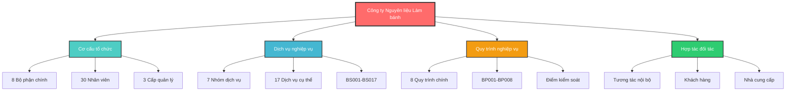
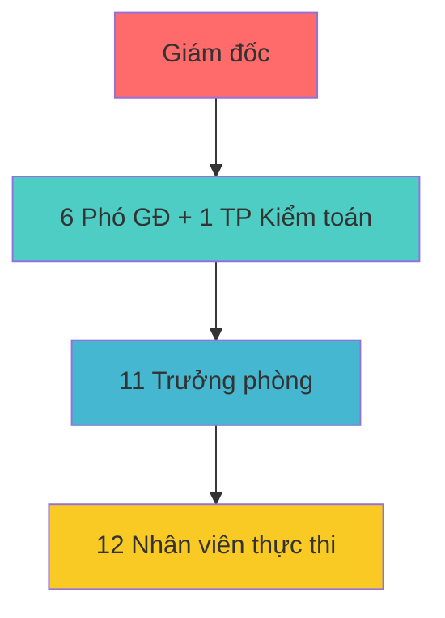

# 3.2. Kiến trúc nghiệp vụ

> **Tài liệu chi tiết**: [3.2 Kiến trúc nghiệp vụ](../3.2%20Ki%E1%BA%BFn%20tr%C3%BAc%20nghi%E1%BB%87p%20v%E1%BB%A5/README.md)

Chương này mô tả kiến trúc nghiệp vụ chi tiết của công ty Nguyên liệu Làm bánh, bao gồm cấu trúc tổ chức, dịch vụ nghiệp vụ, quy trình và sự tương tác giữa các bộ phận.

## Tổng quan kiến trúc nghiệp vụ

## Thống kê tổng quan

| Thành phần                    | Số lượng | Mô tả                           |
| ----------------------------- | -------- | ------------------------------- |
| **Bộ phận tổ chức**           | 8        | Từ điều hành đến thực thi       |
| **Dịch vụ nghiệp vụ**         | 17       | BS001 - BS017                   |
| **Quy trình nghiệp vụ**       | 8        | BP001 - BP008                   |
| **Nhân viên**                 | ~30      | Các vị trí khác nhau            |
| **Cửa hàng**                  | 1        | Cửa hàng chính                  |
| **Tài liệu BPMN**             | 8        | Mô tả chi tiết quy trình        |
| **Ma trận tương tác**         | 8x8      | Giữa các bộ phận               |
| **Biểu đồ phân rã chức năng** | 8        | Theo từng phòng ban             |

## Cấu trúc tài liệu chi tiết

Tài liệu kiến trúc nghiệp vụ được tổ chức thành 6 phần chính:

### 1. [Cơ cấu tổ chức](../3.2%20Ki%E1%BA%BFn%20tr%C3%BAc%20nghi%E1%BB%87p%20v%E1%BB%A5/co-cau-to-chuc.md)
- Sơ đồ tổ chức 3 cấp: Điều hành → Trung gian → Thực thi
- 8 bộ phận chính: Marketing, Nhân sự, Tài chính, Công nghệ, Kiểm toán, Mua hàng, Vận hành, Kho
- Phân quyền và thẩm quyền theo từng cấp
- Kênh liên lạc và báo cáo

### 2. [Dịch vụ nghiệp vụ](../3.2%20Ki%E1%BA%BFn%20tr%C3%BAc%20nghi%E1%BB%87p%20v%E1%BB%A5/dich-vu-nghiep-vu.md)
- 17 dịch vụ nghiệp vụ cụ thể (BS001-BS017)
- 7 nhóm dịch vụ chính từ Marketing đến Công nghệ
- Mô tả chi tiết đầu vào, đầu ra, actor cho từng dịch vụ
- Ma trận dịch vụ với mức độ phức tạp và tần suất

### 3. [Biểu đồ phân rã chức năng](../3.2%20Ki%E1%BA%BFn%20tr%C3%BAc%20nghi%E1%BB%87p%20v%E1%BB%A5/bieu-do-phan-ra-chuc-nang.md)
- Phân rã chức năng chi tiết theo 8 phòng ban
- Ma trận chức năng - bộ phận (8x8)
- Phân tích độ quan trọng và tiềm năng tự động hóa
- Mức độ phức tạp và yêu cầu kỹ năng

### 4. [Hợp tác giữa các đối tác nghiệp vụ](../3.2%20Ki%E1%BA%BFn%20tr%C3%BAc%20nghi%E1%BB%87p%20v%E1%BB%A5/hop-tac-doi-tac-nghiep-vu.md)
- Ma trận trách nhiệm RACI cho các hoạt động chính
- Mô hình tương tác giữa các bộ phận
- Ma trận tương tác chi tiết 8x8 với tần suất và phương thức
- Tương tác với khách hàng và nhà cung cấp bên ngoài

### 5. [Quy trình nghiệp vụ](../3.2%20Ki%E1%BA%BFn%20tr%C3%BAc%20nghi%E1%BB%87p%20v%E1%BB%A5/quy-trinh-nghiep-vu.md)
- 8 quy trình nghiệp vụ chính (BP001-BP008)
- Flowchart và biểu đồ BPMN cho từng quy trình
- Điểm kiểm soát và KPI cho từng quy trình
- Phân tích các vấn đề hiện tại và nhu cầu cải thiện

### 6. [Thực hiện dịch vụ](../3.2%20Ki%E1%BA%BFn%20tr%C3%BAc%20nghi%E1%BB%87p%20v%E1%BB%A5/thuc-hien-dich-vu.md)
- Mô hình dịch vụ hiện tại: Trực tiếp, Trực tuyến, Giao hàng, Hỗ trợ
- Tiêu chuẩn dịch vụ và KPI cho từng kênh
- Phân tích hiệu suất và kế hoạch phát triển

## Tóm tắt các thành phần chính

### Cơ cấu tổ chức

### Dịch vụ nghiệp vụ chính
| Nhóm dịch vụ             | Mã dịch vụ  | Bộ phận chủ trì |
| ------------------------ | ----------- | --------------- |
| Marketing và Kinh doanh  | BS001-BS002 | Marketing       |
| Bán hàng và Khách hàng   | BS003-BS005 | Vận hành        |
| Quản lý Kho và Logistics | BS006-BS009 | Kho             |
| Mua hàng và Nhà cung cấp | BS010-BS011 | Mua hàng        |
| Nhân sự                  | BS012-BS013 | Nhân sự         |
| Tài chính và Kế toán     | BS014-BS015 | Tài chính       |
| Công nghệ                | BS016-BS017 | Công nghệ       |

### Quy trình nghiệp vụ chính
| Quy trình | Tên                             | Tần suất     | Bộ phận chính |
| --------- | ------------------------------- | ------------ | ------------- |
| BP001     | Bán hàng trực tiếp tại cửa hàng | Hàng ngày    | Vận hành      |
| BP002     | Bán hàng trực tuyến             | Hàng ngày    | Vận hành      |
| BP003     | Mua hàng và nhập kho            | Hàng tuần    | Mua hàng      |
| BP004     | Quản lý kho hàng                | Hàng ngày    | Kho           |
| BP005     | Tư vấn và chăm sóc khách hàng   | Hàng ngày    | Vận hành      |
| BP006     | Xử lý khiếu nại                 | Theo yêu cầu | Vận hành      |
| BP007     | Marketing và truyền thông       | Hàng tháng   | Marketing     |
| BP008     | Quản lý tài chính               | Hàng ngày    | Tài chính     |

## Điểm nổi bật của kiến trúc nghiệp vụ

### Điểm mạnh
1. **Cấu trúc rõ ràng**: 3 cấp quản lý với phân quyền hợp lý
2. **Quy trình chuẩn hóa**: 8 quy trình nghiệp vụ được mô tả chi tiết
3. **Dịch vụ đa kênh**: Cửa hàng, online, B2B
4. **Kiểm soát chặt chẽ**: Điểm kiểm soát và KPI cho từng quy trình

### Thách thức
1. **Quản lý thủ công**: Nhiều quy trình còn sử dụng Excel và giấy tờ
2. **Thiếu tích hợp**: Các bộ phận làm việc tương đối độc lập
3. **Báo cáo chậm**: Thiếu hệ thống báo cáo real-time
4. **Tự động hóa thấp**: Tiềm năng tự động hóa cao nhưng chưa được khai thác

### Hướng phát triển
1. **Tự động hóa quy trình**: Ưu tiên Kho, Kế toán, Bán hàng online
2. **Tích hợp hệ thống**: ERP tích hợp các bộ phận
3. **Báo cáo real-time**: Dashboard và notification tự động
4. **Omnichannel**: Tích hợp tất cả kênh bán hàng

## Kết luận

Kiến trúc nghiệp vụ hiện tại của công ty đã có cấu trúc tương đối hoàn chỉnh với các quy trình được định nghĩa rõ ràng. Tuy nhiên, để nâng cao hiệu quả hoạt động và khả năng cạnh tranh, công ty cần đầu tư vào tự động hóa và tích hợp hệ thống, đặc biệt trong các lĩnh vực quản lý kho, kế toán và bán hàng trực tuyến.

---

**Tài liệu tham khảo**: [Thư mục 3.2 Kiến trúc nghiệp vụ](../3.2%20Ki%E1%BA%BFn%20tr%C3%BAc%20nghi%E1%BB%87p%20v%E1%BB%A5/) chứa toàn bộ tài liệu chi tiết với các biểu đồ BPMN, ma trận tương tác và phân tích sâu.