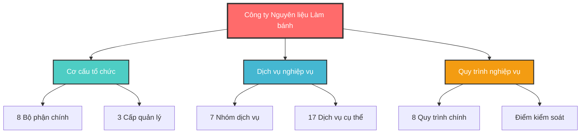

# 3.2. Kiến trúc nghiệp vụ

## Tổng quan

Tài liệu này mô tả kiến trúc nghiệp vụ của công ty Nguyên liệu Làm bánh, bao gồm cấu trúc tổ chức, các dịch vụ nghiệp vụ, quy trình và sự tương tác giữa các bộ phận.

## Cấu trúc tài liệu

### 1. [Cơ cấu tổ chức](./co-cau-to-chuc.md)

- Sơ đồ tổ chức hiện tại
- Mô tả vai trò và trách nhiệm của các bộ phận
- Cấu trúc quản lý từ cấp điều hành đến nhân viên

### 2. [Dịch vụ nghiệp vụ](./dich-vu-nghiep-vu.md)

- 7 nhóm dịch vụ nghiệp vụ chính
- 17 dịch vụ nghiệp vụ cụ thể (BS001-BS017)
- Mô tả chi tiết đầu vào, đầu ra và actor cho từng dịch vụ

### 3. [Biểu đồ phân rã chức năng](./bieu-do-phan-ra-chuc-nang.md)

- Tổng quan chức năng theo bộ phận
- Phân rã chức năng chi tiết theo phòng ban
- Ma trận chức năng - bộ phận

### 4. [Hợp tác giữa các đối tác nghiệp vụ](./hop-tac-doi-tac-nghiep-vu.md)

- Ma trận trách nhiệm RACI
- Mô hình tương tác giữa các bộ phận
- Ma trận tương tác chi tiết và tần suất

### 5. [Thực hiện dịch vụ](./thuc-hien-dich-vu.md)

- Mô hình dịch vụ hiện tại
- Dịch vụ trực tiếp và trực tuyến
- Dịch vụ giao hàng và hỗ trợ

### 6. [Quy trình nghiệp vụ](./quy-trinh-nghiep-vu.md)

- 8 quy trình nghiệp vụ chính (BP001-BP008)
- Mô tả chi tiết từng quy trình với flowchart và BPMN
- Điểm kiểm soát và KPI cho từng quy trình

## Sơ đồ tổng quan

## Thống kê nhanh

| Thành phần            | Số lượng | Mô tả                     |
| --------------------- | -------- | ------------------------- |
| **Bộ phận**           | 8        | Từ điều hành đến thực thi |
| **Dịch vụ nghiệp vụ** | 17       | BS001 - BS017             |
| **Quy trình**         | 8        | BP001 - BP008             |
| **Nhân viên**         | ~30      | Các vị trí khác nhau      |
| **Cửa hàng**          | 1        | Cửa hàng chính            |

## Cách sử dụng tài liệu

1. **Để hiểu tổng quan**: Bắt đầu với README này
2. **Để tìm hiểu cơ cấu**: Xem [Cơ cấu tổ chức](./co-cau-to-chuc.md)
3. **Để hiểu nghiệp vụ**: Xem [Dịch vụ nghiệp vụ](./dich-vu-nghiep-vu.md)
4. **Để hiểu quy trình**: Xem [Quy trình nghiệp vụ](./quy-trinh-nghiep-vu.md)
5. **Để hiểu tương tác**: Xem [Hợp tác đối tác nghiệp vụ](./hop-tac-doi-tac-nghiep-vu.md)

## Lưu ý

- Tất cả các sơ đồ Mermaid có thể được render trực tiếp trong các editor hỗ trợ
- Các biểu đồ BPMN được lưu trong thư mục `./bpmn/`
- Mã dịch vụ (BS) và quy trình (BP) được sử dụng thống nhất trong toàn bộ tài liệu
