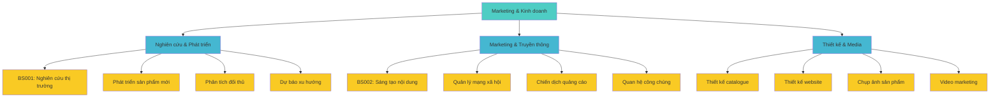
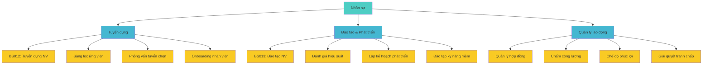
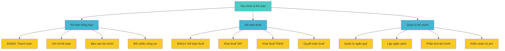
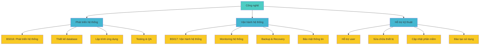
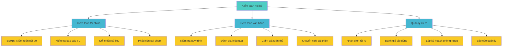
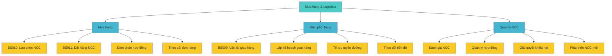
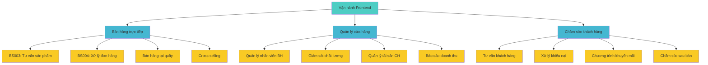
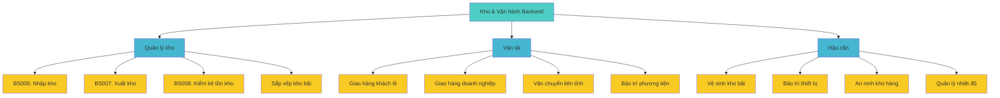

# Biểu đồ phân rã chức năng

## Tổng quan chức năng theo bộ phận

```mermaid
graph TD
    A[Công ty Nguyên liệu Làm bánh] --> B[Khối Điều hành]
    A --> C[Khối Office]
    A --> D[Khối Vận hành]
    A --> E[Khối Kho]

    %% Khối Điều hành
    B --> B1[Quản lý chiến lược]
    B --> B2[Giám sát tổng thể]
    B --> B3[Phê duyệt quyết định]
    B --> B4[Quản lý rủi ro]

    %% Khối Office
    C --> C1[Marketing & Kinh doanh]
    C --> C2[Nhân sự]
    C --> C3[Tài chính & Kế toán]
    C --> C4[Công nghệ]
    C --> C5[Kiểm toán nội bộ]
    C --> C6[Mua hàng & Logistics]

    %% Khối Vận hành
    D --> D1[Bán hàng trực tiếp]
    D --> D2[Chăm sóc khách hàng]
    D --> D3[Quản lý cửa hàng]
    D --> D4[Hậu cần vận hành]

    %% Khối Kho
    E --> E1[Quản lý kho bãi]
    E --> E2[Vận tải giao hàng]
    E --> E3[Kiểm soát tồn kho]

    %% Styling
    classDef congTy fill:#ff6b6b,stroke:#333,stroke-width:3px,color:#fff
    classDef khoi fill:#4ecdc4,stroke:#333,stroke-width:2px,color:#fff
    classDef chucNang fill:#f9ca24,stroke:#333,stroke-width:1px,color:#333

    class A congTy
    class B,C,D,E khoi
    class B1,B2,B3,B4,C1,C2,C3,C4,C5,C6,D1,D2,D3,D4,E1,E2,E3 chucNang
```

## Phân rã chức năng chi tiết theo phòng ban

### 1. Phòng Marketing & Kinh doanh

**Chi tiết chức năng:**

#### Nghiên cứu & Phát triển

- **BS001**: Nghiên cứu thị trường và sản phẩm (Dịch vụ chính)
- Thu thập thông tin thị trường làm bánh
- Phân tích xu hướng tiêu dùng
- Đánh giá sản phẩm đối thủ
- Dự báo nhu cầu thị trường

#### Marketing & Truyền thông

- **BS002**: Sáng tạo nội dung Marketing (Dịch vụ chính)
- Quản lý Facebook, Instagram
- Tổ chức sự kiện, workshop
- Xây dựng chiến dịch PR
- Liên kết với influencer

#### Thiết kế & Media

- Thiết kế catalogue sản phẩm
- Phát triển website và landing page
- Chụp ảnh sản phẩm chuyên nghiệp
- Sản xuất video hướng dẫn

### 2. Phòng Nhân sự

**Chi tiết chức năng:**

#### Tuyển dụng

- **BS012**: Tuyển dụng nhân viên (Dịch vụ chính)
- Đăng tin tuyển dụng trên các kênh
- Sàng lọc hồ sơ ứng viên
- Tổ chức phỏng vấn và test kỹ năng
- Hướng dẫn nhân viên mới

#### Đào tạo & Phát triển

- **BS013**: Đào tạo nhân viên (Dịch vụ chính)
- Đánh giá năng lực và hiệu suất
- Lập kế hoạch phát triển cá nhân
- Đào tạo kỹ năng bán hàng, CSKH

#### Quản lý lao động

- Quản lý hợp đồng và hồ sơ nhân sự
- Tính lương, thưởng và phúc lợi
- Xử lý các vấn đề lao động
- Đảm bảo tuân thủ luật lao động

### 3. Phòng Tài chính & Kế toán

**Chi tiết chức năng:**

#### Kế toán tổng hợp

- **BS005**: Thanh toán (Dịch vụ chính)
- Ghi chép các giao dịch tài chính
- Lập báo cáo tài chính định kỳ
- Đối chiếu công nợ với khách hàng và NCC

#### Kế toán thuế

- **BS014**: Kế toán thuế (Dịch vụ chính)
- Khai báo thuế VAT hàng tháng
- Khai báo và nộp thuế TNDN
- Quyết toán thuế cuối năm

#### Quản lý tài chính

- Quản lý dòng tiền vào/ra
- Lập ngân sách hoạt động
- Phân tích hiệu quả tài chính
- Kiểm soát và tối ưu chi phí

### 4. Phòng Công nghệ

**Chi tiết chức năng:**

#### Phát triển hệ thống

- **BS016**: Phát triển hệ thống (Dịch vụ chính)
- Thiết kế cơ sở dữ liệu
- Lập trình website và ứng dụng
- Kiểm thử và đảm bảo chất lượng

#### Vận hành hệ thống

- **BS017**: Vận hành hệ thống (Dịch vụ chính)
- Giám sát hiệu suất hệ thống 24/7
- Backup và phục hồi dữ liệu
- Bảo mật thông tin và dữ liệu

#### Hỗ trợ kỹ thuật

- Hỗ trợ người dùng cuối
- Bảo trì và sửa chữa thiết bị
- Cập nhật phần mềm và hệ điều hành
- Đào tạo sử dụng hệ thống

### 5. Phòng Kiểm toán nội bộ

**Chi tiết chức năng:**

#### Kiểm toán tài chính

- **BS015**: Kiểm toán nội bộ (Dịch vụ chính)
- Kiểm tra tính chính xác của báo cáo tài chính
- Đối chiếu số liệu giữa các bộ phận
- Phát hiện và báo cáo sai phạm

#### Kiểm toán vận hành

- Kiểm tra tuân thủ quy trình
- Đánh giá hiệu quả hoạt động
- Giám sát việc thực hiện chính sách
- Đưa ra khuyến nghị cải thiện

#### Quản lý rủi ro

- Nhận diện các rủi ro tiềm ẩn
- Đánh giá mức độ tác động
- Lập kế hoạch phòng ngừa rủi ro
- Báo cáo định kỳ cho ban lãnh đạo

### 6. Phòng Mua hàng & Logistics

**Chi tiết chức năng:**

#### Mua hàng

- **BS010**: Lựa chọn nhà cung cấp (Dịch vụ chính)
- **BS011**: Đặt hàng nhà cung cấp (Dịch vụ chính)
- Đàm phán giá cả và điều kiện
- Theo dõi và giám sát đơn hàng

#### Điều phối hàng

- **BS009**: Vận tải và giao hàng (Dịch vụ chính)
- Lập kế hoạch giao hàng hiệu quả
- Tối ưu hóa tuyến đường vận chuyển
- Theo dõi tiến độ giao hàng

#### Quản lý NCC

- Đánh giá định kỳ nhà cung cấp
- Quản lý hợp đồng và điều khoản
- Xử lý khiếu nại và tranh chấp
- Tìm kiếm và phát triển NCC mới

### 7. Khối Vận hành (Frontend)

**Chi tiết chức năng:**

#### Bán hàng trực tiếp

- **BS003**: Tư vấn sản phẩm (Dịch vụ chính)
- **BS004**: Xử lý đơn hàng (Dịch vụ chính)
- Bán hàng tại quầy cho khách lẻ
- Bán kèm sản phẩm (cross-selling)

#### Quản lý cửa hàng

- Quản lý và điều hành nhân viên bán hàng
- Giám sát chất lượng dịch vụ
- Quản lý tài sản và thiết bị cửa hàng
- Báo cáo doanh thu hàng ngày

#### Chăm sóc khách hàng

- Tư vấn chuyên sâu cho khách hàng
- Xử lý khiếu nại và phản hồi
- Triển khai chương trình khuyến mãi
- Theo dõi và chăm sóc sau bán hàng

### 8. Khối Kho & Vận hành Backend

**Chi tiết chức năng:**

#### Quản lý kho

- **BS006**: Nhập kho (Dịch vụ chính)
- **BS007**: Xuất kho (Dịch vụ chính)
- **BS008**: Kiểm kê tồn kho (Dịch vụ chính)
- Sắp xếp và tổ chức kho bãi

#### Vận tải

- Giao hàng cho khách hàng lẻ
- Giao hàng cho khách hàng doanh nghiệp
- Vận chuyển hàng liên tỉnh
- Bảo trì và sửa chữa phương tiện

#### Hậu cần

- Vệ sinh và dọn dẹp kho bãi
- Bảo trì thiết bị kho
- Đảm bảo an ninh kho hàng
- Kiểm soát nhiệt độ và độ ẩm

## Ma trận chức năng - Bộ phận

| Chức năng                 | Marketing | Nhân sự | Tài chính | Công nghệ | Kiểm toán | Mua hàng | Vận hành | Kho |
| ------------------------- | --------- | ------- | --------- | --------- | --------- | -------- | -------- | --- |
| **Nghiên cứu thị trường** | ●         |         |           |           |           |          |          |     |
| **Tuyển dụng & đào tạo**  |           | ●       |           |           |           |          |          |     |
| **Quản lý tài chính**     |           |         | ●         |           | ◐         |          |          |     |
| **Phát triển hệ thống**   |           |         |           | ●         |           |          |          |     |
| **Kiểm toán & rủi ro**    |           |         | ◐         |           | ●         |          |          |     |
| **Mua hàng & logistics**  |           |         | ◐         |           | ◐         | ●        |          | ◐   |
| **Bán hàng & CSKH**       | ◐         |         | ◐         |           |           |          | ●        |     |
| **Quản lý kho**           |           |         | ◐         | ◐         | ◐         | ◐        |          | ●   |

**Chú thích**: ● = Chịu trách nhiệm chính, ◐ = Hỗ trợ/Phối hợp

## Ma trận mức độ phức tạp chức năng

| Bộ phận       | Chức năng cốt lõi                        | Mức độ phức tạp | Yêu cầu kỹ năng     | Tần suất thực hiện |
| ------------- | ---------------------------------------- | --------------- | ------------------- | ------------------ |
| **Marketing** | Nghiên cứu thị trường, Content marketing | Cao             | Sáng tạo, Phân tích | Hàng ngày          |
| **Nhân sự**   | Tuyển dụng, Đào tạo                      | Trung bình      | Giao tiếp, Đánh giá | Theo nhu cầu       |
| **Tài chính** | Kế toán, Thuế                            | Cao             | Chuyên môn sâu      | Hàng ngày          |
| **Công nghệ** | Phát triển, Vận hành IT                  | Rất cao         | Kỹ thuật cao        | Liên tục           |
| **Kiểm toán** | Audit, Giám sát                          | Cao             | Phân tích, Đánh giá | Định kỳ            |
| **Mua hàng**  | Cung ứng, Logistics                      | Trung bình      | Đàm phán, Quản lý   | Hàng tuần          |
| **Vận hành**  | Bán hàng, CSKH                           | Trung bình      | Giao tiếp, Bán hàng | Hàng ngày          |
| **Kho**       | Quản lý kho, Vận tải                     | Thấp-Trung bình | Tỉ mỉ, Tổ chức      | Hàng ngày          |

## Phân tích độ quan trọng chức năng

### Chức năng cốt lõi (Core Functions)

1. **Bán hàng và CSKH** - Tạo ra doanh thu trực tiếp
2. **Quản lý kho** - Đảm bảo cung ứng sản phẩm
3. **Mua hàng** - Duy trì nguồn cung
4. **Kế toán & Tài chính** - Quản lý dòng tiền

### Chức năng hỗ trợ (Support Functions)

1. **Marketing** - Tạo nhu cầu và thương hiệu
2. **Nhân sự** - Phát triển nguồn nhân lực
3. **Công nghệ** - Hỗ trợ tự động hóa
4. **Kiểm toán** - Kiểm soát và giám sát

### Mức độ tự động hóa tiềm năng

| Chức năng           | Mức độ hiện tại   | Tiềm năng tự động hóa | Ưu tiên triển khai |
| ------------------- | ----------------- | --------------------- | ------------------ |
| **Kế toán**         | Thủ công (30%)    | Cao (80%)             | Cao                |
| **Quản lý kho**     | Thủ công (20%)    | Rất cao (90%)         | Rất cao            |
| **Bán hàng online** | Bán tự động (40%) | Cao (75%)             | Cao                |
| **Marketing**       | Bán tự động (50%) | Trung bình (65%)      | Trung bình         |
| **Nhân sự**         | Thủ công (25%)    | Trung bình (60%)      | Thấp               |
| **Kiểm toán**       | Thủ công (20%)    | Cao (70%)             | Trung bình         |
