# Cơ cấu tổ chức

## Sơ đồ tổ chức hiện tại

```mermaid
graph TD
    A[Giám đốc] --> B[Phó GĐ Nhân sự]
    A --> C[Phó GĐ Marketing & Kinh doanh]
    A --> D[Phó GĐ Vận hành Frontend]
    A --> E[Phó GĐ Vận hành Backend]
    A --> F[Phó GĐ Công nghệ]
    A --> G[Trưởng phòng Kiểm toán nội bộ]

    %% Khối Office
    B --> H[Phòng Nhân sự]
    H --> H1[NV Tuyển dụng]
    H --> H2[NV Đào tạo]

    C --> I[Phòng Marketing]
    I --> I1[NV Sáng tạo nội dung]

    E --> J[Phòng Mua hàng]
    J --> J1[NV Mua hàng]

    E --> K[Phòng Logistics]
    K --> K1[NV Điều phối hàng]

    A --> L[Phòng Kế toán]
    L --> L1[Kế toán trưởng]
    L --> L2[Kế toán thuế]
    L --> L3[Kế toán tổng hợp]

    G --> M[Phòng Kiểm toán]

    C --> N[Phòng R&D]
    N --> N1[NV Nghiên cứu sản phẩm]

    C --> O[Phòng Media]
    O --> O1[NV Thiết kế]

    F --> P[Phòng Công nghệ]
    P --> P1[NV Lập trình]
    P --> P2[NV Vận hành hệ thống]

    %% Khối Vận hành
    D --> Q[Khối Vận hành]
    Q --> Q1[NV Vận hành khu vực]
    Q --> Q2[NV Bán hàng]
    Q --> Q3[NV Hậu cần]
    Q --> Q4[Quản lý cửa hàng]

    %% Khối Kho
    E --> R[Khối Kho]
    R --> R1[NV Kho]
    R --> R2[Quản lý kho]
    R --> R3[NV Vận tải]

    %% Styling
    classDef giamDoc fill:#ff6b6b,stroke:#333,stroke-width:3px,color:#fff
    classDef phoGiamDoc fill:#4ecdc4,stroke:#333,stroke-width:2px,color:#fff
    classDef truongPhong fill:#45b7d1,stroke:#333,stroke-width:2px,color:#fff
    classDef nhanVien fill:#f9ca24,stroke:#333,stroke-width:1px,color:#333

    class A giamDoc
    class B,C,D,E,F,G phoGiamDoc
    class H,I,J,K,L,M,N,O,P,Q,R truongPhong
    class H1,H2,I1,J1,K1,L1,L2,L3,N1,O1,P1,P2,Q1,Q2,Q3,Q4,R1,R2,R3 nhanVien
```

## Mô tả vai trò và trách nhiệm

### Cấp điều hành

#### Giám đốc

- **Vai trò**: Lãnh đạo cao nhất của công ty
- **Trách nhiệm**:
  - Quyết định chiến lược phát triển công ty
  - Giám sát tổng thể hoạt động kinh doanh
  - Phê duyệt các quyết định quan trọng
  - Đại diện pháp lý của công ty

#### Phó giám đốc Nhân sự

- **Vai trò**: Quản lý tổng thể về nhân sự
- **Trách nhiệm**:
  - Xây dựng chính sách nhân sự
  - Quản lý tuyển dụng và đào tạo
  - Đánh giá hiệu suất nhân viên
  - Quản lý lương thưởng và phúc lợi

#### Phó giám đốc Marketing & Kinh doanh

- **Vai trò**: Quản lý hoạt động marketing và kinh doanh bán sỉ
- **Trách nhiệm**:
  - Xây dựng chiến lược marketing
  - Quản lý kênh bán hàng B2B
  - Phát triển thương hiệu
  - Nghiên cứu và phát triển sản phẩm

#### Phó giám đốc Vận hành Frontend

- **Vai trò**: Quản lý chất lượng cửa hàng và bán lẻ
- **Trách nhiệm**:
  - Giám sát chất lượng dịch vụ cửa hàng
  - Quản lý nhân viên bán hàng
  - Đảm bảo trải nghiệm khách hàng
  - Quản lý hoạt động bán lẻ

#### Phó giám đốc Vận hành Backend

- **Vai trò**: Quản lý kho bãi, giao hàng và hậu cần
- **Trách nhiệm**:
  - Quản lý hệ thống kho bãi
  - Điều hành vận tải và giao hàng
  - Quản lý chuỗi cung ứng
  - Tối ưu hóa logistics

#### Phó giám đốc Công nghệ

- **Vai trò**: Quản lý hạ tầng và hệ thống công nghệ
- **Trách nhiệm**:
  - Phát triển và bảo trì hệ thống IT
  - Quản lý dữ liệu và bảo mật
  - Tự động hóa quy trình
  - Hỗ trợ kỹ thuật cho các bộ phận

#### Trưởng phòng Kiểm toán nội bộ

- **Vai trò**: Kiểm soát và giám sát hoạt động nội bộ
- **Trách nhiệm**:
  - Kiểm toán số liệu kho bãi và tài chính
  - Giám sát tuân thủ quy trình
  - Đánh giá rủi ro hoạt động
  - Báo cáo trực tiếp cho Giám đốc

### Cấp trung gian (Trưởng phòng/Quản lý)

#### Phòng Nhân sự

- **Chức năng**: Quản lý nguồn nhân lực
- **Nhân sự**:
  - Nhân viên tuyển dụng
  - Nhân viên đào tạo

#### Phòng Marketing

- **Chức năng**: Xây dựng thương hiệu và quảng bá
- **Nhân sự**:
  - Nhân viên sáng tạo nội dung

#### Phòng R&D

- **Chức năng**: Nghiên cứu và phát triển sản phẩm
- **Nhân sự**:
  - Nhân viên nghiên cứu sản phẩm

#### Phòng Media

- **Chức năng**: Thiết kế và sản xuất nội dung visual
- **Nhân sự**:
  - Nhân viên thiết kế

#### Phòng Kế toán

- **Chức năng**: Quản lý tài chính và kế toán
- **Nhân sự**:
  - Kế toán trưởng
  - Kế toán thuế
  - Kế toán tổng hợp

#### Phòng Kiểm toán

- **Chức năng**: Kiểm toán và giám sát nội bộ
- **Báo cáo**: Trưởng phòng Kiểm toán nội bộ

#### Phòng Mua hàng

- **Chức năng**: Quản lý chuỗi cung ứng
- **Nhân sự**:
  - Nhân viên mua hàng

#### Phòng Logistics

- **Chức năng**: Điều phối vận tải và giao hàng
- **Nhân sự**:
  - Nhân viên điều phối hàng

#### Phòng Công nghệ

- **Chức năng**: Phát triển và vận hành hệ thống IT
- **Nhân sự**:
  - Nhân viên lập trình
  - Nhân viên vận hành hệ thống

### Cấp thực thi

#### Khối Vận hành (Frontend)

- **Chức năng**: Bán hàng trực tiếp và chăm sóc khách hàng
- **Nhân sự**:
  - Nhân viên vận hành khu vực
  - Nhân viên bán hàng
  - Nhân viên hậu cần
  - Quản lý cửa hàng

#### Khối Kho (Backend)

- **Chức năng**: Quản lý kho bãi và vận tải
- **Nhân sự**:
  - Nhân viên kho
  - Quản lý kho
  - Nhân viên vận tải

## Thống kê nhân sự

| Cấp độ         | Số lượng | Tỷ lệ |
| -------------- | -------- | ----- |
| **Điều hành**  | 7        | 23%   |
| **Trung gian** | 11       | 37%   |
| **Thực thi**   | 12       | 40%   |
| **Tổng cộng**  | 30       | 100%  |

## Cấu trúc theo khối

### Khối Office (Văn phòng)

- **Bộ phận**: Nhân sự, Marketing, R&D, Media, Kế toán, Kiểm toán, Mua hàng, Logistics, Công nghệ
- **Vai trò**: Hỗ trợ và điều hành
- **Vị trí**: Văn phòng chính

### Khối Vận hành Frontend

- **Bộ phận**: Bán hàng, CSKH, Quản lý cửa hàng
- **Vai trò**: Tương tác trực tiếp với khách hàng
- **Vị trí**: Cửa hàng và điểm bán

### Khối Vận hành Backend

- **Bộ phận**: Kho, Vận tải, Logistics
- **Vai trò**: Xử lý và giao hàng
- **Vị trí**: Kho và trung tâm phân phối

## Quyền hạn và thẩm quyền

| Cấp độ           | Thẩm quyền quyết định | Giới hạn ngân sách |
| ---------------- | --------------------- | ------------------ |
| **Giám đốc**     | Không giới hạn        | Không giới hạn     |
| **Phó GĐ**       | Chiến lược bộ phận    | 100-500 triệu      |
| **Trưởng phòng** | Hoạt động hàng ngày   | 10-50 triệu        |
| **Nhân viên**    | Thực thi công việc    | 1-5 triệu          |

## Báo cáo và liên lạc

### Tần suất báo cáo

- **Hàng ngày**: Báo cáo hoạt động cửa hàng, kho
- **Hàng tuần**: Báo cáo doanh thu, tồn kho
- **Hàng tháng**: Báo cáo tài chính, hiệu suất
- **Hàng quý**: Đánh giá chiến lược, KPI

### Kênh liên lạc

- **Nội bộ**: Zalo, Email, Họp trực tiếp
- **Khách hàng**: Điện thoại, Facebook, Website
- **Nhà cung cấp**: Zalo, Email, Điện thoại
