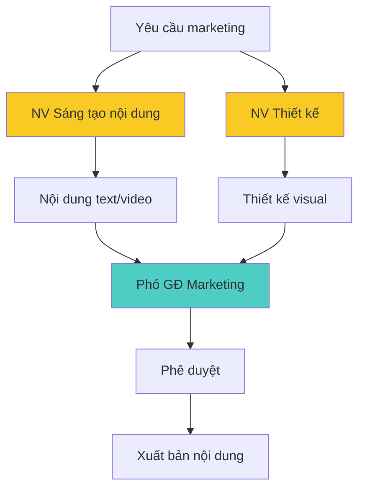
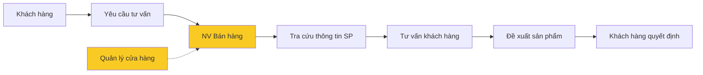
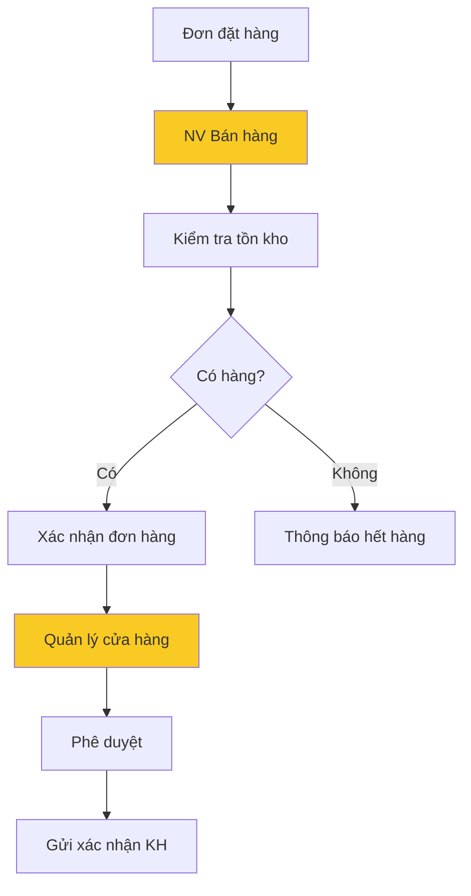
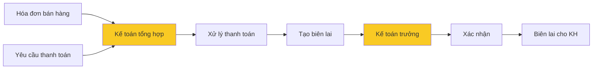
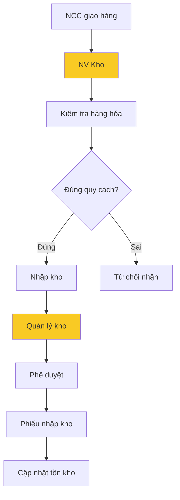
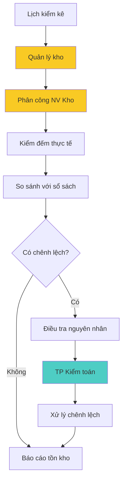
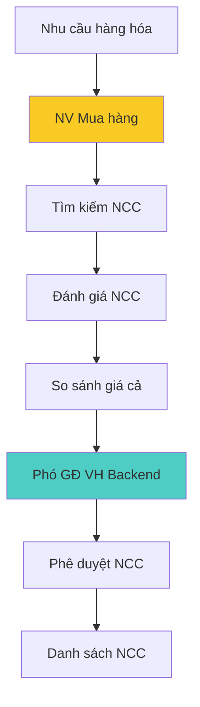
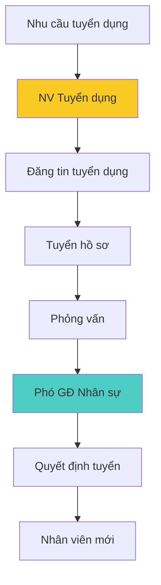
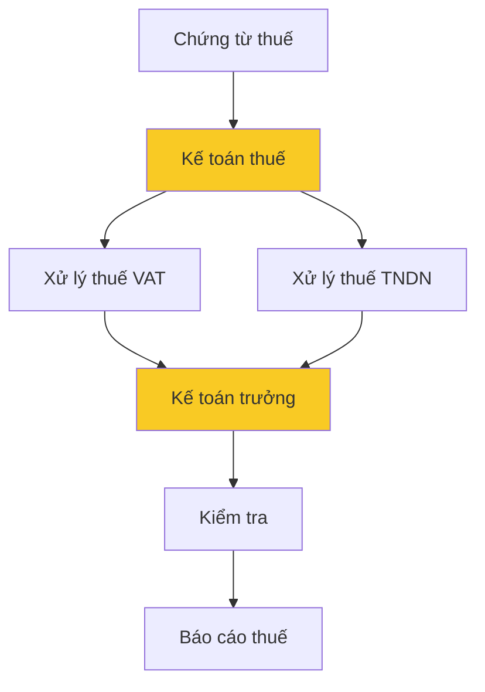
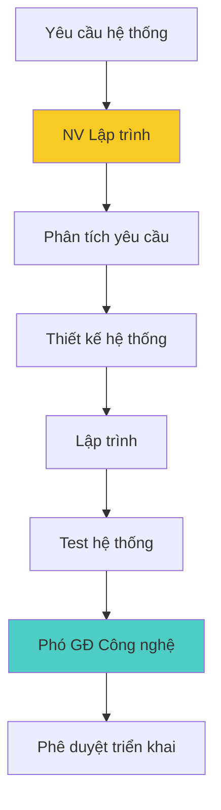

# Dịch vụ nghiệp vụ

## Tổng quan

Công ty có **7 nhóm dịch vụ nghiệp vụ** chính với tổng cộng **17 dịch vụ cụ thể** (BS001-BS017):

| Nhóm dịch vụ             | Số lượng | Mã dịch vụ  |
| ------------------------ | -------- | ----------- |
| Marketing và Kinh doanh  | 2        | BS001-BS002 |
| Bán hàng và Khách hàng   | 3        | BS003-BS005 |
| Quản lý Kho và Logistics | 4        | BS006-BS009 |
| Mua hàng và Nhà cung cấp | 2        | BS010-BS011 |
| Nhân sự                  | 2        | BS012-BS013 |
| Tài chính và Kế toán     | 2        | BS014-BS015 |
| Công nghệ                | 2        | BS016-BS017 |

## 1. Dịch vụ Marketing và Kinh doanh

### BS001: Nghiên cứu thị trường và sản phẩm

- **Mô tả**: Nghiên cứu xu hướng thị trường, phát triển sản phẩm mới
- **Đầu vào**: Yêu cầu nghiên cứu, dữ liệu thị trường
- **Đầu ra**: Báo cáo nghiên cứu, đề xuất sản phẩm mới
- **Actor chính**: Nhân viên nghiên cứu sản phẩm
- **Actor hỗ trợ**: Phó GĐ Marketing & Kinh doanh

**Chi tiết thực hiện:**

- Thu thập thông tin từ khách hàng và đối thủ
- Phân tích xu hướng thị trường làm bánh
- Đánh giá tính khả thi của sản phẩm mới
- Thời gian: 1-2 tuần/báo cáo

### BS002: Sáng tạo nội dung Marketing

- **Mô tả**: Tạo nội dung quảng cáo, thiết kế marketing materials
- **Đầu vào**: Yêu cầu marketing, thông tin sản phẩm
- **Đầu ra**: Nội dung marketing, thiết kế quảng cáo
- **Actor chính**: Nhân viên sáng tạo nội dung, Nhân viên thiết kế
- **Actor hỗ trợ**: Phó GĐ Marketing & Kinh doanh

**Chi tiết thực hiện:**

- Tạo nội dung Facebook, Website
- Thiết kế catalogue, poster
- Chụp ảnh sản phẩm chuyên nghiệp
- Thời gian: 2-5 ngày/sản phẩm

## 2. Dịch vụ Bán hàng và Khách hàng

### BS003: Tư vấn sản phẩm

- **Mô tả**: Cung cấp thông tin và tư vấn về nguyên liệu, dụng cụ làm bánh
- **Đầu vào**: Yêu cầu tư vấn từ khách hàng
- **Đầu ra**: Thông tin sản phẩm và khuyến nghị
- **Actor chính**: Nhân viên bán hàng
- **Actor hỗ trợ**: Quản lý cửa hàng

**Chi tiết thực hiện:**

- Tư vấn nguyên liệu phù hợp với công thức
- Hướng dẫn cách sử dụng dụng cụ
- Đề xuất sản phẩm thay thế
- Thời gian: 15-30 phút/khách

### BS004: Xử lý đơn hàng

- **Mô tả**: Tiếp nhận và xử lý đơn đặt hàng từ khách hàng
- **Đầu vào**: Đơn đặt hàng
- **Đầu ra**: Xác nhận đơn hàng
- **Actor chính**: Nhân viên bán hàng
- **Actor hỗ trợ**: Quản lý cửa hàng, Nhân viên kho

**Chi tiết thực hiện:**

- Kiểm tra thông tin khách hàng
- Xác nhận tồn kho sản phẩm
- Tính toán giá trị đơn hàng
- Thời gian: 15-30 phút/đơn

### BS005: Thanh toán

- **Mô tả**: Xử lý thanh toán tiền mặt và chuyển khoản
- **Đầu vào**: Hóa đơn bán hàng, Yêu cầu thanh toán
- **Đầu ra**: Biên lai thanh toán
- **Actor chính**: Kế toán tổng hợp
- **Actor hỗ trợ**: Kế toán trưởng

**Chi tiết thực hiện:**

- Nhận tiền mặt hoặc xác nhận chuyển khoản
- Xuất hóa đơn VAT
- Cập nhật sổ sách kế toán
- Thời gian: 5-10 phút/giao dịch

## 3. Dịch vụ Quản lý Kho và Logistics

### BS006: Nhập kho

- **Mô tả**: Tiếp nhận hàng hóa từ nhà cung cấp
- **Đầu vào**: Hàng hóa và phiếu giao hàng
- **Đầu ra**: Phiếu nhập kho
- **Actor chính**: Nhân viên kho
- **Actor hỗ trợ**: Quản lý kho

**Chi tiết thực hiện:**

- Kiểm tra số lượng và chất lượng hàng
- Kiểm tra hạn sử dụng
- Sắp xếp hàng theo quy cách
- Thời gian: 30-60 phút/lô hàng

### BS007: Xuất kho

- **Mô tả**: Xuất hàng theo đơn hàng khách hàng
- **Đầu vào**: Đơn hàng đã xác nhận
- **Đầu ra**: Phiếu xuất kho
- **Actor chính**: Nhân viên kho
- **Actor hỗ trợ**: Quản lý kho

**Chi tiết thực hiện:**

- Tìm và lấy hàng đúng quy cách
- Đóng gói an toàn cho vận chuyển
- Ghi nhận xuất kho trong hệ thống
- Thời gian: 15-30 phút/đơn

### BS008: Kiểm kê tồn kho

- **Mô tả**: Kiểm tra và cập nhật tình trạng hàng tồn kho
- **Đầu vào**: Danh sách hàng hóa
- **Đầu ra**: Báo cáo tồn kho
- **Actor chính**: Quản lý kho
- **Actor hỗ trợ**: Nhân viên kho, Trưởng phòng Kiểm toán nội bộ

**Chi tiết thực hiện:**

- Kiểm đếm theo từng danh mục sản phẩm
- Đối chiếu với dữ liệu hệ thống
- Phân tích nguyên nhân chênh lệch
- Tần suất: Cuối tháng và đột xuất

### BS009: Vận tải và Giao hàng

- **Mô tả**: Vận chuyển hàng hóa đến khách hàng
- **Đầu vào**: Phiếu xuất kho, địa chỉ giao hàng
- **Đầu ra**: Xác nhận giao hàng thành công
- **Actor chính**: Nhân viên vận tải
- **Actor hỗ trợ**: Nhân viên điều phối hàng

**Chi tiết thực hiện:**

- Tối ưu tuyến đường giao hàng
- Liên hệ khách hàng xác nhận thời gian
- Thu COD (nếu có)
- Thời gian: 1-2 ngày trong nội thành

## 4. Dịch vụ Mua hàng và Nhà cung cấp

### BS010: Lựa chọn nhà cung cấp

- **Mô tả**: Tìm kiếm và đánh giá nhà cung cấp
- **Đầu vào**: Nhu cầu hàng hóa
- **Đầu ra**: Danh sách nhà cung cấp đủ điều kiện
- **Actor chính**: Nhân viên mua hàng
- **Actor hỗ trợ**: Phó GĐ Vận hành Backend

**Chi tiết thực hiện:**

- Đánh giá năng lực cung ứng
- So sánh giá cả và chất lượng
- Kiểm tra uy tín và pháp lý
- Thương lượng điều kiện hợp tác

### BS011: Đặt hàng nhà cung cấp

- **Mô tả**: Tạo và gửi đơn đặt hàng cho nhà cung cấp
- **Đầu vào**: Nhu cầu bổ sung hàng hóa
- **Đầu ra**: Đơn đặt hàng
- **Actor chính**: Nhân viên mua hàng
- **Actor hỗ trợ**: Phó GĐ Vận hành Backend

**Chi tiết thực hiện:**

- Tính toán nhu cầu dựa trên dự báo
- Đàm phán giá và điều kiện giao hàng
- Theo dõi tiến độ thực hiện đơn hàng
- Thời gian: 3-7 ngày/đơn hàng

## 5. Dịch vụ Nhân sự

### BS012: Tuyển dụng nhân viên

- **Mô tả**: Tuyển dụng nhân viên mới cho các vị trí
- **Đầu vào**: Nhu cầu tuyển dụng
- **Đầu ra**: Nhân viên mới được tuyển
- **Actor chính**: Nhân viên tuyển dụng
- **Actor hỗ trợ**: Phó GĐ Nhân sự

**Chi tiết thực hiện:**

- Phân tích nhu cầu vị trí công việc
- Đăng tin trên các kênh tuyển dụng
- Sàng lọc và phỏng vấn ứng viên
- Thời gian: 2-4 tuần/vị trí

### BS013: Đào tạo nhân viên

- **Mô tả**: Đào tạo kỹ năng cho nhân viên
- **Đầu vào**: Kế hoạch đào tạo
- **Đầu ra**: Nhân viên được đào tạo
- **Actor chính**: Nhân viên đào tạo
- **Actor hỗ trợ**: Phó GĐ Nhân sự

**Chi tiết thực hiện:**

- Đào tạo kiến thức sản phẩm
- Kỹ năng bán hàng và CSKH
- Quy trình làm việc
- Thời gian: 1-2 tuần/khóa

## 6. Dịch vụ Tài chính và Kế toán

### BS014: Kế toán thuế

- **Mô tả**: Xử lý các vấn đề thuế và báo cáo thuế
- **Đầu vào**: Chứng từ thuế, hóa đơn
- **Đầu ra**: Báo cáo thuế, khai thuế
- **Actor chính**: Kế toán thuế
- **Actor hỗ trợ**: Kế toán trưởng

**Chi tiết thực hiện:**

- Khai báo thuế VAT hàng tháng
- Khai báo thuế TNDN hàng quý
- Quyết toán thuế hàng năm
- Đúng thời hạn theo quy định

### BS015: Kiểm toán nội bộ

- **Mô tả**: Kiểm toán số liệu kho bãi, tài chính, giám sát hoạt động
- **Đầu vào**: Yêu cầu kiểm toán
- **Đầu ra**: Báo cáo kiểm toán
- **Actor chính**: Trưởng phòng Kiểm toán nội bộ
- **Actor hỗ trợ**: Phòng Kiểm toán

**Chi tiết thực hiện:**

- Kiểm toán tài chính định kỳ
- Kiểm tra tuân thủ quy trình
- Đánh giá hiệu quả hoạt động
- Tần suất: Hàng tháng và đột xuất

## 7. Dịch vụ Công nghệ

### BS016: Phát triển hệ thống

- **Mô tả**: Phát triển và bảo trì các hệ thống công nghệ
- **Đầu vào**: Yêu cầu phát triển hệ thống
- **Đầu ra**: Hệ thống hoàn chỉnh
- **Actor chính**: Nhân viên lập trình
- **Actor hỗ trợ**: Phó GĐ Công nghệ

**Chi tiết thực hiện:**

- Phát triển website bán hàng
- Hệ thống quản lý kho
- Ứng dụng mobile cho nhân viên
- Thời gian: 2-8 tuần/dự án

### BS017: Vận hành hệ thống

- **Mô tả**: Vận hành và bảo trì hệ thống IT
- **Đầu vào**: Hệ thống đang hoạt động
- **Đầu ra**: Hệ thống ổn định
- **Actor chính**: Nhân viên vận hành hệ thống
- **Actor hỗ trợ**: Phó GĐ Công nghệ

**Chi tiết thực hiện:**

- Giám sát 24/7 hệ thống
- Backup dữ liệu định kỳ
- Cập nhật bảo mật
- Hỗ trợ user khi có vấn đề

## Ma trận dịch vụ nghiệp vụ

| Dịch vụ | Bộ phận chủ trì | Tần suất     | Độ phức tạp | Mức độ quan trọng |
| ------- | --------------- | ------------ | ----------- | ----------------- |
| BS001   | Marketing       | Hàng tháng   | Cao         | Cao               |
| BS002   | Marketing       | Hàng tuần    | Trung bình  | Cao               |
| BS003   | Bán hàng        | Hàng ngày    | Thấp        | Cao               |
| BS004   | Bán hàng        | Hàng ngày    | Trung bình  | Rất cao           |
| BS005   | Kế toán         | Hàng ngày    | Thấp        | Cao               |
| BS006   | Kho             | Hàng tuần    | Trung bình  | Cao               |
| BS007   | Kho             | Hàng ngày    | Thấp        | Rất cao           |
| BS008   | Kho             | Hàng tháng   | Cao         | Cao               |
| BS009   | Logistics       | Hàng ngày    | Trung bình  | Cao               |
| BS010   | Mua hàng        | Theo nhu cầu | Cao         | Trung bình        |
| BS011   | Mua hàng        | Hàng tuần    | Trung bình  | Cao               |
| BS012   | Nhân sự         | Theo nhu cầu | Cao         | Trung bình        |
| BS013   | Nhân sự         | Hàng tháng   | Trung bình  | Trung bình        |
| BS014   | Kế toán         | Định kỳ      | Cao         | Rất cao           |
| BS015   | Kiểm toán       | Hàng tháng   | Cao         | Cao               |
| BS016   | Công nghệ       | Theo dự án   | Rất cao     | Trung bình        |
| BS017   | Công nghệ       | Liên tục     | Trung bình  | Cao               |
