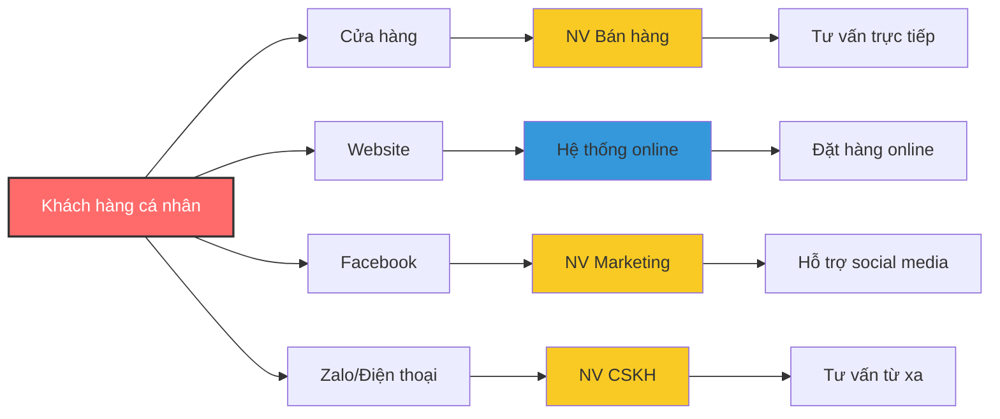
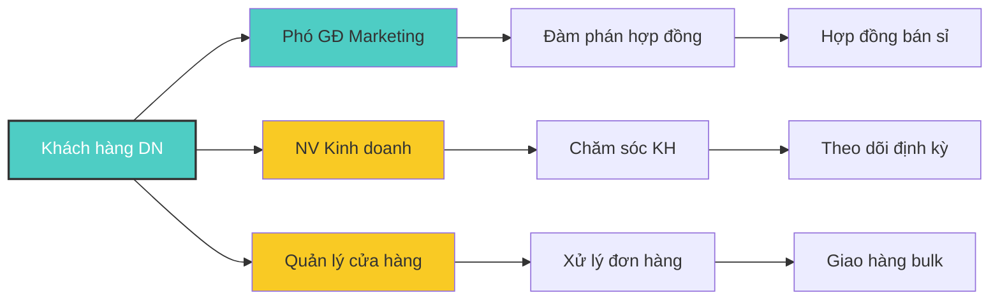
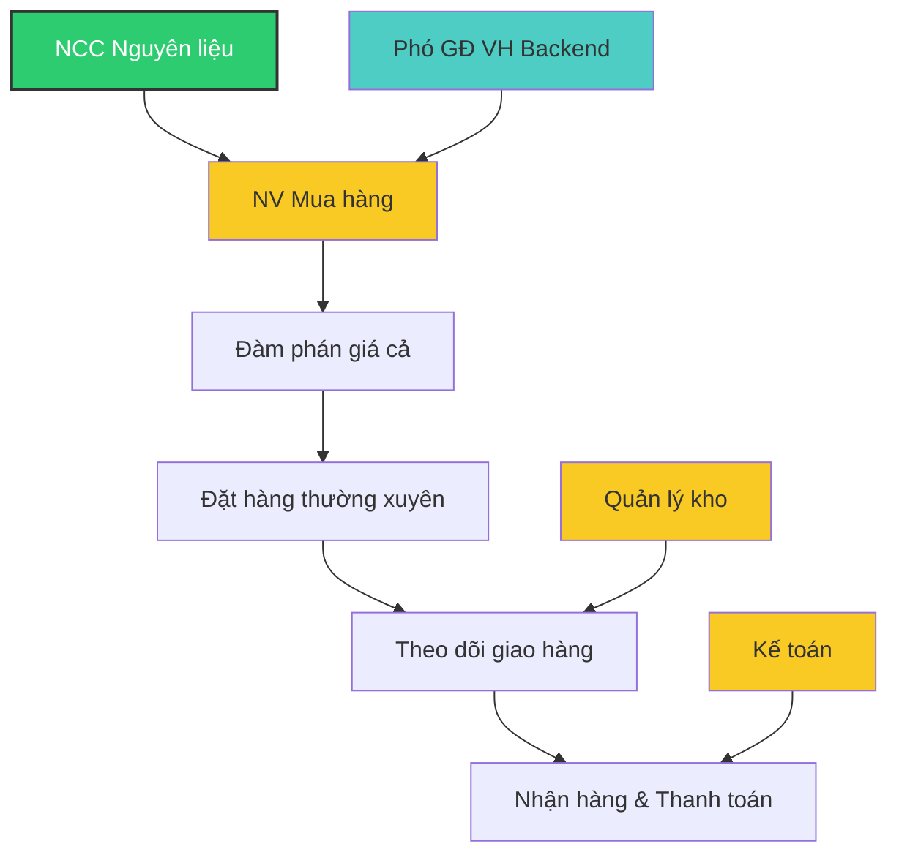
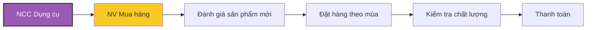
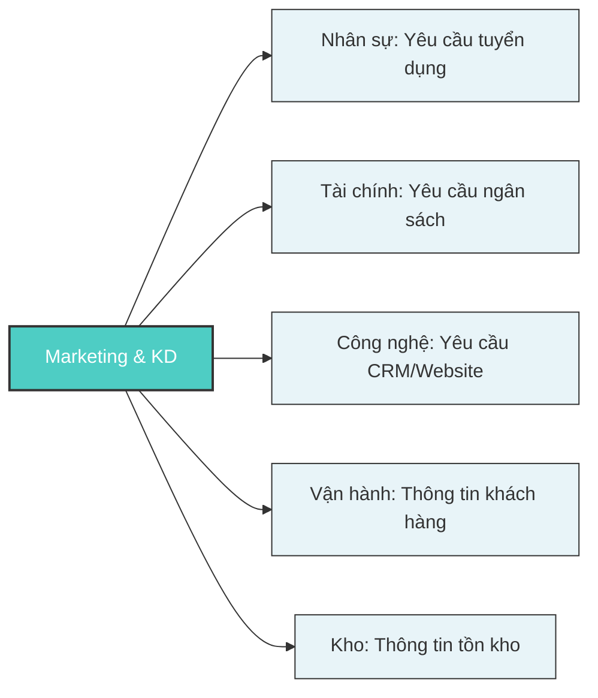
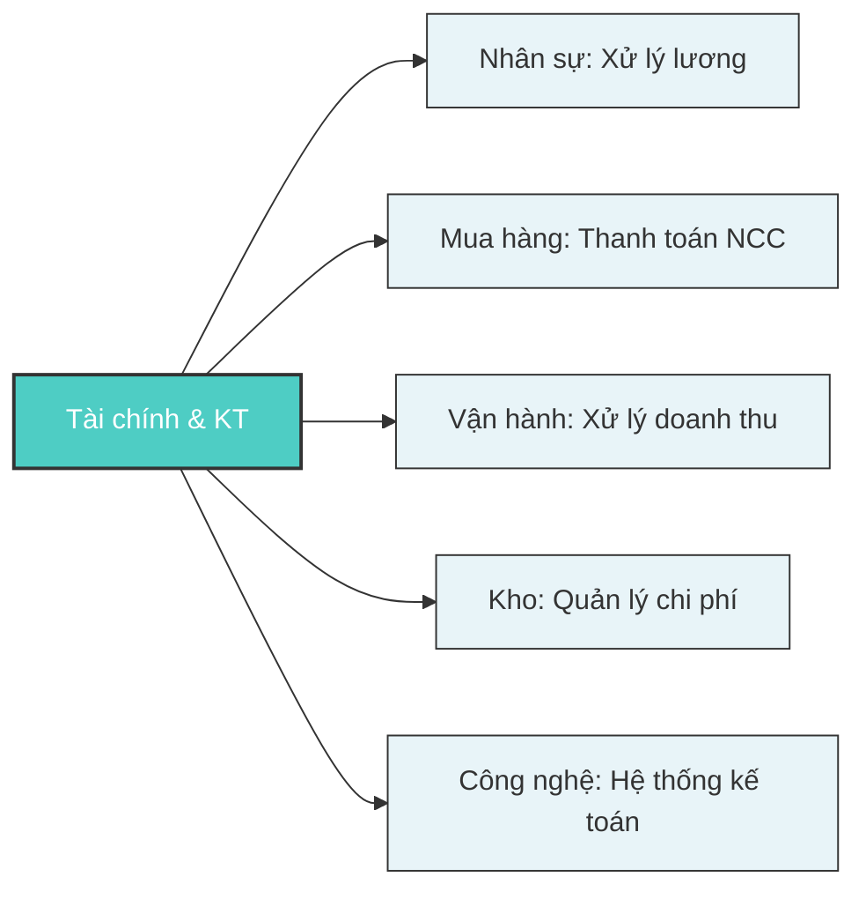
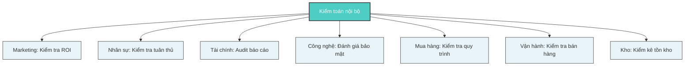

# Hợp tác giữa các đối tác nghiệp vụ

## Ma trận trách nhiệm RACI

| Hoạt động    | Giám đốc | PGĐ KD | PGĐ VH | PGĐ TC | NV BH | Marketing | Thủ kho |
| ------------ | -------- | ------ | ------ | ------ | ----- | --------- | ------- |
| Tư vấn KH    | I        | A      | I      | I      | R     | C         | I       |
| Xử lý ĐH     | I        | A      | I      | I      | R     | I         | C       |
| Nhập kho     | I        | I      | A      | I      | I     | I         | R       |
| Xuất kho     | I        | I      | A      | I      | C     | I         | R       |
| Đặt hàng NCC | A        | I      | R      | I      | I     | I         | C       |
| Thanh toán   | A        | I      | I      | R      | I     | I         | I       |

**Chú thích**: R=Responsible (Thực hiện), A=Accountable (Chịu trách nhiệm), C=Consulted (Tham vấn), I=Informed (Thông báo)

## Mô hình tương tác

### Tương tác với khách hàng

#### 1. Khách hàng cá nhân

**Đặc điểm tương tác:**

- **Kênh**: Cửa hàng, Website, Facebook, Zalo
- **Tần suất**: Theo nhu cầu cá nhân
- **Phương thức**: Trực tiếp và trực tuyến
- **Thời gian phản hồi**: Ngay lập tức (cửa hàng), 1-2h (online)
- **Loại giao dịch**: Lẻ, giá trị nhỏ (100k-2M)

#### 2. Khách hàng doanh nghiệp

**Đặc điểm tương tác:**

- **Kênh**: Trực tiếp, Email, Zalo Business
- **Tần suất**: Định kỳ hàng tuần/tháng
- **Phương thức**: Hợp đồng dài hạn, quan hệ đối tác
- **Thời gian xử lý**: 1-3 ngày làm việc
- **Loại giao dịch**: Sỉ, giá trị lớn (5M-50M)

### Tương tác với nhà cung cấp

#### 1. Nhà cung cấp nguyên liệu

**Đặc điểm tương tác:**

- **Kênh**: Zalo, Email, Điện thoại, Trực tiếp
- **Tần suất**: Hàng tuần, thường xuyên
- **Phương thức**: Đơn hàng định kỳ, quan hệ lâu dài
- **Điều kiện**: Thanh toán 15-30 ngày, giao hàng 2-5 ngày
- **Sản phẩm**: Bột mì, đường, bơ, chocolate, vv.

#### 2. Nhà cung cấp dụng cụ

**Đặc điểm tương tác:**

- **Kênh**: Email, Triển lãm, Website
- **Tần suất**: Hàng tháng hoặc theo mùa
- **Phương thức**: Đơn hàng lớn, đánh giá kỹ
- **Điều kiện**: Thanh toán ngay, bảo hành sản phẩm
- **Sản phẩm**: Khuôn bánh, máy trộn, dụng cụ trang trí

## Ma trận tương tác chi tiết giữa các bộ phận

| Bộ phận            | Marketing & KD                  | Nhân sự                          | Tài chính & KT                           | Công nghệ                        | Kiểm toán                   | Mua hàng                      | Vận hành                     | Kho                           |
| ------------------ | ------------------------------- | -------------------------------- | ---------------------------------------- | -------------------------------- | --------------------------- | ----------------------------- | ---------------------------- | ----------------------------- |
| **Marketing & KD** |                                 | Yêu cầu nhân sự cho Marketing    | Yêu cầu ngân sách Marketing, báo cáo ROI | Yêu cầu hệ thống CRM, website    | Cung cấp dữ liệu chiến dịch | Thông tin sản phẩm mới        | Yêu cầu thông tin khách hàng | Yêu cầu thông tin tồn kho     |
| **Nhân sự**        | Hỗ trợ tuyển dụng Marketing     |                                  | Yêu cầu ngân sách nhân sự, lương         | Yêu cầu hệ thống quản lý nhân sự | Báo cáo tuân thủ lao động   | Tuyển dụng nhân viên mua hàng | Đào tạo nhân viên bán hàng   | Đào tạo nhân viên kho         |
| **Tài chính & KT** | Báo cáo chi phí Marketing       | Xử lý lương và phúc lợi          |                                          | Yêu cầu hệ thống kế toán         | Cung cấp báo cáo tài chính  | Thanh toán nhà cung cấp       | Xử lý doanh thu bán hàng     | Quản lý chi phí kho           |
| **Công nghệ**      | Cung cấp hệ thống Marketing     | Cung cấp hệ thống HR             | Cung cấp hệ thống kế toán                |                                  | Hỗ trợ hệ thống audit       | Cung cấp hệ thống mua hàng    | Cung cấp hệ thống bán hàng   | Cung cấp hệ thống quản lý kho |
| **Kiểm toán**      | Kiểm tra hoạt động Marketing    | Kiểm tra tuân thủ nhân sự        | Kiểm toán báo cáo tài chính              | Đánh giá bảo mật hệ thống        |                             | Kiểm tra quy trình mua hàng   | Kiểm tra quy trình bán hàng  | Kiểm kê và đối chiếu kho      |
| **Mua hàng**       | Cung cấp thông tin nhà cung cấp | Yêu cầu đào tạo kỹ năng đàm phán | Yêu cầu phê duyệt ngân sách mua          | Yêu cầu hệ thống quản lý NCC     | Báo cáo mua hàng            |                               | Cung cấp thông tin giao hàng | Phối hợp nhập kho             |
| **Vận hành**       | Báo cáo nhu cầu khách hàng      | Yêu cầu tuyển nhân viên bán hàng | Báo cáo doanh thu hàng ngày              | Yêu cầu hệ thống POS             | Báo cáo hoạt động bán hàng  | Yêu cầu thông tin đơn hàng    |                              | Yêu cầu xuất kho              |
| **Kho**            | Báo cáo tồn kho sản phẩm        | Yêu cầu tuyển nhân viên kho      | Báo cáo giá trị tồn kho                  | Yêu cầu hệ thống quản lý kho     | Cung cấp báo cáo kiểm kê    | Thông báo nhu cầu nhập hàng   | Cung cấp hàng hóa            |                               |

## Mô tả chi tiết các tương tác chính

### 1. Marketing & KD ↔ Các bộ phận khác

**Chi tiết tương tác:**

- **Với Nhân sự**: Tuyển dụng nhân viên marketing, đào tạo kỹ năng bán hàng
- **Với Tài chính**: Xin phê duyệt ngân sách chiến dịch, báo cáo ROI
- **Với Công nghệ**: Phát triển website, CRM, tools marketing
- **Với Vận hành**: Chia sẻ thông tin khách hàng, feedback thị trường
- **Với Kho**: Thông tin tồn kho để lập kế hoạch marketing

### 2. Tài chính & KT ↔ Các bộ phận khác

**Chi tiết tương tác:**

- **Với Nhân sự**: Xử lý lương, thưởng, báo cáo chi phí nhân sự
- **Với Mua hàng**: Thanh toán nhà cung cấp, kiểm soát ngân sách mua
- **Với Vận hành**: Ghi nhận doanh thu, xuất hóa đơn, thanh toán
- **Với Kho**: Tính giá trị tồn kho, quản lý chi phí vận hành kho
- **Với Công nghệ**: Triển khai hệ thống kế toán, báo cáo tự động

### 3. Vận hành ↔ Kho

```mermaid
graph LR
    A[Vận hành] --> B[Kiểm tra tồn kho]
    B --> C[Yêu cầu xuất kho]
    C --> D[Kho: Chuẩn bị hàng]
    D --> E[Giao hàng cho khách]
    E --> F[Cập nhật tồn kho]

    style A fill:#4ecdc4,stroke:#333,stroke-width:2px,color:#fff
    style D fill:#4ecdc4,stroke:#333,stroke-width:2px,color:#fff
    style B fill:#e8f4f8,stroke:#333,stroke-width:1px,color:#333
    style C fill:#e8f4f8,stroke:#333,stroke-width:1px,color:#333
    style E fill:#e8f4f8,stroke:#333,stroke-width:1px,color:#333
    style F fill:#e8f4f8,stroke:#333,stroke-width:1px,color:#333
```

**Quy trình tương tác hàng ngày:**

1. **Sáng**: Vận hành kiểm tra tồn kho có sẵn
2. **Trong ngày**: Yêu cầu xuất kho theo đơn hàng
3. **Kho chuẩn bị**: Lấy hàng, đóng gói, kiểm tra
4. **Giao hàng**: Vận chuyển đến khách hàng
5. **Cập nhật**: Kho cập nhật lại số lượng tồn

### 4. Mua hàng ↔ Kho

```mermaid
graph LR
    A[Kho: Báo cáo thiếu hàng] --> B[Mua hàng]
    B --> C[Tìm nhà cung cấp]
    C --> D[Đặt hàng]
    D --> E[Nhận hàng]
    E --> F[Kho: Nhập kho]

    style B fill:#4ecdc4,stroke:#333,stroke-width:2px,color:#fff
    style F fill:#4ecdc4,stroke:#333,stroke-width:2px,color:#fff
    style A fill:#e8f4f8,stroke:#333,stroke-width:1px,color:#333
    style C fill:#e8f4f8,stroke:#333,stroke-width:1px,color:#333
    style D fill:#e8f4f8,stroke:#333,stroke-width:1px,color:#333
    style E fill:#e8f4f8,stroke:#333,stroke-width:1px,color:#333
```

**Chu kỳ bổ sung hàng hóa:**

1. **Kho báo cáo**: Sản phẩm dưới mức tối thiểu
2. **Mua hàng đánh giá**: Lượng cần mua và nhà cung cấp
3. **Đặt hàng**: Tạo PO và gửi cho NCC
4. **Theo dõi**: Giám sát tiến độ giao hàng
5. **Nhập kho**: Kiểm tra và nhập hàng mới

### 5. Kiểm toán ↔ Tất cả bộ phận

**Hoạt động kiểm toán định kỳ:**

- **Hàng tháng**: Kiểm kê kho, đối chiếu tài chính
- **Hàng quý**: Audit toàn diện quy trình
- **Đột xuất**: Kiểm tra khi có bất thường
- **Hàng năm**: Đánh giá hiệu quả tổng thể

## Tần suất và phương thức tương tác

### Tần suất tương tác

| Loại tương tác   | Tần suất  | Ví dụ                                                                   |
| ---------------- | --------- | ----------------------------------------------------------------------- |
| **Hàng ngày**    | Daily     | Vận hành ↔ Kho (xuất kho), Tài chính ↔ Vận hành (thanh toán)            |
| **Hàng tuần**    | Weekly    | Marketing ↔ Vận hành (báo cáo KH), Mua hàng ↔ Kho (nhập hàng)           |
| **Hàng tháng**   | Monthly   | Kiểm toán ↔ Tài chính (audit), Nhân sự ↔ Tài chính (lương)              |
| **Theo yêu cầu** | On-demand | Công nghệ ↔ Các bộ phận (hỗ trợ IT), Nhân sự ↔ Các bộ phận (tuyển dụng) |

### Phương thức tương tác

| Phương thức          | Mô tả                            | Ứng dụng                            | Ưu điểm                          | Nhược điểm                |
| -------------------- | -------------------------------- | ----------------------------------- | -------------------------------- | ------------------------- |
| **Hệ thống tự động** | Trao đổi dữ liệu qua hệ thống IT | Đồng bộ tồn kho, báo cáo tài chính  | Nhanh, chính xác, thời gian thực | Cần đầu tư hệ thống       |
| **Email/Zalo**       | Giao tiếp văn bản                | Yêu cầu phê duyệt, thông báo        | Có bằng chứng, tiện lợi          | Có thể chậm               |
| **Họp định kỳ**      | Họp trực tiếp                    | Báo cáo tiến độ, đánh giá hiệu suất | Tương tác trực tiếp              | Tốn thời gian             |
| **Biểu mẫu giấy**    | Chứng từ giấy                    | Phiếu xuất/nhập kho, đơn hàng       | Đơn giản, quen thuộc             | Dễ thất lạc, lỗi ghi chép |

## Phân tích hiệu quả tương tác

### Điểm mạnh của hệ thống tương tác hiện tại

1. **Linh hoạt**: Nhiều kênh tương tác phù hợp với từng loại công việc
2. **Trực tiếp**: Giao tiếp face-to-face hiệu quả cho công việc phức tạp
3. **Quen thuộc**: Nhân viên đã làm việc thuần thục với các phương thức hiện tại

### Điểm yếu cần cải thiện

1. **Thiếu tự động hóa**: Quá nhiều tương tác thủ công
2. **Không đồng bộ**: Thông tin không được cập nhật real-time
3. **Dễ sai sót**: Giao tiếp bằng lời nói có thể hiểu nhầm
4. **Khó theo dõi**: Không có hệ thống log và audit trail

### Đề xuất cải thiện

| Vấn đề                 | Giải pháp                        | Ưu tiên    | Thời gian triển khai |
| ---------------------- | -------------------------------- | ---------- | -------------------- |
| **Tương tác thủ công** | Triển khai hệ thống ERP tích hợp | Cao        | 6-12 tháng           |
| **Thiếu real-time**    | Dashboard tự động, notification  | Cao        | 3-6 tháng            |
| **Sai sót giao tiếp**  | Chuẩn hóa quy trình, checklist   | Trung bình | 1-3 tháng            |
| **Khó theo dõi**       | Hệ thống log, audit trail        | Thấp       | 6-9 tháng            |

## Ma trận độ ưu tiên tương tác

| Tương tác                   | Tần suất   | Tầm quan trọng | Độ phức tạp | Ưu tiên tự động hóa |
| --------------------------- | ---------- | -------------- | ----------- | ------------------- |
| **Vận hành ↔ Kho**          | Cao        | Rất cao        | Thấp        | Rất cao             |
| **Tài chính ↔ Các bộ phận** | Cao        | Rất cao        | Trung bình  | Cao                 |
| **Mua hàng ↔ Kho**          | Trung bình | Cao            | Trung bình  | Cao                 |
| **Marketing ↔ Vận hành**    | Trung bình | Cao            | Thấp        | Trung bình          |
| **Kiểm toán ↔ Các bộ phận** | Thấp       | Cao            | Cao         | Thấp                |
| **Nhân sự ↔ Các bộ phận**   | Thấp       | Trung bình     | Thấp        | Thấp                |

**Kết luận**: Ưu tiên tự động hóa tương tác giữa Vận hành-Kho và Tài chính với các bộ phận khác do tần suất cao và tầm quan trọng lớn.
