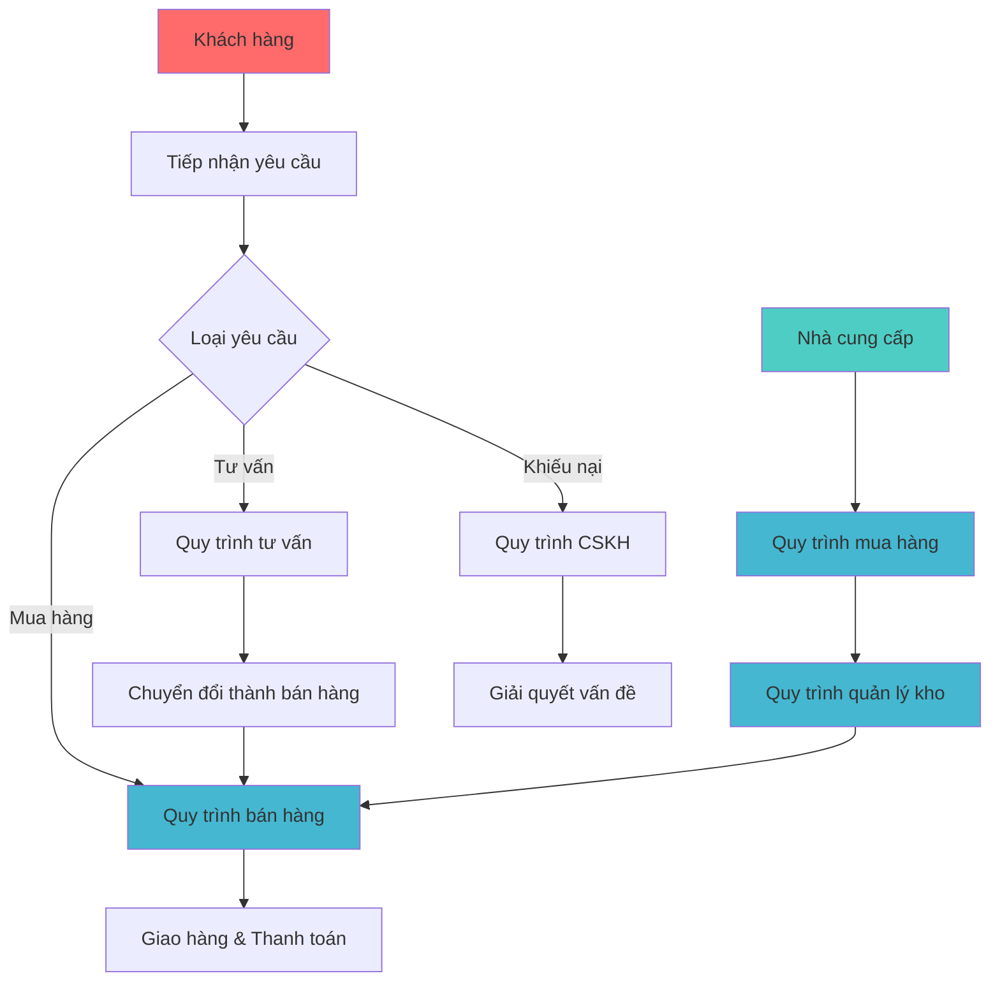
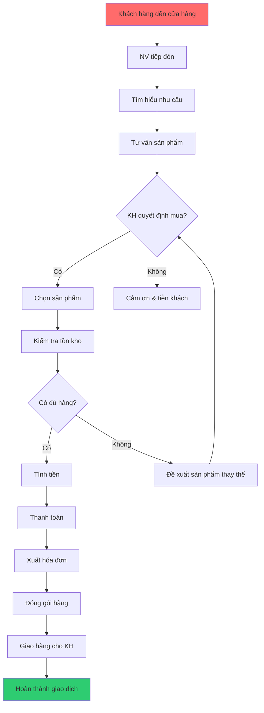
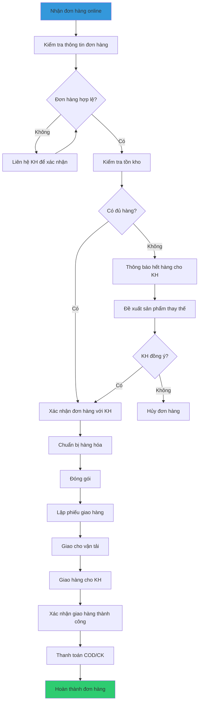
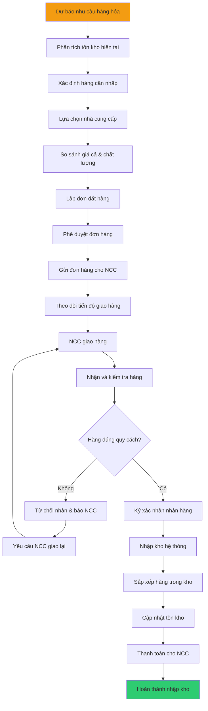
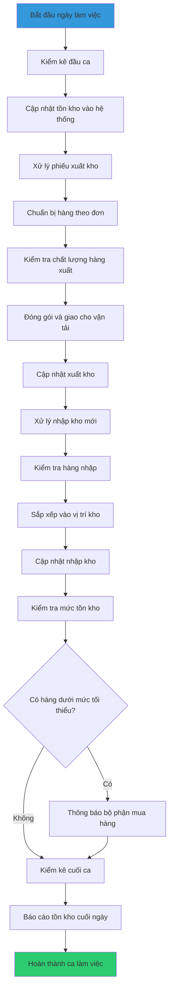
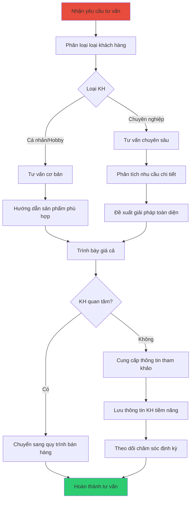
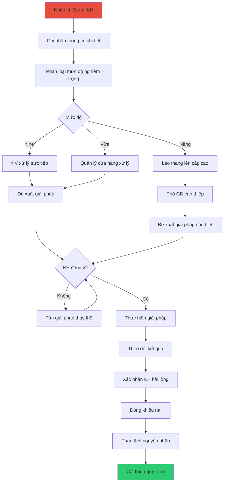
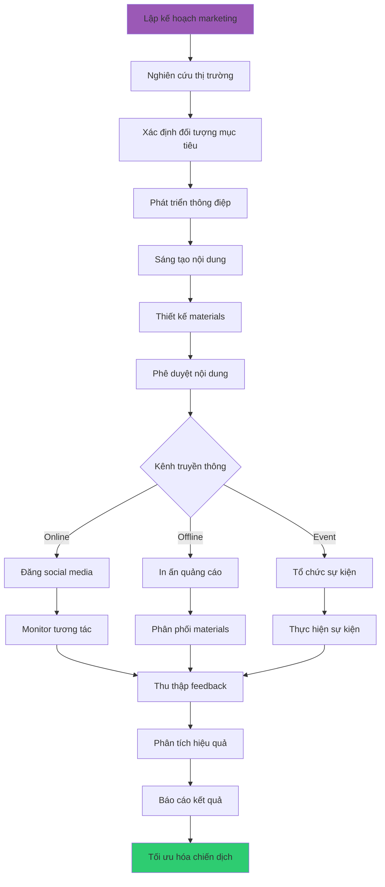
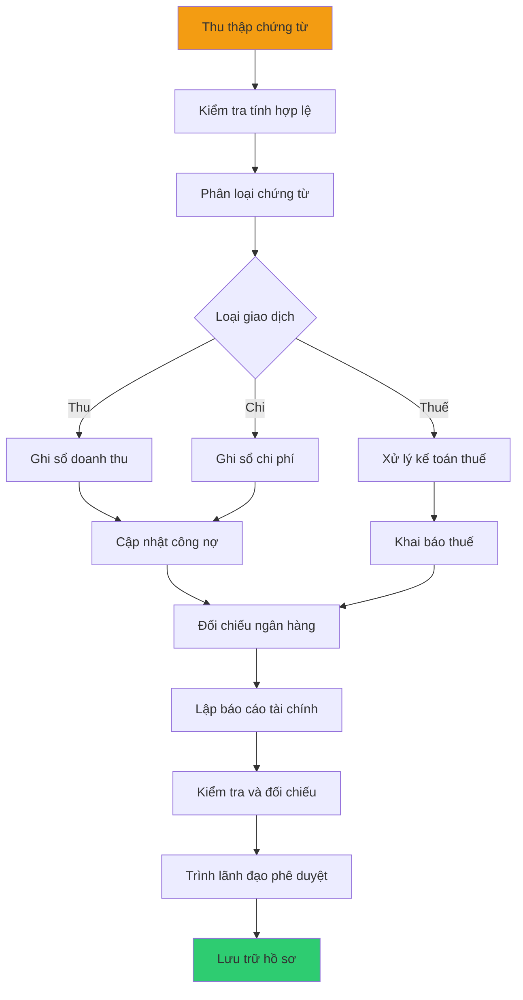

# Quy trình nghiệp vụ

## Tổng quan

Công ty có **8 quy trình nghiệp vụ** chính (BP001-BP008) bao trùm toàn bộ hoạt động kinh doanh:

| Quy trình | Tên quy trình                   | Phạm vi                                     | Tần suất     |
| --------- | ------------------------------- | ------------------------------------------- | ------------ |
| BP001     | Bán hàng trực tiếp tại cửa hàng | Từ đón khách đến hoàn thành giao dịch       | Hàng ngày    |
| BP002     | Bán hàng trực tuyến             | Từ nhận đơn online đến giao hàng thành công | Hàng ngày    |
| BP003     | Mua hàng và nhập kho            | Từ dự báo nhu cầu đến nhập kho hoàn thành   | Hàng tuần    |
| BP004     | Quản lý kho hàng                | Các hoạt động hàng ngày trong quản lý kho   | Hàng ngày    |
| BP005     | Tư vấn và chăm sóc khách hàng   | Từ tiếp nhận yêu cầu đến hoàn thành hỗ trợ  | Hàng ngày    |
| BP006     | Xử lý khiếu nại                 | Từ tiếp nhận khiếu nại đến giải quyết       | Theo yêu cầu |
| BP007     | Marketing và truyền thông       | Từ lập kế hoạch đến đánh giá hiệu quả       | Hàng tháng   |
| BP008     | Quản lý tài chính               | Các hoạt động kế toán và tài chính          | Hàng ngày    |

## Quy trình cấp 0: Tổng quan hệ thống

## BP001: Quy trình bán hàng trực tiếp tại cửa hàng

### Mô tả tổng quan

- **Mục đích**: Xử lý giao dịch bán hàng trực tiếp tại cửa hàng
- **Phạm vi**: Từ khi khách hàng đến cửa hàng đến khi hoàn thành giao dịch
- **Dịch vụ nghiệp vụ**: BS003 (Tư vấn sản phẩm), BS004 (Xử lý đơn hàng), BS005 (Thanh toán)

### Quy trình chi tiết

**Biểu đồ flow chart**

**Biểu đồ BPMN**

![Biểu đồ BPMN](https://kroki.io/bpmn/svg/eNrtXVtv3MYVfvevmPKhb_Jyr9pVLRmSVrKNxKpirY0CQSCMuaNdWiRnw4suj0HQp6BAi_6BGkURFGiAAs6T9JAHBf4f-icdkkMuh5wZDi16Nyj44ijLM2e-c51zZoa7T55e2Ra4QK5nYmdbaz_WNYAcA09NZ7atvZ4cbgy1pzuPnrxd2E5na4rOTMf0CakHyDjH24o-39bmvr_YarUuLy8fY3v2GLuzlrdARmvv-OVRq6O3db3f6bVe_nF88KWWGTk1VYeOXyzHeabNDIs-iQcac2RDrxWJEZNPDfEU43Fmgv10hKk4IoU0dTG2PGbUu7fY86Jx8cOE9Moj3Mk_GjCn29pp_93zN8O9UXAwHhyeewfHe53xmfsVIfbMrViYL7EB_cg2FXQMws86-uMrbwokoED8nzwZV58g_jRHKlEnGO-rU78A4xcRNfG-qwV2feRua--IFODYxQbyPPAST5GF3OXzN4nPdkJj-9CdIf8I2shbQANxtRX5qq7tPAKA-rOBLQu-xW6k4dgiXX3QHfQHvY3d_mCw0Rtv9jb2-r32xu7maDzu6sPD7h7xFIdMtK2N0RkMLB_sZ9lE_NMZFtD1TcNcQMeP-e8N9P6hrh9sdPXO4UZvuDvaGI4G7Y2ePhwPDkbdfn93nPA_JtYBx0sOGljE2niFzra1vWNdb2utSJwWR56MnHRYhCAeRk1P8BnncIaOovkMbD9GV9BeWCglYFMD_RBOn2MSV2fQ8lAClvKlU02uF6EAwVvLNFiNeOjbgGQYdGjhywhQ-MfpCTGgP8GvkIEWkRaBhwPXQJGk0cODC-T4p_uB52Mbubuua15AKzF8RDaB3nnI6OxsyaalMHdKPcGvnSmR14fOlAHA41yYeTn2CKGppzT1cswE75OsSrypOHGecWFmEiPTwPApA6gsOB0wwWNkmF5e60LW2fmfQR9dwuvULiknlfkTYiL7HOOlK-3ffWCQCCcpaCLmQ0FTv0tBoCsfOeG4AwvZxJm85DmhoI5tIx-OoQ8pEBQThv-jLYlZ8jfQCtDOk999vT_enex-TbB_883Ok1aBYjlXKzdZCrMlxZk8zuqykpIPoYsukWUlav5ifvezM_tETU_m0DnfdaYp03UoO5bgt6Xv2AUn-IUTJizsXheDivVSjhMj43w5XCWSUuoJPvGxcc6bk2HKi-Fo5O4FNMkaQlYAlXl3LbISOyQtXCBZFjkJZjPk-Rnq-pJIhHqCGd6l_p0TtbiKFAE3_s3oex9aRmARdZYl7TJVp4yOXdNATc6Ockiikwk-htchP05As3orFgV0oEoMUdooaeGIW6EOSGDkp3nheQFKhimmqpA2lCwsPc1chBaZciSLatZnGCtWWelMYY6ySDDzkjLDtTAnHUf8nuYoxQInni0s7sKq2udotsg5O_mBM40L34kLHQ8aYQGW8lKBkKzPE3zAK2oLyzh38iOcmT4_bVqcR5PKavU0Lb835mB-9w9nBn792_3NLw4w7m9_gvFH60q0MkyfKTukMuLAn2HinzvcXijhklKxqSVVOGMWn1g3Mgi3d4kVdfQG-CaRdUFEvvvgrEXzOQyfW9OmQ5rcUk2nVDIzcdtGua1Co0isVGj0Yq1O7v5jg7l5f_t9AJx5QBzz5sdgLcbiIlmtyaRaV7Ibp-d-kNW4LTK13Mf_gov7m385wLu_-acDFvP7m3_b6zEdF8pqbSfRvJLlCvsVFe2Grgwr8MhqS2vTyIbilpcuV8_Bt8E1yVB-uDDc_uDMgR3Ap-tZpvhYVmtFbs9XYkeWg9COSl5Q3NDgu0Hp8LgNl_tQ3mUkeSDX1dOuaH5_-5ffQPhzcKzWa0RqVwv8_J7KgxJ2sealtiLKscHH9w74PbQXfwjrkts_O-A8qg3XY7UlIhbNumyXjzgl6zEtyIMsl9_Eohk6LEhs4LsQ-Pe3fw91hNeTnjlAVmspYaAoGSq_i1jn8prfBko3jaKV7Me4z3qqgVlMPzZdZMTnnuOwPY72Cda0N8QgXK09RRZRMmd-p67SMlncVq1toeTtBsf2-fWv97ffgauA1Kk-s1YBf078ySd__7IWL1ABturWVWQfJd-QFnGflptz-5FJ7_oTKVLDtes7Z00t6xLAWixUCD-1iqewA_ywHjXZvqVWIRUQUQq-e78moyznX_H6KFSrklXy--QPsgm7yR3r8k9xhpnffYBk1fm4JvMUUKzWSCItq9YwueOFBwZO9lQgWaXuPjgzMLv7YK5xy7qAYuWViUDPipFUOJJ5kJ04pyixZp-ZENN9fWOOwRfP12KsAopVR5RQ24pbLvlzrKqtAT1JigwmPdOiOn6OibJIXUX-nYNZqL3p_e0Pa2rDRWBW3YWLjMDaMOVO1axgCPZ8L2mro31GIvWNEe46_Ex81w7gehprLpTVqp-7i1Gu-eQzei8yvZQ5NbfCS7pjE85caGdsRB8cW9BBIPyAoktuWDIgKfHJHC5QZFIv_OtUZFiGnYAoaz9jaw8HztQDc2TO5mRMf6CBS3Pqz-M_r7a1YbungettrTPqJAfDidBZcJVQc_MCHzuPtKIE7c12JxKh3dcfKoJoLWLAC4iksId6Crut6zHuPsEb4e4Oa8HN1jpFyMzzymh7nXrRsuVzES3zvDLazqhu3dIGjKfW-FFljO1BvRjzHXwRquCuljJivVsvYt5OUhG15DKfKvLh5jAG_lDYou1QBrWAqGJeG-l6rWktv_nOcQ-WoqqSNzfr9Y7iOU8RsvAasyroQS8G3RnWpWXmFJGnZN4V96pwa9Cx-OCc68wFsoru3O_V687caxuc7Mwhq6r0Xrtexy7cEyrCzpNUhRy6c62ZOncBjZOlWYrq1VBtgGVXGBncEsKqzv3Jvn0wncXYEfnjVJL9Tn18WqE74FwezcpkbpGYXpDO348yN43NbieDv0iW9AoMGSNmKE0lKQtlNEfM8nZCdFlXLEp7kJhscygTedlcbA7rkjlbhy_FVWo9hNehJRL0O2qS9nkaeZik2Ro-J6mkWRFdM5dg747UZOx19PqtGZX_OfEk3Q3_xr4EdGegJlxnVLtwbMNQMCGvJxK9ACEB3u6qCdge1Ckgv0rPySjtqfjv04gFGIWrhYKcenflcpZ2YqJ3tSTSdobFRVFMNmzX5bRFWZbCKha9kpfjJMsjbTJ7bZm8_UEVKnFFUT2Wme6uqBJpS8t_S1GmC6WQTnvcGlNWtr_KR7OsBRa8_VleNZXIuLn5OaI578A5SUt6Z9GbxeUO2dEHKn5bUkkOeAXn59aJrDXnv88ukXOklMoHvfrrjWJD-2nprfjtARJx20qu3q9f3FwjnC9BSjcBhF_TIJaiO1QStteuXVi2h87JKt81kHwThliEjloT1BnWKam4687XJLI9B_63jsiKKrXaq0ITxHwcnfctDwyLx4P0UNJFVuSm3txcAD_6lpW94xPTDg84tdx1XPHxpmfaW-mwjDTxkxMDOdA1caT5afwlN8mpMBkTUASUij3EZTkcQ4KedNKu1-JQUWBLIkDPhmVvx2b5pJwmpo2WbFiSlIh-lVDY-BLyPFFKdoRdG1pj0_Nd820QfTOQjaCzrRHLRgEB3ekYXZj0a5mYdWpp77IJExoZcgroFYrf2i0VkBZfpmX610LxiOMT5M4s5QYuwnNzqSAyxpTtVwF0_Lrn5TNNnpbphU68jz2_VHWvHdMPCWuFz2eaPBXjSigK8fFpMSQ4t23CpwmfJnzKw0dwkaAJnyZ8mvBRWX3y-7dN5DSR00ROeeQIb1s1AdQEUBNA5QEkvfjXBFETRE0QKaxCokudTQA1AdQEUHkASa4YNyHUhFATQiprEP_OexM_Tfw08aOwByd9iaGJoiaKmigqjyLxOzVNBDUR1ESQwoac6B2vJoCaAGoCSBpASi8b_p_HkYI2E5LkBmL2Dibn1mPZ77fQ31iInHNH8HON6S8xxFTsl1SFP6ZRNpBSZb4tJnvLc-dR8mnm5zd3_gd6jE92)

### Thông tin chi tiết

- **Thời gian**: 15-30 phút/giao dịch
- **Tần suất**: 20-30 giao dịch/ngày
- **Actor chính**: Nhân viên bán hàng
- **Actor hỗ trợ**: Quản lý cửa hàng
- **Điểm kiểm soát**:
  - Kiểm tra tồn kho trước khi xác nhận bán
  - Xác nhận thanh toán trước khi xuất hóa đơn
- **KPI**: Tỷ lệ chuyển đổi 70%, Thời gian phục vụ ≤ 30 phút

## BP002: Quy trình bán hàng trực tuyến

### Mô tả tổng quan

- **Mục đích**: Xử lý đơn hàng từ các kênh trực tuyến
- **Phạm vi**: Từ khi nhận đơn hàng online đến khi giao hàng thành công
- **Dịch vụ nghiệp vụ**: BS004 (Xử lý đơn hàng), BS007 (Xuất kho), BS009 (Vận tải)

### Quy trình chi tiết

**Biểu đồ flow chart**

**Biểu đồ BPMN**

![Biểu đồ BPMN](https://kroki.hieptuanle.com/bpmn/svg/eNrtXUtv3MgRvvtXELzLw-G8hZUMjWZkG2tb8mq8yE2gOK2ZXnHYI5KjxzHIYQ-5JNhjLmssgmAD5OScLAQ5aJH_oX-SJtl8NPvBlmdEGQkvtkRWd1fVV1VdXd1sffPieuFol8DzIXJ39OZzQ9eAa6MpdGc7-ofJwVZff7H77JvT5cI1t6fgDLowwKS-htu5_nb0fEefB8Fyu9G4urp6jhaz58ibNfwlsBvDo7fvGqbRNIyO2W68PRyN3-i5llOo2nT0Omk3tcVtRqNci_20BVRs8TrjzYcLqlH0JG5mz8HC8huRqsgAHkKOT9H_cIp8P6KPXyak1z5mBv-ja3C6o5-YH9zzt8PB5XjUff3yIrjotw7t9-91LbC8GQjeWQvgLy0bcPmPVB_Cdb1EXgC8Hf0HrDPtyEM28H3tLZoCB3jZ--8TkE3M-e4zTSOg2shxrFPkWSGuMVu9vYE5MvZ6W71h39xqD01sBkPD3DowDvZbzUFv3O8d6JqL2dvRR-DMWjmBtp_vJuo_HWFpeQG04dJyg7j_frPbH5mD4daoM25utfvd5tawvz_eGg72B4NOp3OwN9hL-j_C6tOOsh50bRlL-B0429GHR4Zh6lojkqfBESgnKGkXsUDaxUOQX8j7yc0yHHZ16kBb12L4sAj2uTUD7yJ6Gy2eg2trsXRASkC7EHloTV8hbK5nluMDWiU-uFhhPwMHDrqKGAp_ODnGuAcTtD8H9rmu-Wjl2SASM3oxvgRucPIdsAG8BIeuA11w6E1DiGNziSgnln9-EnUQvXvtniGinpKxozYT9L3lwCk1NrfH3IgvrQBcWTcn0VvSvGTAE8M0xp32YLA1Noy9rXazbWDsx50tc9jvtYYHe6N-f8RhArmBZQf7Kz9Ai4LcHC5iHlIuwHUA3BCjsQMWWJN-8h5TELwWILBGVmARu4D-3ipAeFQX2KEtPY_H07OGdFM87ArsBt4KfNNgHmeDNQqjpXw2pIwmr_PaVMA10sUEvXZD60HeTWL0-3efKA3zYOTaVdbT2goGMWH4S4lSMbdfkU5TFUzQcYAKvsrTFM9So5Z7lxbEwSoMJA2lAIFCJ32HAniWIvnt_O6f7owLZnGMIqBxR4er4PAsFqRCSGO2vyJUY2VM0J6DZ0sXzx6XgAWW0Rij0-PVbAb8gOpFBdtcAzwFkBg3AjYMBWQZ4Q3DsbKko72ZB4CvOBUkg0PfIs1KLa04DhM6LDyME89X_89GRjwYTypn0FuUBeMy_yXdVK7WryscF21PrtNSS611Guo01sIEHXkA5--Am41lemK0SJq9RGiqGHVICzxinGuzI9J9MiPGzR4yYtwCT-IOXHKGozpkzMQD2KBGwMGR17uJe1CawjHlBE08y_XDdRlHr5yOi4O_stwp1YnKyCn5BJHe2cGZjosjk5bZDKU2dtYstprjlR2utVgGOP0LHDTVUNJVQ92sSZvQ1m5CXxFaNzMIa-fRojHtR83uIuJQGeEaMuCaOt1tbtixO41XgpHnZV0oiR_NwhOE--CInJuiJQNGVA5gV3npGjUar2TJGkfHd_P7z_9wtd_-_J-Prja_-9mdaSiiqjLwCpl4jHCcSoRWwQxBd7bLrPyTHlIKOo6neqW0H2AEI71zl-skfYP3t39YaIFnaUGUF2kBpOSuNDMrY-ZRtQ9dGy2k2k8pZLDliyZy2EJ8KMDAte2sfOwWJC-JwOMtwmPF_vanzDrn97e_LDXn_vbHF1UiJmChGpyUSkYl2NGg87BTAr1YUeEDL2hsXLUuVhdAbixF25B5erEmFqP6Bt793Q1R-lH79hX2Kuxr2vXdR1tzo2BXpdmUsFKhmxd0Xwb2g0xO0es5YZqpzOUj4_3tT652PkdPFZmT8StESeReSr5ZrMxtMigXF-PpMjMy6r_FkfGFrs1i-hH04rLxjj4Kc8gZrHaCLTJWIYQiFJQgpCskDwquVHl0YyGWLfnFUEzitOX07iPC4e3zvwMyN9pzhCNdlVDLOak0keIAoIQ6p_i6VmjllUeTTOr-9vfa9er-818Dzb___IurLbHSfsURb449PggVWG1aVc5PhRBKgFACUlrG3mQ45lf9SIrxE7b-u399PcGYZqtCOJXgUFvrUPp-UFxmNhQ2l_7maxYxKK_wlHfzVKtaZvAKoRZqWQ3erDS0Xk5LlYVj_f0uS_epMsvl_e1fYMVzZRkvTwDYngpa3Im2kCSpAV2o7K-FNl2SJxnxHM9lv7ra6f3tH5Nywd0nq9Lcl89CldgKtKwEUXErZD2IqG2MJAe6-4R1Mrv7BKtNddJhK4RCpE01KPJ7ROsFRs6-DinW4GC0xEkfxJneSptBC1U_cYl4qBInnqrVloz0ntpaMDE7YLEmX4YaCddTl9HMEeA8vVLX4Y1f5cKOr2EldNh9x7UA4uwQ5iB6qiU4M3iF4IgVrISPYG92E1kgs33K5oNZqAn3gX5255odHTJ6opRQwE6FaJbA8ZAcr7jNvWaqR29JJ0UwC-soQHc4kd4_HDX2v6228FUcvfoUT6RkxfSicBTgoRUSsjcfwSQ6GUDWxQibc2LUT7U8FvBQaZYh0DiNV9o50amy1rPjEezGbbwcCUsET7Vvm3FQpaOwpYUHKJt_koXs5SmcTJUeaC_unlIfkpAPQtJPSKZwO_wqaQStmWctckySF0eO5QItfEDUknxaQmmHEB_PrSWI5PHDn05KzstQvcpp86Zjbw_Ryp362vWO3jF07WZHb4b_X8FpMMePuro2B3A2D-KfGzTQeVZVZOCePaE451GI-G0mDLf6KcNNw8g47htrc8wzEophHgH031reOf4V-vDUwdYXfvIhFMMctKvTe24zWaB39vONIsOtfnV6L-6pcnVfJHqY_jtmNXbPbhOyCAi_tygy3R70I6bNfu_RMGAL6ByT4RzbL_La68W8ts3mI_NKlZY5zPJObhe57ZqPb92c0ijLLfVeqNtuVdxSVUIOt_n3Im4HRkXc8mppHHtgqYRzjdGuiHWmvsTyXSQRMt2sIFIL01uKbxGV0FJMM44ZrdajBmXeMQBW4RwqYfggScljBmbRDjd3ciwSPWxy7BOPNQeDchxort9Yp8ChVx5Uz91u1HPLzE27_aznZpvuuSHqeg30OaVCFnyWqNTfzL5RyUzHlM-Ec16RUihCy6xIhGK5iDcBUhRCltvdx2dZVDqRBbmESMh4N3Uuc8PO1ez045yr1c4ifz-nErP3-N7FLJ651kmRCFXVI5pqbwzh8XQWcwzwDycKa-yTAJ2oLmPZ2xryksFtHJiXCLpBnFrEgbAZpskNCV2y3KXoKGFDmVRl5QiRSVi67GWvhBAzbnIZ59AlC-FNCkgb2AMkVLuDQiJNN_bAyE4lUreSnFiVrmduQjus_Dz7FpUL-DdHSJhXNIG0tLBpG0-ZZC1AWmLgX-cgFqDdVxM0LTpsRlC-LAVESwoQnAskJPy3Sf3B6MrlbOfqFBsCtChHQczSlF54mYNEDFJuaRXnzQJdkv3TdOuJy8rD2rB0JaBwe4RYoh5XIpYuWShsSHK-YMUQJaxNCa6pkLBvEoA7HbmYZq6W9YULn1Y8zbV62ZKqZa678Nl4tJAU03gXVUh8p6eW33QfJyTKLahEyIJfldtFtE5WsB-zK5_tu0nCq0rX7H-pPfZCjw27aOUqFp0q7ZGBooCSpFLKv4tCEs5Mtfk5ratuMBHJi1GUUFxd5d99IbGwrpqEaS12kxLmxCh6WllFlnPjhmzNZKhJmdVtN5lRMrIUhJXXcLnXfEhEaLYVZW0-QvZcEKUgaFkBTXSviEQIsyWIaEJC8eL_4chmGUUmqVqFm7k_Q-KiyYZYtyl30aQITtGtJyGDGH9GlFcWpVe2yCDrG1nNV4ZtUoWkCTcywRQkY6YaSVVSekOMRJq2qSh2UsncpNi0REKr5lc0BdfRyIpUXUVZu8b6suZP-pxMIY_55ByQpOZAvCyqrzXK6bpteRWLZGRFMvWErEUKgu3Wo6wPqMfRkaTsTBN7gokcsvKAE12X68_hUguiG3CHR8dwER7-0gvfZIqPfvlwsZ02o3QTvjm2gWt5EEXQTuNrg5PzW7jNinBAqOhDbXQPRxbmHhuq5-c1lZIRznJU5LCc8H6lfCdpNxO4AFkfNElKRDqC7iwkLxKlZO-Qt7AcvFINPHi6im5aXgDL3dGxMfkBnoMtbzoCl9CKv1GlLTWDu2zEhEbGOuHoOxCflSuVkCwgoQODG6F82Bcx6-4s7U27DI8UyiWR9Uz6fb-y3GDjA_N7Td6WaYaMvI_8oFR5H1wYhISb5Z_fa_JWzFhCwTjIlzlR6d5j7Uy1M9XOpOZMsmMItR_VflT7kZofiQ_P1V5Ue1HtRYqpnezobO1ItSPVjqRYaOCfm69dqHah2oVUa3XcD2VqF6pdqHahB1Xqil_G1S5Uu1DtQoouxP0Stvag2oNqD1LzIOlXlrUj1Y5UO5KaI0lukajdqHaj2o0UMzrRdTi1E9VOVDuRcmVB8IV37UW1F9Ve9ICpiHcjXu1EtRPVTlTqRKoXYv6vu5OCRhOS5Cx9_msCzvn9sr8uTu5ojSx098T84J6_HQ4ux6Pu65cXwUW_dWi_f5_-6dqYir5iOryQtawhocpdzZr_XmH3WfJ0Cs4gtsXw-e6z_wLkHk17)

### Thông tin chi tiết

- **Thời gian**: 1-2 ngày làm việc
- **Tần suất**: 10-15 đơn/ngày
- **Actor chính**: Nhân viên bán hàng, Nhân viên kho, Nhân viên vận tải
- **Điểm kiểm soát**:
  - Xác nhận đơn hàng qua điện thoại
  - Kiểm tra hàng hóa trước khi đóng gói
  - Xác nhận giao hàng thành công
- **KPI**: Tỷ lệ giao hàng thành công 95%, Thời gian xử lý ≤ 24h

## BP003: Quy trình mua hàng và nhập kho

### Mô tả tổng quan

- **Mục đích**: Đảm bảo cung ứng đủ hàng hóa cho hoạt động kinh doanh
- **Phạm vi**: Từ dự báo nhu cầu đến nhập kho hoàn thành
- **Dịch vụ nghiệp vụ**: BS010 (Lựa chọn NCC), BS011 (Đặt hàng NCC), BS006 (Nhập kho)

### Quy trình chi tiết

**Biểu đồ flow chart**

**Biểu đồ BPMN**

![Biểu đồ BPMN](https://kroki.hieptuanle.com/bpmn/svg/eNrtXU1v48YZvu-vIFigN6_4NaTsxg7Wlp1dZO048SZZ7MWgqbE0a4lU-OGPXHvooSjQRf9AXKAIkCKHtocC9qEHL_o_9E865AwpDkVS5HpIyYVOK5MzL59533nmeeeD3M8-vx6PhEvoesixt0X5uSQK0LacPrIH2-K3bw42uuLnO88-O5uMbWWrD8-RjXxc1BNwPdvbuvbQtjj0_clWp3N1dfX8Sn3uuIOOIkly5-3h6xNrCMfmBrI937QtKNJakTWmnjMeRBW9CbQ6u8eHR9iELElA0TqHX_X2X6dr9lHVqr1Xcb2-VVyn10vV2EtqoIo1Xs2weWjMVIqukGqRI7xO5GD6ANdxRh5T_v2Z43lReXJTFFB_Wzz9_s3lu-7uprzf05VD973_1nr3NRyIgm-6A-gfmWPoTUwL5uKNXB0G9XriuD50t8X32EfCsetY0POEQ6cPR9Cd3f8u7gpKhNRDWwT6a8cy_ehGjagJ4TVFen7t9YWSZgrkn2yxXO8J5GqmaEk8hd5e9dKvhN6rqLS480wQaK9HPhz3kp5PQnJqnJ5coMnEPBvBV_Yk8N--wqVEwfPdwPIDF34Dz7fFr87eQ8sXhc5ia8cuclzk33AxtueMx9D2udjqQc9y0SS8xgebC00f9nf5tPSN6V2EBOBi7AvXCSav-pxCYPu8QnDk-CeY69hr30DT89DA5mUWd5TJCDZgmOLFv9D5DXe03MwCriwGPFkMOLIYcGYx4MpiwJPFgCOLAUcWg2ZYDJpiMWiCxaAZFrswLMiVytQkRz5Ti_xITQ3yZXaMkiO9qUmOHKcW-RE9iQ0vtlODjVB-ZrsJ3s8h583SRkYAnSv5dZ681zlSXufMdp0r0XWeHNc50lvnyGy9GVLrTfFZb4LKejMslrmyWObJYpkji2XOLJa5sljmyWKZI4tljiyWm2Gx3BSL5SZYLDfDYoUrixWeLFY4sljhzGKFK4sVnixWOLJY4chipRkWK02xWGmCxUozLFa5sljlyWKVI4tVzixWubJY5clilSOLVY4sVpthsdoUi9UmWKw2w2KNK4s1nizWOLJY48xijSuLNZ4s1jiyWOPIYq0ZFmtNsVhrgsXao1lsOaOReea45syqKksH-5vq7sYm2AMb2j5QNrrG3ubG3kFX393b76ldcCAKNu5e2yJGZAYjX9hLm4n2spMnTHCTkYUmpu0T-90ueCHLXWkD7Hb3NrS9fQk_6UDd0A5eaIqy39WkXT22f-w4I-F4ZkEUJuQgQdSg3WNJUuP2dHIalGoorRdBoPXII6I_hA3hMDCF4cNP9kC4fPhJsIfTu18nwsXQSR755mYSIgrORsgSBeTtX0Mr8MOhblvEfoYiPVaAW2xdmAN4FJm3nPFzeG2GIUoKsMdf6EWz_9KxtsVzc-RB1oMj04Yn0CfXmKvEoeGvU9OynMD2kT1IfDd8-CduzZfTu_8IvvNwG8clZQNeYzaGUPZHMBwavVkJXIYCG0Pf7Jm-Sc1CUjT8Q0wXZyt8Z44CuDMH4bPOXJn0EzuZR6YAdxYipm06HzlXR04_7PI7p_ASl5HjyulbpdWM2jWg3S-pE98KI1UexivThUMnwF2AuvvL4fT-AxK-xB2x9fDNnt123EDtAJDV_trVBlh1r8wbpXZFnUu4J4FrDc1ZtClhkrFoaZRNELQdeRqQ-pz1Qm2tXav-c-p3FbV2Da1W50pfSXSCmvXgDwG0LXiADZF-F5qUcWrg4K5H8gLiuvh4H7kkU1ldZChjSWetkOG3mqluzIGPf57e3frCzcMvgWBN734O2EfEjGWfpIsZopV1u3osmefIHMIykhRSZCFBkhTN7kdJ3_71xMV5SJioheck_SgfIWX8A8cdm6NZCVHAvWEQ4DSEPfBpXprPcUrSCX-IOz8E5gjPrk6dC2F7WwiTmFkaNfdQtrOlg1ghugYbRMBGbxbTSp1OZY0ZmU5n9yvaUVg7cW9NGzOyprA0u-H0ipjR4k77xfT-VyR8_PDfW5tmkdbQEY729trsl4UgGu2fyMYdCuedO6F3T6VLz_IuzuLKyc3SOtDs22fqgjpO4A-cpI48tK9AcB3XSW5mnuOcTKCFzpGVzAeY-33c3mjCRMOZmTnjNB_Po06CaOJEOkTB7JqEKr6TJPV9QlJm5lUOILN-ko8gd5GFQEhuVceAQiOpCUYePPxob2eu7bH32WIVzGQasMDOrGOwQJPr-VHOPvyF5zkWyu8ICeeLGzkrkq1MFglCbuS0_dx1xhXG653woYns4zo5pnyniqHiBjjzLp2HPheLHLd9smcL4t6wa6M5NS_fFjWBk3PjErHOMOIDr61R4KFL-AURTDJoxClzahLxi9APbqb3f_DTatCmFBVhaFGJZEmV7B-NWqqSUS9WVWYw2CiU5AfJKtPraDmJOOLjh-ndv_32Y1KEoc2YyGNfujmrp_RsHPkovVpB6dUmlV6tovTq0pRe5aP06korvfrUlV5dVaVXn77Sq0tVelZGlJmM3P_DxLO66f2fbMHGo7dgBeE0b3r3t4nw29-o3d_hGa3gPdzaQ2GAHm7blZcybOZ4ksHW5qT05lxGV-_ryQ4rVXxkR6kgO0qTsqNUkR1labKj8JEdZaVlR3nqsqOsquwoT192lBWSnfSM8q-24D_8ag0Ff3r_FzvcGKd6c_1wa4XTifs_4nGdrjpO73626RZ6y5POPJiR9CyA2Y4YkWXnejNSVrr4yJBcQYbkJmVIriJD8tJkSOYjQ_JKy5D81GVIXlUZkp--DMlLlaFoQ3o_3I4jwwXdoKZnzvA8Qzh7uHXw0E33X-mAPnz4l9mm3pQjaVRSEh1gJSV_wXLmTsbLyPahO4Z9HBa4Z_rWMOXxeC-UuOSlg1sl-GHbhumjcS36ugBCm7pdWbjp7vICzQ45g1kXOjp1sLPDhi4_RiU5W3J08ijxEU3UrOjvyHX-LD1qM4ZpSFFSlg-pxZh264VU5puG6RXSML3JNEyvkobpS0vDdD5pmL7SaZj-1NMwfVXTMP3pp2H6Cq0GkBO2ydgzvf97tNj7AVF9mR2HEwbIdITR9O4WtSkvDKRIX3IhtbnufDXUb6wf60342cNQfJQm95s4eYN9ycdzOGlO_seTSrAsS31yXfGJEpTflJXSodLmPhkxKm_FshWpvBs8HVla0I6lH4VK9ktfRrPxjx8e7vA_PwQ3gvVwaw0_FwVasIdc3JDoXawetuUOULtHcgrwtTgDMmrNgLoLZCkjZaz8Pfo0FWDmtjbNOy7Q9P73Y8F3zfaPVMVAomwjC6TNc1XsaehKseR8ogpUyC5Ak4kFqJJTgKWlE4BPJgFWOokATz1_AKuaOoCnnzWA5SYMdj-9vh2-JJSzuD0OlqAi-QjaXNouePcmsUZ9V6LNRjKOD03ciuht72W8A5Xz-DYdqdRbUOY8zTcqaLDRpAYbVTTYWJoGG3w02FhpDTaeugYbq6rBxtPXYGO5-_rZ93DTR5zYl3Ez7-EufjU4fWiXNZV5VVytaIq8dsKaUnPfW5arWaQvF-W-zp5prlbRIlkrZi3G6_SfYI9OI1l7GmsKVIRG5v5V3t2PATPf8aEf3Um-4NNHW-F_7tND5sA1xykA9MZx9GWN8AIV6vgzPwznaeGToTkhn-Hwwl-n2Y9xMGYyN9O5irW16wR23xOut0VZkkThhv57hfr-EP_Wwj-GEA2G2JAS_tFhqZQGVB1p6isxOVBndxdhVVvAmv4wUQ7Y1O1FaEGzaGdMZGHOriPv0HQvoPsd8tDss09FsA1dIR3CUBLYQJ-BDn8_FnN8TIdFTK8W-9PoEodq3cXIWASvzTM4YjNw1rSuRqZ1WU9Md0EqUgZrulNk-xMdArK-AIVu6Bo6IYEygyorqV7V5dCp6Mk1FhO5WBgeUKPf1IuOJkeWFWUWd2OzveDMddTiPqroGnGCLjUXHCWLRynEo6lS83jULB61EA_YbAGPlsWjLSRTo3jiRIEFRa8WIdM1SvPNBpHNEptc7VDqaocsAdL_NYn7ICBpgJgGqVGgxSFazzpJL3aDAmiiooPmgmdkARklgGRApXOzOUDR4mRG0vGlQlCaTDoL0GXuiiERydBTItlVGuss-_0B8QTEP07TGnrqO6dFMkI-aZZ2D9rCrJs4yPYjMZFIvsOmiTnlqOiUpJMhwMrA9RTo_EyNfkOtGJKsyoQBmgZKsScFgVLeSBnnaDULhmkiB3fEg2HKK3qeQ7piKSiD-ENVy9HHQ8dcwRq9XwabdBSesR2kEiZZ-5TeX8tpIOWtIpUhH1gr9sXmJpVAY0HEpa5Sr2AkTxy6hpFmyvzoR7_6Vtb7VToudzfLkSdjJVPw05ETXqfgG7ngldI-rcaYFrg9UZ_upw9Q6SW30z7KoGUW5IqRqF2t0ogap82PGVHTC3sFgONlv2IgAEiVAMd59eMBk-XDIsB0cbEYiCFXAxyvMjwaMF2dLOoSdO2yGEhXriay8Uzh8YDJ4mcRYLo0WuI5KTUx6FQoBxY0LM5VK5ZT1IqOUh_bFcmqblFXpGu-JfKhUiBaOeC4XLSg8qjIkrXjosjSleUyeYpnT-oi8ug55QoQM5eP48_vMldTq9N0cdyFo2hzxBuiiUA2Z3aPT9A43GoWMwcaizeaPTTeSqoxqUx458SCtukiJ3Jgn3yRP9lOReOAIqClxMzmUdrCsYnRQx-6XtprSTGKLFWK7svH30rNfFya1HqDxnBWhS2SFDomy_3IHoTFs4WSYkfRjlYPeb6LzoLohbkxNO1tUQr_swPT7ptuvwcvyYZUdLUz98DO4ifGZcqgU0TfQLLBsbCFLy5NNDLPUPjB3cL24Q5uhmvhiTXhMjyvUN6SMsvU7teBafvcH5xvNb67yDP0yXuO5y903rc28sOCfPHnW43vFgOLS8zxoT5nwJoza86sOVOLM3MLvmvirImzJs5i4uhrzqw5s-ZMLc5k9-r_33nD0XXyerhZDzfr4aYWZ5Q1Z9acWXOmFmfUNWfWnFlzphZntDVn1pxZc4YpEu-CpfcBc3beFrwZGr8VE_lz5_T7N5fvurub8n5PVw7d9_5b693XcJB8mZOUejb3vtmiirRU6oWZ9E7jzrPkRa3ky5IY3v8A-b0zjw==)

### Thông tin chi tiết

- **Thời gian**: 3-7 ngày
- **Tần suất**: 2-3 lần/tuần
- **Actor chính**: Nhân viên mua hàng, Nhân viên kho, Quản lý kho
- **Actor hỗ trợ**: Phó GĐ Vận hành Backend, Kế toán
- **Điểm kiểm soát**:
  - Phê duyệt đơn hàng trước khi gửi NCC
  - Kiểm tra chất lượng và số lượng khi nhận hàng
  - Xác nhận nhập kho đúng quy trình
- **KPI**: Độ chính xác đơn hàng 98%, Thời gian chu kỳ ≤ 7 ngày

## BP004: Quy trình quản lý kho hàng

### Mô tả tổng quan

- **Mục đích**: Duy trì và kiểm soát tồn kho hiệu quả
- **Phạm vi**: Các hoạt động hàng ngày trong quản lý kho
- **Dịch vụ nghiệp vụ**: BS006 (Nhập kho), BS007 (Xuất kho), BS008 (Kiểm kê)

### Quy trình chi tiết

**Biểu đồ flow chart**

**Biểu đồ BPMN**

![Biểu đồ BPMN](https://kroki.hieptuanle.com/bpmn/svg/eNrtXctv28gZv-evIHh3RFGiJBuxA1uSN8YmjhMr2WIvBk2NpYn5Kkn5ce6hh14a9FTsJYtFUWyBYAukJxtFD17s_6H_pENySPExL0USXRS8KLL4zTff6zfzffNgnj2_sUzpCng-dOxduflUkSVgG84Y2pNd-d3ocKsnP9978uzctWx1ZwwuoA0DROpLqJ3t70S_78rTIHB3Go3r6-unjjV56niThu8Co3Fw8uq4oSpNRdHUduPV68HwpZxpOYaiTQdHSbuxQW8zGGRa9NMWULDF0UI2H1q5RtEvcTNjCizdb0Smwh14jmP6OfoP547vR_Txw4T0xkfCoA9ZguNd-UwNoDE52P5-OOi8cY-0bw9VV-9dy1KgexMQHOsW8F3dAET5I9OH7rpxHS8A3q78AdlMOvEcA_i-9MoZAxN4i-fvEyerSPK9J5KEnWo4pqmfO54e-jUWq6Nq_fbwsL91oHUHW-3B_vZWb7_f3hoMhwOt0-_2uy1Nlmwk3q48ABf6zAykfpZNxD_twdU9pCd0dTuI-WvNLmKzrWxp2r6y1W73Olu9br-1NWgNVbXdPBh2D7cT_ifIfNLJgoMsubGGb8HFrnxwoihtWWpE-jQICmUUxe0iEXC7uAv8B34-unXDbmfnJjRkKXYfUsG41CfgOKI3HOspuNEt1wQpQR5C-Ed9_MJB4Xqhmz7Im8QHv58hnIFD07mOBAq_nJ0ivwcj58i-AnbgeLf9KTAuZcl3Zp4BIn0jimH4-OwATKD9neNdDvTbJGIimpHuX8ZPbYTiIrOGgBxpm5Hzzh3rAcjJwOZfFCRmkFKd3voBsMTEiJuOHBzSwxsYlAWh8C-KkeFxakLXF5MgJQ-FACiOwTeOM_bLUpTZlwXIthfpHLcYOW9mugkDQjQQGBe7zbZ9PQsmDnKZWPfZlkh9BICoabF7cgcl7ePm-_b4hW6PnatwYBKyQdwuiUNyCJCYk8PwO2SoqTPzMSPxIAzpF4FoB94tLRILXVDi8Bhch1wgEI6FRc8jJzL2EZqmLaJLCH0UxchxWCImc-1Gzr7n6faEMDyQ-BdlwI1Tg504fpxbiImCm6ehQXYKoxNeiMQMl4iRjHNegitg-vwYifugeAcPaQkvYf_EDUbON6ira_2W6p0C_4wUuCUa5RHTVyjns2ZWRCYmBW4-co6dAF7cnqDep7ofxWo84_YfvuSkYvRXtE2JZSxPKhG4CYAdTsVDE1hIQT95jijwtGyBQB_ogY6FATFh-Ie8IM6Tv9fNGdhDYj9rlH5d8G8UOkhFazBlSx5njSlg5dgSI2dojxkZA9loJbMSmCzlaUL72LrfTh_-VRiklvB2mW2F7o5F_x_yePOD3Wlf2mX_EqxPsOTrC5QqvgVhOVDybppXRr1R00ycMM_vfgmkXz_O7_4-k-zJw6dbyXz4ZElXcH7_R6NKF7El2YTrUrUcnOzs0VP3hFVKmnd-auScKwLkrcgJ7Dwbowvp-QdLunz4R2IEQ68UIoT-N2p1iHMKAaunpCy_lUodts9C5zC8RSlG8KQ3v_vsSvYU_RNIwfz-L7Z0OXWkq4dPjjRF4SoF6PNjxTOaoEwV-pTqESF_EmrGlTxaLuxiE_9ufv8ZDTX_ltwpnN_9ZybdzOZ3fwtC61XpP4YYFbqMYXQhp1HK7BUdly2LMQKnyDo_29L5_P5P0vThkz1B8Q0cNHT99qNdKexYglToOI7hhZxHXKZYyXXkJYXchBd4umRMo1A3f_vn_P4nZMHYjjEAHmEO5IlUoVuZLhFyKnHxZzU8EhZpYkv_-ueHL8hKk4cvMJx4pAnUHWRJNAuhWclGs9LdT7BKf4rIU6Ezma4QQ2h5EW0NWU5hoYuQ4zzOlEgRoUr40e29RA5TXnJcRyKTXRQsZDKRydwo_7Pm9z_AR8ljikJUnsXQzS44G1IXaldyH2lBtTQjxtNNbMJHmgGzIlQ643HNLuQ-8vr2Sp5jrEDHdj6d3_3iSjcofXfjwusqzAoD7-Fz1UMnW5IK3cl2g5AnSdsDa5314qV7wrS3GMIebdpbiFCh01gWX2beK22jrGPgLOx1lIZONNn8bCxWQB5p9CxIUf3kR7W9-OhZ2H1a0nngxjBnPrwCuHnkSMaGQbqfhGeecVh6_QAXlvwIUWkdWnj2XJYmMaMB9IARRMc1Bqgrb1L9PpKAuFWPtxTHCXmevg9E9j-PTXHDih1FxaBhDAe0HclRtNcjnT_86ISrMn-V3GlU7VkznNNUGR9cYSoMDa5LhOKDule50thO33RcbEsYswhUj7Ytkvb_GD6jmpvitDwbrtOEXI83LVd1dG7zEm9Dhvgwwo_FzgU2d7QVWOlGJEeWCr1fMLiQk5QLQ-nc3iw7WdvjxZ7xEP9x1nfCk5EoVXa8y9MpvEj99cJBYxea3tDnFAHisfaMGWJU6KWCxfNeSllimwqcDcD8iGcDctjJHAxguSx3pBYfjU0P047hTng-ewD1iadbGenwgxNTt4EU_oBtkRyyzZkEE59OdRdEivjhtzPq4YMcPxpVNlCMnQNnZo996WZXbrbbsnS7K3e3ZekajoPprqx1ZGkK4GQaxN8bmbYZ-V7q58DMh1SOsbodMW62OynnXoaz2s1zbtBY555ERhGxFvuUQM5kTFKa3VRNidTrKKl2TUVZqNdTMuqtoAJl67ysAJmQJn5bqUb88j5xWfISDU1oTatK6OweKUngzHOasN2KLEzeFSwLTaSjCd-rytKE3S-CvctU1OFMUarEZWGzh4bKPBlV9qZWKSizex5UVGaIuHKryoYFJ632lyUnUHHDZeOiM5a7yxrQiXmA3bge5OVefuBHdLyxsqoAKqx6UkMoT8ebljYpPWOpLyc9gw76r3TvEnjvoQ_PTVQaBN4M0BMEVY2VavbWnBi2m1qcGPaUp1rKu6tUmxqWF7zKUUA9U19UqbUdJ9Gt9objl7CyUxabfjiclsRuHHfFYosodJaCOmCrm5eYVf7lBGcQ0sutGFYtTV13vdWKY7CtLuqtrroxUA3Hk9hmAH05Y1aoZ4FztnRRxrj4mbUt3EGjnYty2SCKZzyPNJWCskU6jUSXUzzUT1RvlloF5UXKOcpdU7o6rVQdhal2WyHRraY2UaGC0pwikHqpla6JpohprGnr17ioTUlZavHIvDtLV6Ij6N6usgllFyIWFBUoPBn3delq9AR929uAb0k6Ff3LK1kZt4TpymwL-jgtWNbq5JJKxFGLVexSbyUzVGkKOjqtL9c_buVUIo9a1CqZfQ2aoU46S7U5eqvZsmi9o9dCq4LW3BKbe-9awJEqT_MkNPKEq2le1qygumiJzrrxLYBcnvLb2vp1p6rGATqhuqdfMucP1TzVextwO0klcsyzVgXY99n5czJP8462sYDPqbXQXHRFgX5_np92qWG1w0pIu20C3VdrTVWp4G9O7c-5q89QJ9zqCtXpcvJwTNcqBsUSiygaXp7pLerIcF0lqfaa7a-p9pYOsaJxCobmLVdw7uszKp5kwaXHtnQLw0-UTu0pVQaikH0Y7xJghJjaEUJgi4ZU8VBsJSDOrBS21MpDsWSdsq3pS1C51wjw1w14o7mqrj6aZ08vnI0hSeDkbAMj6eiS4ppOFy1L8QTO_RwdaViciSifgMCnMzxgRi8e86fQlYLoXWIHJ6fQCk-MyIWjrvTzIj60dtJmuWgNn5wawNY96ET2G8cvYEtvEyAMYgkwVf44TJ7DiY6kBwHw_KzVUjIsWYYKH7OhHi_JMknZjKAFFjzyJCkRTrXDLBORF4lSsmPHs3RzAH2U1J_PonfWWUC3d2XkWD9AZZ3ujQfgCurx-d58OCzczesxoWGJjiV6C-IjN1wN9690aOrnMCyYqfqhgEei25OUm3QVnkNia8LijPmiQt0O1t4xmWvylGcZ3HPf8QOu8d7ZMAgJ1ys_mWvylC5YQlECyFeDiDrj1TiqcVTjSAxHjBqmhlENoxpGYjDinAqpoVRDqYaSGJQ4x8NqKNVQqqEkBiWRw6I1nmo81XhaKssjHx-vgVQDqQaSGJBYN0hqHNU4qnH0dbVS_lhdjaQaSTWSBGck1kXSGkg1kGogiQGJc5m8hlINpRpKolUS8RJQDaEaQjWEllpoIL1ApoZRDaMaRsusM9DfIFVjqcZSjSUxLPFfJ1ejqUZTjSYumvjvs_x_B5KALROS5PpK9gIP4coM739hxe9TjWJz70wNoDE52P5-OOi8cY-0bw9VV-9dp_9bZ0yVf0dx-CZVXkNMlXmbavaK0N6T5NcxuIB2fKBl78l_AYVDPo4=)

### Thông tin chi tiết

- **Thời gian**: Liên tục trong giờ làm việc
- **Tần suất**: Hàng ngày
- **Actor chính**: Nhân viên kho, Quản lý kho
- **Điểm kiểm soát**:
  - Kiểm kê đầu ca và cuối ca
  - Kiểm tra chất lượng hàng xuất kho
  - Báo cáo tồn kho định kỳ
- **KPI**: Độ chính xác tồn kho 99%, Thời gian xuất kho ≤ 30 phút

## BP005: Quy trình tư vấn và chăm sóc khách hàng

### Mô tả tổng quan

- **Mục đích**: Cung cấp dịch vụ tư vấn chuyên nghiệp cho khách hàng
- **Phạm vi**: Từ tiếp nhận yêu cầu tư vấn đến hoàn thành hỗ trợ
- **Dịch vụ nghiệp vụ**: BS003 (Tư vấn sản phẩm)

### Quy trình chi tiết

**Biểu đồ flow chart**

**Biểu đồ BPMN**

![Biểu đồ BPMN](https://kroki.hieptuanle.com/bpmn/svg/eNrtXUtv20gSvudXNHh3JFLUw0bsIJLsSZDE442VYG9Gi2yLHFOkwocfx0EOe9jL7nkv4wSDxT4GCJDdw9qHPSjI_9A_2eZTfHQ3W5HEBAteYkWqrq6qr6q7qtgtPXp8PTXAJbId3TL3BfFhUwDIVCxVNyf7wuvR0U5PeHzw4NF4NjWlPRWd66buYlIH4HGmsxe8vy9orjvbazSurq4eWtPJQ8ueNJwZUhr9k5fHDakpNpttSW68_HF4-EJIjVR13qHDZ_E4VaGPGQ5TIwbJCJ1zxLOlbI4-zQwK3gmHKRqaQqcRmCqawLYsw8nQ_zS2HCegDz-MSa8dLAz-RwC6ui-cPZ88Oez1d8eHw86x1n7TMk9N6fdXAnChPUHuMZwiZwYVRJQ_ML0P1_XMsl1k7ws_YZuBE9tSkOOAl5aKDGQvP38TgyxhyQ8eABCBqliGAceWDX1cQ7Gkw8POoXgk7siDZnNHFvtHO_1-t7Uz7BzJg1Z_cNQaDAVgYvH2hSE6h57hgkGaTcA_mWEGbVdX9Bk03ZD_0dFg2D3qdnaa_SftHbkndnZ6R9JwpzWQJbnfO-yLQynmf4LNB06WHAQwCzV8hc73hf4Jxk4AjUCfBkGhlKLRuECEaFw4RfSf6PPRzcyf1hsbuiKAED6sgnIBJ-g4oFes6UN0DaczAyUE2RCK3oTqUwu76zk0HJQ1iYPeejjO0JFhXQUC-S_OTjHu7sgaGNBx9PObgee41tTH0LE8W0GBxgHN4SUy3bNXSEH6JRrgcMQIBOq-8vk6buxBwYgRdC7O8jx9LSO7lQgVjxxZP0AXXcGbjDgM5ikRopFnq88ejRxZfejoSlrVGL3B_BaY2vy92XhqjcdZ6cjz5m1TZB0KloiGrl1k-vAeGmiKLe_En2OKCOopcuEQujASCoWE_n-EJXGW_A00PHSQE_9Ro0CxnKuRmywRs8GUM_44bWEO0wdmGVl4QVE9xf3B01WIaYroE5DJW7jAYyXon6iX_iiViL7m3cz_bgJzoumL-z_MvgJ-IvsqPSCnwnfkArFpRtYxQqrzxITGjaM7RR8gQ5S39BALrRtIzTHjcYbMELxEWtOZjTRf1Ut0ahleOGFeLMqEhcWRzI1rdSQN9YMGb1fmhLBUkqcqBgxyMHoJGx5RckHGEKIQjpuZPiAeWc9MnG3gTYi6XeS5MzaKmBefCDH1yDqFBnKiVGi5UXxirg7LufLmGNnQdM7x-pHlW-ku8ek7WhaWdsY2wq8wwTPz3IoN_Vyb_yvndvy2xsa91FWUZVyhpUPhvyNjZyzheyDO-EiJId16BRv7PE4sLKSrQ2PJjCfE0tOPrCOcaltXr2dFQShT5CV5hSaeAe2YzwDanMlBPCLcCgzkEhITIvOUBIemGibSMYvs7sVnjuV6wBKFsoJ8vTRJFRDIwlkUhLFwrC3ufjMBzjk8oCzu_uoB98tHcLm4-7XStIchxjaiL9HJ8tyJhfedA1bJFTNLiLMRnJg7A4qLkQ7gYBRFUVHrJ_zAsBZ3t3r850Kb3yoa0Oa_4LWzQhzKZNkqGLqJi2leMBJiFqCFcpUNpY9ZBkR0rRien5xFwwNAyYVEaOkXocmePxXAJCQb6jZS3KAbMMSM7IleLaKJRBVCRzU7F2jMUo8MYBmnQlXK9oM87IzApnYiRvH6BZQvt2C8uPtQ6YJKmL5CByg3PJcnkJsOK8ZwFq9CtRMa9umXj4v7v5gToC7u_mECx7cXmOFN6W9T_Gf-H6At7j_MqgSQT6IKMWWDwYUnrShdC1FWQygVBVFfxZm_975RHKYk-BahyFpNudCj9H_WAo_Sk0knRu78N5x9mFqcGCqaDlx9cfdft_rEiC5LhYiW4MCFJU8HbS1gKa2t0Oyf_7S4_xlcezguXDDB9vug-2va7Qy4Fs4ygeq3PivdLvkkqhDkVQDiS4WZvck199RsCy9ae-35P00NjOe_3GCLzm_9kPlQ6dJLEqBCCMt2OwpsuVSaCzbO3Zfck91GTbRs6UVdwKfgrQf9BfT99PF3UxtlpKrUM9hIcMFJ6buuVCCRe-QbK45oja7l07rF_TucEUGc5r71boAbR-ytWX3rg0OcCl2EjQyXg5DbketWT4SOcgSnh82Gl9hf8Z4ZtM1xZoRDS4NTcIHLlg-VNu5LhfkmUBIDlQtLRt9_LUApnfmomfXlo5c2H14ucbJ7__MUmJ_fVdzFYotSIZocSHBGJ-nZyVpgEh9xRMmYhiygzv-t45Ll87spLkI_KeDznxf3f8QL3MXi_lOliVmZMFV2mZkwcCFZfPq0akYVPewJkCx58hO1q4KixPU3Je3bPLAhS1ApcKzdjSu3pgOXHZ4IGEGTPl8YnRNMThaq-p5_WHWow4kNpymYow9ODGgi4L8RaRmfOMxIGhGfanCGAq9w_FdnjEdJGY50urQHKHt9yzNVB1zvC1K7KYCbfaGH_1zpqqvtC2ITv9aQPtHc8P1GFrC0jDzCkx-bZOQmk-jOS2hfIPuN7uhjA3upa3t0TWSxHWiy2040aXeWivivG6mxKYFfwDEysl6fYRyZSJRbCWc5ZSJRznJu0Fh_nfloTxuKwNNPMOZVasuhreTtoU5uuheFzpPQRO70mpWITO4qF-Vmnhcs2FuKXKizZekpbdWi-GTCMuNvXX5a4VhUoOQ0Vl4DsdVsVuXyhEqJ6Pf0E05U6cXelsWn1AVF-cmEpQoEf7epADEXLopPIqMKL7a3Lzzn4Z2MJnxj6JhI4YYpbXjDFMXd0FnbvYRzT1pylrrb3zDzrWlSAGYoqFZqVrRwUB6cEPI7IiFN_l5r-0t3SemSUYFNS0VB7oXO2tm4s8qyHAZ3J-HcFStzVnr_nJkgL8lWS5JFsRvasb35oO_ID8OsUuoRLbnhPPlQnYSGRPjF2QqL6Jlrna1WVjGvZaVNre9hkGa48ncDk_R6YehJzazmObq4BsvSZazgK8trBKpWS8U5SjLKrS-6Fi2iFkW6uE7bkLYkVXIIlxVPZVfMGLrIzaTmbJST9diWiauyPNkKparYDVfJZaXa7a4bgSv7XsGCOTzYVSHr1hnddh2K7fJkPQIS2_Q9jnKS45pbuWuJMp8LSs0SH5QodKs4YS9ikfLCduVeSDJkDhyeapl5A47haBKfvWOHzNKtpzlRrfyux5Ft8l-5o-vX7fHZIU5TN2kHoqyFtYhRJ_Dc7aOrtNviU323sxpdyRKXFCy9zVkytw6vbEPqpcRyx_km2qb1oWdNlFydfQ-SoYoYqdLdZassdsOKpdvbxiYWC5wDmaszx7p_yVBIknpcWLeazTUTJDHOtVMZkljp3sRpbo42IvMSJst9dsMkUWy2S_wsIpQkTlwKhKsA05ILWUNLqjxrINk9Bw1Pi7T0zibLmpGLSp0ys6fbkhta-4jK5QxQ3mJlXRLl8KOWXKJ5HMVZwvU0J2i11HuVDhftZipLn1jxshUwJpRbJYTtVQlFsbMxU5L3ijWsSblgy1BLbvKlD3JP5k4fMm8Hz_OXBwKKj_-jkwc2MgK1HE2fATf4VqH-yak-9Q9CCLnztfRjEI4-3UuGZRZY_5NTBZnQ1q0ADDX8Kqb4xAge40USRFTZAx5ZDicQS49NaztpqyVkkWQpqujgCPu6dZpTwmukT9GSUZYkIYow9zMpTJ4nSsiOLXsKjaHuuLY-DhJ0MEXQ3Bcwqo4LTRXa6hBd6jA8c5z1iSXmZTPGNCzRI4leofDyd6mGTy5xrQbHuqG7N1T9cBBg0c1Jwg1c-mds2JqwOEd8f-dBvNBvemIy1_jTMstEMw8sxy013mtTd33CzcpP5hp_ShcspihEyddFUtkT1jqW6liqY4kvlkpOW9ShVIdSHUp8oVR68KoOpjqY6mDi3Zcoh5DqIKqDqA4iviAqeyZZx1IdS3Us8cVS2b2AOpbqWKpjiS-WSo5y1aFUh1IdStz9O8pB0DqK6iiqo4gvilhH2-s4quOojiPOhgP7GxbqUKpDqQ6l0lBa9fby_3tYcVg2JomPa6UPrBGOiJX9FEn0OwaBpx5QfoYw-bWDkCr7JVT-z1aUDYyoUl-dkz4Sd_Agfjf1s5IHD_4HhOMhqQ==)

### Thông tin chi tiết

- **Thời gian**: 15-45 phút tùy mức độ phức tạp
- **Tần suất**: 15-20 yêu cầu/ngày
- **Actor chính**: Nhân viên bán hàng, Chuyên gia sản phẩm
- **Điểm kiểm soát**:
  - Đánh giá độ hài lòng của khách hàng
  - Theo dõi tỷ lệ chuyển đổi từ tư vấn sang bán hàng
- **KPI**: Tỷ lệ chuyển đổi 40%, Điểm hài lòng ≥ 4.5/5

## BP006: Quy trình xử lý khiếu nại

### Mô tả tổng quan

- **Mục đích**: Giải quyết khiếu nại và duy trì mối quan hệ với khách hàng
- **Phạm vi**: Từ tiếp nhận khiếu nại đến giải quyết hoàn thành

### Quy trình chi tiết

**Biểu đồ BPMN**

![Biểu đồ BPMN](https://kroki.hieptuanle.com/bpmn/svg/eNrtXcty3MYV3esrUEhVdtTg_WBMukQOZakk0bQoqbxjgZjmTJszwBjA8OFdVlmlyq6ssouTyiKOvcirUpHKlQX9I_yTNN5oDJ7SBWbGmSxiCui-OH1vnz630d2Yjz6-mU2ZK-S42Lb2WP4hxzLIMu0RtsZ77OtXj3c09uP9Bx-dz2eWsDtCF9jCHinqMqSe5e7euHiPnXjefHcwuL6-fngtPrSd8UDgOH7w-Yvnp-YEzYwdbLmeYZmIjWoF1qh69mwcVHTnyBwcnLw4JiZ4jpMFafDi0-HR82zNEW5adfg0rjcyy-sMh5kah0kN3LDG0xSbi2dUpeBKWC1whDsIHBw9wLHtqUuV_-Lcdt2gfHiTZfBojz17JVpD7kAXj4bKQt55-fpaMC_PH7GMZzhj5B0bM-TODRMV4g1c7Qf1Zm47HnL22C-Ij5gTxzaR6zIv7BGaIie9_ybuCkKA1MW7IfTntml4wY0WUWP8awL38MYdMRXNZML_5IsVeo8Jr-aKVsSTGR42L_2UGT4NSrP7Dxgm6vXYQ7Nh0vPDkJzxZ6eXeD43zqfoqTVfeJ8_JaVYxvWchektHPQSXeyxn55_gUyPZQb11k4cbDvYuwUxdmjPZsjyQGwNkWs6eO5fg8HmIMNDowOYlr4y3EufACDGPnHsxfzpCCgElgcVgmPbOyVcJ157iQzXxWMLyizpKPMp6sBwhJf8hS9uwdGCmRVAWSxAslgAZLEAzGIBlMUCJIsFQBYLgCwWumGx0BWLhS5YLHTDYhGUxSIki0VAFovALBZBWSxCslgEZLEIyGKxGxaLXbFY7ILFYjcsVkFZrEKyWAVksQrMYhWUxSoki1VAFquALFa7YbHaFYvVLlisdsNiY-qdufZ04V8CJTRlGJDblF04mlNmYRlPIwYkP2UYcByg7MINCbnIQY0OlNlOBor8E7oYM0pa0Q3POxlJNNDhQ4McMzTAgUIDHh000CFBgxwHNEDya4CM17qhudYVt7UuCK11w2IdlMU6JIt1QBbrwCzWQVmsQ7JYB2SxDshivRsW612xWO-CxXo3LOY52OUuDnS9i4Nc8OKgV7w42CUvDnTNi4Nc9OIgV724jpa9uM7WvbhOFr64bhgtgRJaguSzBEhnCZjNEiiZJUguS4BUlgCZLHVDZKkrHktd0FjqhsUyKItlSBbLgCyWgVksg7JYhmSxDMhiGZDFcjcslrtisdwFi-VuWKyAsliBZLECyGIFmMUKKIsVSBYrgCxWAFmsdMNipSsWK12wWPlgFpv2dGqc246RWuUfS_LR8EjfUR8f6DvSgSzu6Cqv7ejCkXA0FERRPRJZxiLda48liIzF1GMOs2aCHafJE-akydjEc8PyQvuPHg-lo8e8sKPxurgjcby-c3DEH-6o-pGs8QeHOidosf0T254yJ6kFlpmH232DBh2ccJwSt2dQ0KBMQ6N6AYSoXviI4B_MDvP5_bsfmOndj8zlBN-__e-Cse7ffouTB766nft4FudTbLIMdo9ukLnw_IFujyVeRmy09Ze017w0xug4MG7as4foxvADlBSgt6hHF43RE9vcYy-MqYto_00NC50iL7xGXQ3d6f915hpT5MYteja5f_cNZt7cv_3BYiZ3f7AmbFw7qY9uCA99GEdT5A-KblqClIlAzZBnDA3PiOyisKj_DzZbnK7wxpgu0P4yho8GS4WyjxzknplBPKiFHDXqYmpfH9sjv7fvn_FxvezVyhpjMgJfG7ftK4qta6ita2ita-ita_Bc6yquP6K1riW8b2zaezq7ute6MrJGFXXiWz4Dq-k5MywyJDgxQT9b3L_9kxUMNiYZdYyAIOP-SVqMo2-iSiAuHiEie7eJbkzu_sF88tPX_fs0fnLfXpRbd27lfUkotApY9kqiY5F1F325QJaJHhNDYSx9kzyRRddeOGaYtpwp8fmg8J8xikj4a4zptC2ZtqU0M8JrtBUfYdYMGScaGlJpQzptx7fbyIxCm9FoM3pDK0ka99PX9-9-Z42Zux9pu_GoS5vX2BwVq7pqO0Yt8ymFVsWoUj7VsinJg61RkFkf3cwdku752bB_ZMwL0r6wjPfYdmbGNC3BMqRTjxdkaKfPvhlXxkOS-Q38P9h9c-F69gw5Z8bYQchl9vYYP2FME9alJ9PEyQavQVRzXVWiY6c26xq5biq-l5EkxT6-f_tvom9FXYunLct9dq0Q1qZ2KxeRiQT2bv3-xAb_QGxXfUqOI_nm_t1fjSaBlPoMZIDqZxHHGRrhxayzOEoJIyf3b__TJI5ir4T0Uf0s4jjF44nXWRhFOnJCYX7ENxukhVxmQ9tqmGTxtJFgUpjLbPKG0I05Xbj4Cn0Swg2Npbld2HdeIGKCiYr02RWpB3faJbFF-hC2xvtR7hvXS67Txe2FN7b9y34EznibNzwumRUnNx_QCGhXU3FYuMjxXxeH_leyGeGvmRsyQfyzx4wxmSdiZj65-3bO_PQNkU2TOcf3737j9Z0JNoDUY7D0prHKhZYOU2rcPp0jE19gM3l5Sd0fEcDB290oVrnX_CzjvyM-XQRveUPWlSwFhJ6P7yTvIEfhKEi9Jq4GkFvsKUZQuCIUQkhuNceAfSOZ96FF8Mij3f2ltsfep4s1MJNrQI2dtE_QQJPrxVHOP_yR69omLu4IycBa3si0SL5yuKLhd-6Ctl849qyBIO77D03eApA6BaY8u4mh8gbYyy5dhr4UiwK3vbdnS-LesWuDJQAo35Y1Aci5cYlYRCqURc6_mmNMw2K8iT9mz_uUkaLn96gZSivN0GElQ24gGXKXkiE3kQx5ZZIhw0iGvNaSIW-6ZMjrKhny5kuGvEaSIVWvlzE30Yp9n-pRA6VHIZFbCYkGKyRSAyGRuhQSqYmQSCsTEglGSKS1FhJp04VEWlchkTZfSKSVCgmyRkdXKN5xFizPhqx_YpPxmqT9_o6kZNTObfnqUU4awOnz5aNWrCmJtcirFZrtr2An87w_kqbd_WBOGGu8uL37zmKs4NovfyFqvyLy6b_ACydgFvPl4pbxnLvvM3vV-pkLlmE0ZvNyjH3GRG33khFY6JcO6RXpbMlJPiCpXz6xWYJhVWK_1Pz3VPvlJqyV3Jc2c2P0vrwFqxb88tBvjuJXtKH_uaOeDD8TZDOju39h5pJoqkcGcTKmRxJ0c_etScb7YI_ysyf-VA4T_f17ZitmDxpUAjDQn1KAfQpQuzeWqV7BCJDeQH_0LuVHb6I--srER4fRHn2tpUffdOXR11V49M3XHX2NZEdLZef-3d9MJpo5ZHcr9KstZSj6FBCxnYAosAKiNRAQrUsB0ZoIiLYyAdFgBERbawHRNl1AtHUVEG3zBURbIwHJHldLRqC772f0hjdvYtyS_yPzhV7VpAJHP3oS7HnkZO328iur3T7J6eJ8rJmwylLxkdmiIb72m7RAelP13eJaXKtSoQrnvKcgVTVrrbSpQdM3RqaatGXVitWkY2yOeDVqTS9LblUb-pOThs-e-Lu1oxN9H7NMdH-IHTKEBF9FOLStK-SMcb9v4WhcPaoZ76hfzc-_rFGzXB1azZpNq8Qa8aMFMyeyH3ywQK09WLAWRwl6nBarTUNO799p1kHoYyHNUiS6I8KkSGqDvEjtMhlSm2RA6srSHhUm11HXOsFRNz2rUdc1lVE3P39R12jynWQpx2_SzTieE7xD9fwtOb2KVCmIHkVKapVjAC_9iQ3EQ-xSPMQm4iGuTDxEGPEQ11o8xE0XD3FdxUPcfPEQ13fGyydH2O_f_cUMJpe_Z6zxBN99NwuG89_6X0RZnv4O8QpmvxUYexSbduuEUtP5LH1aolFpBWzeK9DbYae2v6WXmVX0id63v9Zj6rEPCK36gAibcAgNEg6hy4RDaJJwCCtLOASYhENY64RD2PSEQ1jXhEPY_IRDWKPZapJhfDLB8SZRb3L3T2tM5okWY5KrwXyx14-01GHpc99RKykRgM9NNDk20empiUaHJlZ3ZgLoyMR6n5jY-AMTa3te4mdwXGKlUhJ8oi1zRDL6ZFv6dUAygFPHEJlnT_r-FGABhE7lI7dgWj0HTB1Y_X287Hpc4QcXhbbfVs2u1tEW1cIPAYrNLEYrvumPCATqnS6KN_kyML17rVE7wqVs2jhtpqJJcTCi32hIfu5hhHcPTl4cD7ExdoxZBkZ04yT4eLh_IeoK8W9CUD0iKnw6Mebhl8Zd_68z-nvjlBHqVpYN5u6BvbBGLnOzx_IcxzK3e6wsk_9e45E3IdcU_-IE-Z-NJP-SuYy6ho3MgmmOMvnwfAHM-F4dTonrHmf0-xUFKMM7dRj5UowiB4AxpSqNML2O3ReGc4mcN9jF6W-ClMOWQtxKBrespKhl5cNBK3m0SikeTY26pCanbhQyXtQAnCjn8cileFSuBzxSHo9Ui0cSO8TjH52nAZErpT1IjnqQwHPdQdLziPRyQKLaAyAtD0grByRwPQBS84DUUkB6H3jEPB6xtlPzcod40tWQwpGTbztyynrkREGuHzhpbM-NczSls07KssRH4VESy6qaWhZU2vKgzPT70n-J_aVOEOQeelI0I6AxhRdLKSdJUXAE4ODw_sDrW1a1NDhSf8FZUn6h1AlSHzRP8-BCWontExJF7Sp0nKIsxU7WMlmk1G3s6NkE7S_qXrlzot7HdxnS4CNFNDr_UnkCoAoBKJEHj5jkR8o3LaRDodYd245G49ATiPxxFmevZ559VpN-Rz8WlHUR3iUF52S67gWSG6mF4qvFoLxcmo9TBSn4PsrG6OUMeqUItl6BWhOaoY6zdijQPJdBXdAdo19CqnCjEo99Olft77hg0HkBoOsZ5Mt5dPTLSxV4pDitkGuAJ2l3-dS3FXAtA1wvxK1U4RaFhriT7BwIdyw0GfhaIXyxCj75X4hKEarhJ7l8vmCLUY0Ma6ENP9GLRjV_YP8wHWrlNSnjLrXIXVqDYUFSa4YFpV25ur6TzFuAuo5Y5wS1gRP4mhEmblzTcn07IZ7_ZHwhF_miiv0KH8q0oPGV2ONydXoSTwiXyjUnmRL3UX8mEHFMUHvlWIFnpSLPylWelaKUVRarPatxrcrVUTJ5z6S-fwS0MFcV5UwE-FVHQCyKgFTZt-V0nj-oL1fH8-Rlhw7DX2E5PeWL2lglf3JD8ZZ1EXTsyQamMKcWKkAXJxLL5STgATN485DN8gqzjQrgAtcMePJy5QOAZxf9zkY4B5VaEqyalChaukgwaFBQ0mpELM4MGpYT9A91QbhKWeaCaA2zqmVN89vk_cWHRi1aBi2BHC-SViHR5fRNyqBBwaWhq01Oy0VC5S8uR6O9onU-2meXbsuCGy3sVjlAa5ajJQUFUa0PLnX5JP4dYupqZl04Wpx20DTYOeFO8JwJd24cnJzimb-NgM1t-i_fRODi2W5SjQqof-fURJbhYDvw4AhdGItpsuOC1FlECKJSbG5nSdbCiUHQIw85btZtSbEIWaZUtO8i--t8ud-xDmu-wjOUVqOLJIVOwsV2bI394vlCSbHjYMvLELueg8-DF2zMDBnWHuv_urNnWCPDGQ3RVbhjJbg6WHrgoP6JcZly6HGJJbe0dx3_f-S2BNFLFO7NqG3hoysDT41zPMXebWn7yOBAoFvjxBpz5W_jqW5JleXI7mcLw_LAH1xsNb5b55noyYe269U677WFPb8gLP5iq_HdcmCAnBG2nNlyZsuZVpwRt5zZcmbLmVacUbec2XJmy5lWnCnZ_rClz5Y-W_rU00fbcmbLmS1nWnFG33Jmy5ktZ9q9dua2pNmSZkuaVqSRtpzZcmbLmVackbec2XJmy5lWnFG2nNlyZssZqki8USm7Vatgc1TNh1niD4cE_tw_eyVaQ-5AF4-GykLeefn6WjAvzx8l32MJSz1Y-l5QXcWoVOZrItnNYPsPkg_toAtMPOdf33_wPxp33z4=)

### Thông tin chi tiết

- **Thời gian**: 1-5 ngày tùy mức độ phức tạp
- **Tần suất**: 2-5 khiếu nại/tuần
- **Actor chính**: Nhân viên bán hàng, Quản lý cửa hàng
- **Điểm kiểm soát**:
  - Thời gian phản hồi khiếu nại ≤ 2h
  - Xác nhận khách hàng hài lòng với giải pháp
- **KPI**: Tỷ lệ giải quyết thành công 95%, Thời gian xử lý ≤ 3 ngày

## BP007: Quy trình marketing và truyền thông

### Mô tả tổng quan

- **Mục đích**: Xây dựng thương hiệu và thu hút khách hàng
- **Phạm vi**: Từ lập kế hoạch marketing đến đánh giá hiệu quả
- **Dịch vụ nghiệp vụ**: BS001 (Nghiên cứu thị trường), BS002 (Sáng tạo nội dung)

### Quy trình chi tiết

**Biểu đồ flow chart**

**Biểu đồ BPMN**

![Biểu đồ BPMN](https://kroki.hieptuanle.com/bpmn/svg/eNrtXU1v48YZvudXELx7xRl-L2IHa8tOjK43TrxNczNoaixxVyIVkfLauRU99JBLc-ihhwLdFj00QID047Q-5OAg_0P_pMNPkRRFkbvvUJTBk2Vq5p1n3plnnpmXr8iPP7mdjLkbMnMtx97n0ROB54htOgPLHu7zv315sqfxnxx89PHVdGLjpwNybdmWR4u6HK1nu09vXWufH3ne9Gmv9-bNmydvxCfObNjDgoB6X589vzBHZGLsWbbrGbZJ-KhWYC1Tz5kMg4rulJi9w_OzF9QEEgQZS72zz_vHz9M1B1bVqv3TuN7AXF-n30_VOEpqWBVrnC6xudYkUym4ElYLHOH2AgdHDcwcZ-xmyr-6clw3KB9-yXPWYJ-_tI2JKx3q0nFfefW70_Gn32qeI3zBc54xGxLvhTEh7tQwSSHewNX-oN5OnZlHZvv8K-oj7nzmmMR1uTNnQMZktvz-q3gq4ACpaz0NoT93TMMLvqgxapx_DQtPbt0BV9JNLvyTL1boPS68mitaMp5c_6h66VOufxqU5g8-4rho1lsemfSTmR8OyaV2efHamk6NqzE5tadz7-tTWornXG82N735jHxJrvf5z69eEdPjud5ma-czy5lZ3h2IsSNnMiG2B2KrT1xzZk39azDYZsTwyOAQpqcvDfe1TwAQY5_OnPn0dAA0BLYHNQQvHO-Ccp167UtiuK41tKHM0okyHRMGhiO89JN1fQeOFsysDspiHZLFOiCLdWAW66As1iFZrAOyWAdksc6GxTorFussWKyzYTFCoDSm5gB5TK3BEZkag2Wyjw6QytQcIJepNTgyB-MAxWZqjAmdQ7ss-JxBDMk8JoyWQQktQ_JZBqSzDMxmGZTMMiSXZUAqy4BMltkQWWbFY5kFjWVGugwry6CqDCnK0JoMK8mgigwpyJB6zEiOmakxEzFmw2IMymIMyWIMyGIMzGIMymIMyWIMyGIMyGLMhsWYFYsxCxZjNiwWQVksQrJYBGSxCMxiEZTFIiSLRUAWi4AsFtmwWGTFYpEFi0U2LJZAWSxBslgCZLEEzGIJlMUSJIslQBZLgCyW2LBYYsViiQWLJTYsVkBZrECyWAFksQLMYgWUxQokixVAFiuALFbYsFhhxWKFBYsVNixWQVmsQrJYBWSxCsxiFZTFKiSLVUAWq4AsVtmwWGXFYpUFi1VGMWoBNkgtgEapBcgwtQAdpxZgA9UCaKRagAxVC5CxaoFRsFpgFq0WmISrBUaMhg1YI9CINYIMWSPomDWCDVoj0Kg1ggxbI8i4NWIUuEbMIteISegaMYpdI9jgNQKNXiPI8DWCjl8j2AA2Ao1gI8gQNoKMYSNGQWzELIqNmISxEaM4NoINZCPQSDaCDGUj6Fg2gg1mI9BoNoIMZyPIeDZiFNBGzCLaiElIG314TNt0xmPjypkZS7Oyivui9Ezd6-vHyp4kPBP2DhVB2cNHh4KONVlX5COes-kk2-cpJGM-9rijtJng91ZJC1PaZ8u0pobthfYP1f4z7fBE21OPFInaP-7v6Yp0vKf11RPx5ORYx4cnsf1zxxlz50sLPDcNf-wWdOjwXBDUuD-9gg6lOhrVCyBE9cImgn-4Pe7MmL0mnmUPuZuHv3HUcXeL-9_bnDd6-J89TNp9eTf1Yc2vxpbJc5Z7fEvMuecvffs8rUP46PdvtNvma2NIXgRtmM7kCbk1_HFKCmR_pxldNAafOeY-f22MXZJ149iwyQXxwmuZq6FX_U-XzpSEHXfj3v1mtLj_3uK-Wrz70eZGD3-zR3xsIjFCbikvfSzHY-KvlO6yBC0TIZsQz-gbnhHZJWFR_x8-XTxb4StjPCcHqxg-7q0USjfZy7WZQtzbCDnq1PXYefPCGfgz_-BSj-ulr5bWQKh2Fa2kRvyVP0rlQzghA8tIpv_o4T90Qp4F1xoft3TrTY-YDOPMmNN5hybXt-bUGEHTjkVifS7g-lWE2lXU-o3UrlG_I_W9JdWuodTvef1GXH_vUbsWsQe160zIbEjqj82QboPfGHeoFvHTVxJ1jKy75Js5sU1yQg2FawI60k5wX1X2TkQs7EkI63vP9OOTPUlTdFE7PsTHz47ppsmZz8xwx0QdHf8yP_yf-iPab5Q04yNHWs6QmDXkG65kR83ZwTk7YkU7StZOOEg5W7iiLSmHScjaiW1XsoWyttQcJKGamRyinLMr-lrMGsl5uqqjs0YC2uX6VM2QnDWUm4hyRTQ5Kwh9wFDl_KPnulXVjBCL8fEN8Xf0aZvxIpA1rfM5mS_TvHoSvSrQAaoyVV6ryRsVOTlz2YPgGHd8O53RM4V_8vIfzuEFZ4uwjHfizCbGeFmC5-gaN5zTI0X2KSPGjfGEHi96_gf-wBwZtk3G3P4-x5PAvctz0Uqj2SU0PVpVhhFnR057_4mlxxPi8-vrsWWTKlNCa3JKRLgew6RwIhd_-LSgUhhQJRzHQBhDv37m0COef26mBz3OHFmLdz_b3GBx_5054iYrG-8Ghq8SIKaDa9l0NGgjB5W2ILHVpFZmQGK_ZwZj7pKZH_qL9jlSPBYvg5P3rz_N6bn7v0au802OQSmQhnwf7suKvZsUd-be0Kk9VEmtXNvOxZSY1rVlJuGozPcD2p8gXhePWy5-y3N-3O9iHgTuwoVvXZA3Gu_omySgNAjXj0zobwOEXDB_DYbCkH8IIvmqOgrLN5IKbxUBpG27B6vdj4cgW66KnVwXNhhazpss1OR68VjnW3_muo5pFU-HROBKurksk68dBqsnydKQPWrNnEkFPTnwG01OYLROgSnPqWKopAfOqlNXsa-MRoHj3t-3a4aesXODsC6Yd9f1Aci9cYlYWsr0RkzF1_5OpfbhRyqtdIm__-Oc-2a-ePePJqVmHYYmVUatrDJZUQLSEbGKjohMdUSspCPi9nREBNIRsd06Iu68joit1RHxEeiI2CYdwcn6M5rTA9vi3Y9T7pqQwZVhvm70tLLafJPqodRTDxVYPXAV9cBM1QNXUg-8PfXAQOqB260eeOfVA7dWPfAjUA-8VfWYGjNjPCbjT8MQcbh2xJHncBU48__jnpmedWN5FnF5Loon960ZXQWCBJwjx76hxRqOSuaRNSkweIPA5IrL9YpL9eRLKZav-GpukMu2D8mdpTPHtjxnxnm__vTrW3tID4NvzUbHtqD9JscX1RsBCXgDIVTZQAhMNxBCpQ2EsL0NhAC0gRDavYEQdn4DIbR2AyE8gg2E0KLjZ5IS_MuffvkDXbUDS2Nuksm-bEA9CppvUDy0etqBYLVDrSAdKkvlUKsIh7o13VBhZENttWqouy4aals1Q919yVDbd-RcpihFP7p4-MEerf6EZPXk2be2cPAsRNeMwPhJRJdoMh1bA6-WzOgbVCYnSkKt4hrUAVRJ3Qb9gRv4Dv6jx9mL-79Y9L9mR3kNhAbHWbi7Q29G11XHuWhuwOwplAp7CoXlnkKpsqdQtranUGD2FEqr9xTKru8plLbuKZTd31MoLTqFJrmbFw9B6HDx7q2zJQ0pRtDgWbReJFmGlY0qyZhMczErpWJuLxMTKBGz3XmYO5-G2doszEeQhNmmHMx0CuZbjx7vrMX9H-LTHffL934i5LThA8haHA1KiFhLQoDvhFXJw2SahlkpC3N7SZhAOZjtTsHc-QzM1iZgPoL8yzalXybZl18_vDXpUr24_84eBX-_t_xUhsX9P-gSPlnc_9PkPOvhh3mTclIVE1NpyYqFCCsWVdIumWZdVkq63F7OJVDKZbszLnc-4bK1-ZaPIN0StylXP-b8i-GIrrs2Zy7u_xVkzd9_R3f9_sr812ajVaVAmsy-25QtWTObrkoyHdNcukqpdNvLpANKpGt3Ht3Op9G1NovuESTRbVUWgiccpZ4EEj3xKGT-8-A3VK8X737mRs7i3dttPQKkDEeDJwZUnmmwdGWJ8MrL38j5z9Dwwl5NDI_MLDqnmv2ZXBGCBqVWrpVckEtIgDm1yRXkWWYpz3IVeZa3Js8yjDzLrZZnedflWW6rPMu7L89ym05taKkei_t_m-EDMmzOpf9wr4PPzQrIGhBNHtfq3SFCwFkGqNL5ju0Br9oJb4tHPKgzXssPebt_ymvvMe8xnPNQi5RETz1i8M-cSRfyf5lbk5FiCE2KiFBPRIBvHekVNERnKSF6FQXRtyYgOox-6K2WD33X1UNvq3jou68deoukQ4s5f2pzi3f_tMPH89lDznx46zSpG0XtNygaej3NwLCaoVXQDI2lZmhVNEPbmmZoMJqhtVoztF3XDK2tmqHtvmZo272vVPiugEQ7PrervipAbfRVAfajeVOADfSigJWBTP_SMzuASnbkluPZq2Axur2TtShnLSq5twVGb_VL3hM4sJ4enp-96FvGcGZMUo1GX5wHLxjzL0SDE79MMDNGUeGLkTEN30bm-p8uV95JlrGz8q3lfubMrG8d2zPG0csF0xPVfHrozO2By93u80gQeO5un9cpPd5Qr47oJU2m10bEGo6ocUkQUmoY9j6Nsgb88P10RdDDb94Dtuz_LcSNwXCnX41YAD799Xv0QC3pAfrwHvgP2M6CplfWYpIl_YkmI1XFWFM1BSsBRFFOTQ6cQqgBuNh_cmsOIF4PUFSbByisABRKPCgWAUQSQ4BqHp9a4j-lcXhoxX1r4WFFyqCTQ3hYEtnB0_Pw9LLZF3JWExj6K8qCyYIKL64Fpkqho2Q5weX7LoYlK6sHmqj558YVGWc3JhnLih4yzL_9F1lW1NQapWYt99aZfk9nrCwO69cGCQvsZ8vKarp-MZX1BvBIeTzSWjyq0gAeOY9H3ohHxgI7PEoej1IiyGIDDlpuTLO4kutr4WF_kWZDcqzLoWll2XM91fHUKyeZsBytagQq26Q0sAqjFWYhqWT91TH7jUjworQsJv_SWlAaDlUBKQL0hAlc75vG-MlyNmoNCkP8rOasP6Kr68cJY2ZCKaMVDqlacxzS8r7QNu9jVEEHm67Hg2GIh9APlwmLLj3ncv38rfRa3XQ3rKd0kZw6lu2F81BO8a5XoSBGyrqe-R2o3jEx1bHVtSJ6j28JICUaAkmQypHHS0u24Acgx2nkYiFytQy5pBcewfQNI7DmaJmp9v69Comf7hku7JlS1jNVjDa7mdBBkQtEXLOgDNNNJKS6WLwERq9ZLpt60cYLacqGqSfXLBgsqwDdVNMDKRT2EJVOUa3wlKttmqLi5mrv36l4h5fqm1rUtdJlA6tKgadLCtKVr7xgrAUrBevsH7Xo_ImX2ufP_A_TvlreTa_HhctxGSVUFM1fTSx1VnKEypR7f9DppbhwJRZLQMfb4E2gk3MoEOggFJEmaCE_S4BjsRpwrMigwNN7EbkItFwCWouiCyIuBx2XC061ECs-qrbiy1VWfE3Sqi3klQuKCIF0U09PqOIeiuWbkorAk8OjxGxV1wvhC6XLeryw6JuW9aojmYQq8wXrLOs4JKCUCohgvdFlXas2-3GVuaHKFbcxlQtCzf6CSaQV9VMv66YoSJWWVSTKQr2CQXerTLaVgjUmmyiH8OXUvYgG9hDpO8qXAyvn9cz95hIHoKouTYJ4H6Bp6VvWayDHN7RLdEqLdErZMLaCXrNgViHXdC1zObg1vry3vnonPbp5PyPj8EbryJpyYc7C4fmFNfFTIfjMbf6yRAjXmjxNqmXmqv_NhUlsY2Y5gacH5NqYj5OfJNM68whBVIrPpcikLZwbFD3xyMxNuy0pFiFLlYpSRcJ0Ay1jOqn10pqQZZVskaTQeZiaYNlDv3i-UFLsRZDo0bdcb2Zdzf1ucRNi2Ps8HUe6ybMHxmzQJzdh2k1wtbfSYG9zi3GZMugRoi9JmICxsYfPbgxrbFxZY8u7W9s_ygTDz4dIrHE3fj5NeU_KLEd2v5gbtgfecLHV-NtNnolaPnJcb6Pzfmtbnl8QFn-x1fjb9cDiEit8qM8ZveNMx5mOM7U4kwmkdaTpSNORZjNp5I4zHWc6ztTiTD6D7bHzBlKju-WmW2665aYWZ3DHmY4zHWdqcUbsONNxpuNMLc5IHWc6znScqcUZpeNMx5mOM7U4o3ac6TjTcaZe3EzoSNORpiNNPdJ0kbOONB1papKmC511pOlIU5M0XeysI01HmmyROHs8nT9fkLG-4Yl_8dPuAn8eXNrGxJUOdem4r7z63en40281zxG-SB6_F5ZKVwwffLepYlQq9VC8dIb-wUfJYxzJtWUHTwCk8P4P-h7kOQ==)

### Thông tin chi tiết

- **Thời gian**: 1-4 tuần/chiến dịch
- **Tần suất**: 2-3 chiến dịch/tháng
- **Actor chính**: Nhân viên Marketing, Nhân viên thiết kế
- **Actor hỗ trợ**: Phó GĐ Marketing & Kinh doanh
- **Điểm kiểm soát**:
  - Phê duyệt nội dung trước khi phát hành
  - Đánh giá ROI của chiến dịch
- **KPI**: ROI ≥ 300%, Tỷ lệ tương tác ≥ 5%

## BP008: Quy trình quản lý tài chính

### Mô tả tổng quan

- **Mục đích**: Quản lý dòng tiền và đảm bảo tính minh bạch tài chính
- **Phạm vi**: Các hoạt động kế toán và tài chính hàng ngày
- **Dịch vụ nghiệp vụ**: BS005 (Thanh toán), BS014 (Kế toán thuế)

### Quy trình chi tiết

**Biểu đồ flow chart**

**Biểu đồ BPMN**

![Biểu đồ BPMN](https://kroki.hieptuanle.com/bpmn/svg/eNrtXcty20YW3fsrUJiq7GTi1XhoIqUkUU5UsWzFspPsVBDYIjsmARoAZWk9iyxmM1NTWU88Wc3DNVnMyqqpLDSV_-CfDN4EQIBsKLdB0sWNTYG3L07f7tPn9gPgp5_djIbcNXY94th7vPhY4DlsW06P2P09_tXLJzs6_9n-o08vxyNb2u3hK2ITPzD1uKCc7e3eeGSPH_j-eLfTefv27eO38mPH7XckQRA7354-PbcGeGTuENvzTdvCfFIq8lYo54z6UUFvjK3O4dnps8CFKAhIUjqnz7vHT_Mle4S2aPckLdez6st0u7kSR1kJQlniZIbNI6NCoehKXCwKhNeJApzcwHWcoVew_-7S8bzIPv6S50hvj794NTC-sV4Y6Lirng7eoLOTk9Px8wOe8023j_1n5gh7Y9PClXijUIeNejN2XB-7e_x3QYy4M9exsOdxp04PD7E7-_7rtCtIEVKP7MbQnzqW6UdfNGg1LrwmCY9vvB63oJpc_F_ZrDJ6XHy1ZLqgPbnuEb31Cdc9iaz5_Uccl_R64uNRN-v5cZNciMLF-WsyHpuXQ3xijyf-tyeBGc95vjux_ImLX-CrPf755XfY8nmuQ-HuzCWOS_xbGG9HzmiEbR_GWRd7lkvG4UUgdC42fdw7BKrsS9N7HdIAxtvnrjMZn_Sg2sH2wdrhmeOfB6QPIvcCm55H-jaY36C_jIeYhecEcfCJXN3C4wXzi0AJjSD5jADpjIDZjEDJjCC5jACpjACZjNgQGbHiMWJBY8SGxSooi1VIFquALFaBWayCsliFZLEKyGIVkMUqGxarrFissmCxyobFImxyDZpbQ6bW0Jk1bGINmldDptWQWTWjpJpZTs0kpWbDYgmUxRIkiyVAFkvALJZAWSxBslgCZLEEyGKJDYslViyWWLBYYsNiGZTFMiSLZUAWy8AslkFZLEOyWAZksQzIYpkNi2VWLJZZsFhmw2IFlMUKJIsVQBYrwCxWQFmsQLJYAWSxAshihQ2LFVYsVliwWGHDYg2UxRokizVAFmvALNZAWaxBslgDZLEGyGKNDYs1VizWWLBYY8NiHZTFOiSLdUAW68As1kFZrEOyWAdksQ7IYp0Ni3VWLNZZsFhnw2IDlMUGJIsNQBYbwCw2QFlsQLLYAGSxAchigw2LDVYsNliw2GC00wS81QS71wS62QS-2wS83QS73wS64QS648Rqy4ndnhObTaffvutkOcOheem45sztk4MDQzqQjnekriHvKE-Oj3cMpKKdQ0MwnhxIoqIcyDxnB51sjw8gmZOhzx3l3UQnP7M7jIM6E4uMTduP_auqIB4fHqo7xweatqMcdw93DnXheOfAODqWkIYkXT5M_Z85zpA7m3nguXF87Daq0OGZIOhpfToVFcpVNCkXQUjKxbeI_uB2uK8m0w8_2dzw_r-cf_8j4azB_Xt7kN3w5e04xDO5HBKL54h3fIOtiR-OeXt8EGXMJ0dwg_par80-fhY5t5zRY3xjhg2UGRSPiicXzd4XjrXHX5lDDxfjNzRtfI79-FrhahzO8NOFNSD46sK0LGdi-1Gc4sp9Of3wC-c79-9sznd__Xl691e7z6euMmf4JiBmiOl4iMOh0ptZBDYJwhH2za7pm4lnHJuGf_B582KBr83hBO9Xofi0M2eWv2mndNcc5s5S0Em1robO22dOL-z8-xeikBbMX35U9BnGcnGgffMmDTMJQlkR5kHQj35ZbYwjCG0HGC2Ib3UJFaRFZq1x0cc2ds1hVatM736w-9xgevfTeLVtkwPSdgt5ofw0biWxcQm5cQmlcYkRdvu4OTStcQm9cQmjcQmpcYl-kDO-NW-bB0BsXgTbvUZEzV_JhCtx7OE3E2xb-EngKOZw6FJUg1TFmbhWnKcEINMnc-K_AwSJyi9zJBcd6UU_BqUXqehFK3rRKb2IRS9xjy260uhc6UVPStFJ6pjGk1b0JD_cE0pH2aMBKTpN-2bRt8KXhvFFg1ezIXd-wA0wLRpca4fWpQNrljXbvSgRP74Zu0FyGObO4YNefpQkxjb-E8cdmcOZBc8FjOhPgtyw-MSaeW0-DvLETviB3_dd0_ZMK3R-Ebrj9vY4Ht-MAzyYnyW5c_cvci_fZhSNqaSN-XIwoWlMuc3GDDB9VI3p4mtsT9g1ZmkMlIpNN2tQGpaXRsJSN5AoR8KikygNKTqiRCMKRU_qw4cvo-gJFT2pdE7UHG3CpJ-COahl5iyZCGwceYL5FzPiiKjU24VSL6XtpkrRj1FyI5TdBPnNcTAmJOsjUbYTN_UXzv2P4Xwu-HfAvZncBtPn-38FH_MLFC32Jwo4TDsbsYPeEUz09pOsMS2XXS-0fhrVQqgnHnbDNdI41GGLxkF4-uvPk6A607t_h3Ozv3Der-_ajGzF7duMJKqOZGbuTPy-UxH47HrJu3M-xha5Ila2Clf4vhcgjpYp01YoLVvzXLjceT6J1itj0tStbSfjb_JNtpzWi8efwornEgilPYwaDJU7HTGI7Ct6FCR0klvcqwIY3Nvbn69-2gRFOxo_pSoscTTrGUWo2fXqti7f_cDzHItUd4dscFxQzZlNuXS8Rj_KiF6cyLrOiEKP9sObZpPcoEyFK9-hcbSgBs58UOexz7VGReAeHtuapmcc3GhRGyy6dXUACm9qkQrFAvUwMvGYfng_5i7v3zmcFf6zInleAKNNMZGbiYkCKyYGhZYYLKXEoFESY2VCYsDoiLHWMmJsuooY6yoixuZriLFGEpLtQv_vT9O7P4ejNQlm7BPO7t__zebCiVa_TQWpR9GmgEjNBESGFRCdQkB0lgKi0wiIvjIB0WEERF9rAdE3XUD0dRUQffMFRF8jAdGybbgo-bcHwX9-kP7_x-5z9vTup1Z33aohtCkdYjPpkGClQ6OQDo2ldGg00qGtTDo0GOnQ1lo6tE2XDm1dpUPbfOnQViod-MYaTjxyjT-P9ybjQSPdNo0HgNPwL-7lbO_N47lkK7NLXGzFb7A9cuzrwJC0Oz2Zx9amtghLtKVorjWy1pvpllitW7OKFdt5Qf6Qnfz4fEA4b3r3Qzj548aD-_dtNuzczVts12Z7XzpsxqBQZAwKy4xBockYlJVlDApMxqCsdcagbHrGoKxrxqBsfsagrNFkU54Ti55jhuc_BpOVqEV29xblQmkkFxqsXMgUciGzlAuZRi7klcmFDCMX8lrLhbzpciGvq1zImy8X8hpOMGcnYZPjEs70wzvC9YnpcL3p3R-tQdUUs0tWMMOch9aitDQ7OLHsEF7RWmlkjcDml1L2JO8g3EscxvG1BtO7v9v98Gm4f7bZvLUgWmzlZrubwJubEkUCIbFMICSaBEJaWQIhwSQQ0lonENKmJxDSuiYQ0uYnENIazTezjOFLMr37w4jzXZPzw-OM8fPT3HB6932b8rEARpsL0Y0EBHiLk-qoPtOT-lQH9Vd3Th_omP56n9Lf-EP6a3tG_yM4or9SAYkeLs09TJc8bJo9psn5g-iUyqpmIDUQmMpHafNw8dxuFsAFwpw9-PrlwCTxEwel9960ocale7cowUaz7VoBVoNVCg1WWWqwSqPB6so0WIXRYHWtNVjddA1W11WD1c3XYHWNJnHZi2K-nd69j16v97r2bWktqEY9ihb1Q22kHwasfCAK-UAs5QPRyAdamXwgGPlAay0faNPlA62rfKDNlw-0TmuAQsUi4Ce_k_XfhwcF_8H1JrfTu-_92WPPK1oQ_MQcjesgtbk42Ox8ioiAlwcFmvVBgekCoUC1QiisbolQAFojFNZ7kVDY-FVCYW2XCYWPYJ1QWIXKpNeSt3pnLwjvkd3Ds9NnXWL2XXOU06Pki7PorcPhhWQYTt8iXmjJxPh8YI7jVxR74aeL-hcVFxzWmuUVy9o9DL7uedzNHi8KgTjeJv-_JT1_EHxWwz8GmPQHgUtFEHKDVVz5PEh69OUXX1cgL5ksQ41qUYsICvX8e9ErcM8ZLUOuIqbIjTJKox6RLMeQJC0HScoh0gEA6WVAej2gIB7sAWllQFotIMNoAU_6CFURVHqVeKem-xq7XxOPzH4voA6wngLWUQYYqTO8SJ1PPxJcT81LPCxmrIVQiHrkWZb1zLMqzzxLWtFzp871A6OklAOk1AZBS5gmI4atJpfxyEvxiCzxzHUgsRaPhJJOojLEk-ydFTHFF2vpn-LSpOWd94Gw1DIktZ5LWiI1MmIXJlTGg5Z2I6Z4whlzqR8JywVE1RlCksqIpFpAitRCz56dSC7Cml1vNmar4Svjabt9ozEbqWo8EErybMzWcwmHwnbMFucHpfpRSVT0FsQ2ej9uEVN4qX5IShpHVKEbJxjtxNi1pDye0UfTmWnqca8fxwIHHy6yNrrwnYv66CQ_sZAPENkNuvnYIbYf10PJtVuHxlDU6xoyhEgNXc8hNypxy4twS0l_k8UluNNRrmj4cNxaDrdeiVtahFsUKXGn2TQU7jglzYHXKsGLC8AbCh32NPGGgq7kUFfn2_FPZdQj0hNpkY3FyHWEmtktiYQOHAmZKhIaRSREyhqKaxqJVK9zAVGqYoEWxEJVk1mRsBi7llKR1g4JD9UVLZEVSdNmMqr9VtH_rZGVqyKrLIqsrCXVQAsjltot62XZJMx4cGRVRY4h5dIp0Wg1slIupHV5aPwzHvWRSGV4WV9M81JZgOFbvjtIVaAXqZ6s0YFOZwBQoKMZaw54ZbQXKZ4kqFTA00k5FHCVapwvTe6qRRgtoaAoiKiZoYKWyH9DO1lGIEFDuaCpVfEyKHRxWRSydQUNsdIxVIV9URKvpmOCpC8eExS6OmZrFWW7JqNtPPwoymzmJamtjraikGd-NYEWZQeibOTWRzoUhoh2DkVtKCOY8cTIh0KoDIVCEwoZCXShKMasBnjh8ln6M4KFq7lduWSP0cXDaKPPG5AxF-80Hp6dk1F4gIIvPZJef3zCI6PdrFihh4ffnFvYNl3iRHHsxT90nB0QIKNJgiCx4ks7oXkPZ2aAHvvY9fJhy8wSZDmr5ARK9ntBpR8YjYu9JCM8K1M0yYzO4n1OYvdD87JRZvYs2p_tEs93yeUk-i3oETbtPT78xS3ftHum2-vi63h3NbrambthZ_kdU5tF0BNEL3D8E0pLa3hwbZKheUmGxL-trd-ToWOGm5KZN-46PIazuCaLPCd-v5qYtg9-42qv6bfLIpPc-cjx_KXBe2UTPzSExV_tNf22HlhqMUeI5qRBW85sObPlTCPOqFvObDmz5UwjzpS3wz923gCGTtwON9vhZjvcNOKMtOXMljNbzjTijLzlzJYzW8404oyy5cyWM1vONOKMtuXMljNbzjTijL7lzJYzW8404oyx5cyWM1vONFtr3i42b0mzJU3RJD2elD-gVXEkasmLaNIXr0bx3L94NTC-sV4Y6Lirng7eoLOTk9Px84Ps7aKx1aO511osK5hY5d7gkD8Ctv8oexsEviJB5MLr-4_-D-W3wtw=)

### Thông tin chi tiết

- **Thời gian**: Hàng ngày và định kỳ
- **Tần suất**: Liên tục
- **Actor chính**: Kế toán tổng hợp, Kế toán thuế, Kế toán trưởng
- **Điểm kiểm soát**:
  - Kiểm tra chứng từ gốc
  - Đối chiếu số dư ngân hàng
  - Phê duyệt báo cáo tài chính
- **KPI**: Độ chính xác 100%, Đúng thời hạn báo cáo

## Tổng hợp các điểm kiểm soát quan trọng

| Quy trình          | Điểm kiểm soát chính | Tần suất kiểm soát | Người chịu trách nhiệm |
| ------------------ | -------------------- | ------------------ | ---------------------- |
| Bán hàng trực tiếp | Kiểm tra tồn kho     | Mỗi giao dịch      | NV Bán hàng            |
| Bán hàng online    | Xác nhận đơn hàng    | Mỗi đơn hàng       | NV Bán hàng            |
| Mua hàng           | Kiểm tra chất lượng  | Mỗi lô hàng        | NV Kho                 |
| Quản lý kho        | Kiểm kê tồn kho      | Hàng ngày          | Quản lý kho            |
| Tài chính          | Đối chiếu ngân hàng  | Hàng ngày          | Kế toán trưởng         |
| Khiếu nại          | Thời gian phản hồi   | Mỗi khiếu nại      | QL Cửa hàng            |

## Các vấn đề trong quy trình hiện tại

### Tồn tại các điểm yếu

1. **Quản lý thủ công**: Sử dụng Google Sheets và giấy tờ nhiều
2. **Thiếu tích hợp**: Các công cụ (Pancake, KiotViet, Misa Amis) làm việc rời rạc
3. **Khó theo dõi**: Không có hệ thống báo cáo tự động tích hợp
4. **Lỗi con người**: Sai sót trong đồng bộ dữ liệu giữa các công cụ
5. **Phản hồi chậm**: Chưa tận dụng tối đa FPT ZNS và Mailgun cho thông báo tự động
6. **Thiếu chuẩn hóa**: Quy trình chưa được tích hợp giữa các công cụ

### Nhu cầu cải thiện

1. **Tích hợp công cụ**: Kết nối Pancake, KiotViet, Misa Amis, FPT ZNS, Mailgun và PA Vietnam
2. **Tự động hóa thông báo**: Sử dụng FPT ZNS và Mailgun cho cập nhật trạng thái đơn hàng
3. **Đồng bộ dữ liệu real-time**: Từ KiotViet đến Google Sheets và Misa Amis
4. **Tối ưu hóa Matbao Call Center**: Tích hợp với CRM và theo dõi khách hàng
5. **Cải thiện trải nghiệm omnichannel**: Liên kết WordPress, Pancake, Zalo và KiotViet
6. **Chuẩn hóa e-signature**: Sử dụng PA Vietnam cho tất cả chữ ký và hóa đơn VAT

## Ma trận quy trình và dịch vụ nghiệp vụ

| Quy trình | Dịch vụ nghiệp vụ liên quan | Bộ phận chính |
| --------- | --------------------------- | ------------- |
| BP001     | BS003, BS004, BS005         | Vận hành      |
| BP002     | BS004, BS007, BS009         | Vận hành, Kho |
| BP003     | BS010, BS011, BS006         | Mua hàng, Kho |
| BP004     | BS006, BS007, BS008         | Kho           |
| BP005     | BS003                       | Vận hành      |
| BP006     | Liên quan BS003, BS004      | Vận hành      |
| BP007     | BS001, BS002                | Marketing     |
| BP008     | BS005, BS014, BS015         | Tài chính     |
