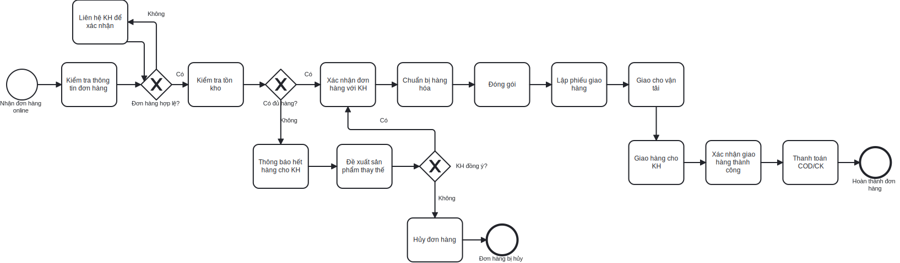
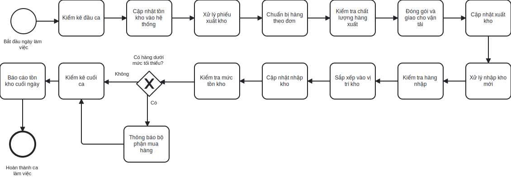
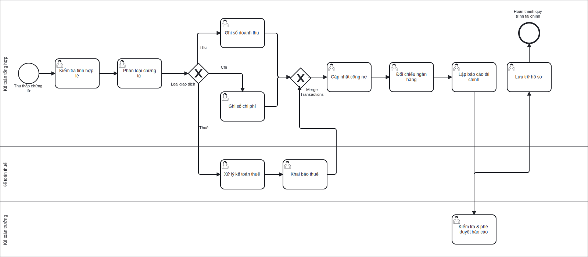

# Quy trình nghiệp vụ

## Tổng quan

Công ty có **8 quy trình nghiệp vụ** chính (BP001-BP008) bao trùm toàn bộ hoạt động kinh doanh:

| Quy trình | Tên quy trình                   | Phạm vi                                     | Tần suất     |
| --------- | ------------------------------- | ------------------------------------------- | ------------ |
| BP001     | Bán hàng trực tiếp tại cửa hàng | Từ đón khách đến hoàn thành giao dịch       | Hàng ngày    |
| BP002     | Bán hàng trực tuyến             | Từ nhận đơn online đến giao hàng thành công | Hàng ngày    |
| BP003     | Mua hàng và nhập kho            | Từ dự báo nhu cầu đến nhập kho hoàn thành   | Hàng tuần    |
| BP004     | Quản lý kho hàng                | Các hoạt động hàng ngày trong quản lý kho   | Hàng ngày    |
| BP005     | Tư vấn và chăm sóc khách hàng   | Từ tiếp nhận yêu cầu đến hoàn thành hỗ trợ  | Hàng ngày    |
| BP006     | Xử lý khiếu nại                 | Từ tiếp nhận khiếu nại đến giải quyết       | Theo yêu cầu |
| BP007     | Marketing và truyền thông       | Từ lập kế hoạch đến đánh giá hiệu quả       | Hàng tháng   |
| BP008     | Quản lý tài chính               | Các hoạt động kế toán và tài chính          | Hàng ngày    |

## Quy trình cấp 0: Tổng quan hệ thống

## BP001: Quy trình bán hàng trực tiếp tại cửa hàng

### Mô tả tổng quan

- **Mục đích**: Xử lý giao dịch bán hàng trực tiếp tại cửa hàng
- **Phạm vi**: Từ khi khách hàng đến cửa hàng đến khi hoàn thành giao dịch
- **Dịch vụ nghiệp vụ**: BS003 (Tư vấn sản phẩm), BS004 (Xử lý đơn hàng), BS005 (Thanh toán)

### Quy trình chi tiết

**Biểu đồ flow chart**

**Biểu đồ BPMN**

### Thông tin chi tiết

- **Thời gian**: 15-30 phút/giao dịch
- **Tần suất**: 20-30 giao dịch/ngày
- **Actor chính**: Nhân viên bán hàng
- **Actor hỗ trợ**: Quản lý cửa hàng
- **Điểm kiểm soát**:
  - Kiểm tra tồn kho trước khi xác nhận bán
  - Xác nhận thanh toán trước khi xuất hóa đơn
- **KPI**: Tỷ lệ chuyển đổi 70%, Thời gian phục vụ ≤ 30 phút

## BP002: Quy trình bán hàng trực tuyến

### Mô tả tổng quan

- **Mục đích**: Xử lý đơn hàng từ các kênh trực tuyến
- **Phạm vi**: Từ khi nhận đơn hàng online đến khi giao hàng thành công
- **Dịch vụ nghiệp vụ**: BS004 (Xử lý đơn hàng), BS007 (Xuất kho), BS009 (Vận tải)

### Quy trình chi tiết

**Biểu đồ flow chart**

**Biểu đồ BPMN**

### Thông tin chi tiết

- **Thời gian**: 1-2 ngày làm việc
- **Tần suất**: 10-15 đơn/ngày
- **Actor chính**: Nhân viên bán hàng, Nhân viên kho, Nhân viên vận tải
- **Điểm kiểm soát**:
  - Xác nhận đơn hàng qua điện thoại
  - Kiểm tra hàng hóa trước khi đóng gói
  - Xác nhận giao hàng thành công
- **KPI**: Tỷ lệ giao hàng thành công 95%, Thời gian xử lý ≤ 24h

## BP003: Quy trình mua hàng và nhập kho

### Mô tả tổng quan

- **Mục đích**: Đảm bảo cung ứng đủ hàng hóa cho hoạt động kinh doanh
- **Phạm vi**: Từ dự báo nhu cầu đến nhập kho hoàn thành
- **Dịch vụ nghiệp vụ**: BS010 (Lựa chọn NCC), BS011 (Đặt hàng NCC), BS006 (Nhập kho)

### Quy trình chi tiết

**Biểu đồ flow chart**

**Biểu đồ BPMN**

### Thông tin chi tiết

- **Thời gian**: 3-7 ngày
- **Tần suất**: 2-3 lần/tuần
- **Actor chính**: Nhân viên mua hàng, Nhân viên kho, Quản lý kho
- **Actor hỗ trợ**: Phó GĐ Vận hành Backend, Kế toán
- **Điểm kiểm soát**:
  - Phê duyệt đơn hàng trước khi gửi NCC
  - Kiểm tra chất lượng và số lượng khi nhận hàng
  - Xác nhận nhập kho đúng quy trình
- **KPI**: Độ chính xác đơn hàng 98%, Thời gian chu kỳ ≤ 7 ngày

## BP004: Quy trình quản lý kho hàng

### Mô tả tổng quan

- **Mục đích**: Duy trì và kiểm soát tồn kho hiệu quả
- **Phạm vi**: Các hoạt động hàng ngày trong quản lý kho
- **Dịch vụ nghiệp vụ**: BS006 (Nhập kho), BS007 (Xuất kho), BS008 (Kiểm kê)

### Quy trình chi tiết

**Biểu đồ flow chart**

**Biểu đồ BPMN**

### Thông tin chi tiết

- **Thời gian**: Liên tục trong giờ làm việc
- **Tần suất**: Hàng ngày
- **Actor chính**: Nhân viên kho, Quản lý kho
- **Điểm kiểm soát**:
  - Kiểm kê đầu ca và cuối ca
  - Kiểm tra chất lượng hàng xuất kho
  - Báo cáo tồn kho định kỳ
- **KPI**: Độ chính xác tồn kho 99%, Thời gian xuất kho ≤ 30 phút

## BP005: Quy trình tư vấn và chăm sóc khách hàng

### Mô tả tổng quan

- **Mục đích**: Cung cấp dịch vụ tư vấn chuyên nghiệp cho khách hàng
- **Phạm vi**: Từ tiếp nhận yêu cầu tư vấn đến hoàn thành hỗ trợ
- **Dịch vụ nghiệp vụ**: BS003 (Tư vấn sản phẩm)

### Quy trình chi tiết

**Biểu đồ flow chart**

**Biểu đồ BPMN**

### Thông tin chi tiết

- **Thời gian**: 15-45 phút tùy mức độ phức tạp
- **Tần suất**: 15-20 yêu cầu/ngày
- **Actor chính**: Nhân viên bán hàng, Chuyên gia sản phẩm
- **Điểm kiểm soát**:
  - Đánh giá độ hài lòng của khách hàng
  - Theo dõi tỷ lệ chuyển đổi từ tư vấn sang bán hàng
- **KPI**: Tỷ lệ chuyển đổi 40%, Điểm hài lòng ≥ 4.5/5

## BP006: Quy trình xử lý khiếu nại

### Mô tả tổng quan

- **Mục đích**: Giải quyết khiếu nại và duy trì mối quan hệ với khách hàng
- **Phạm vi**: Từ tiếp nhận khiếu nại đến giải quyết hoàn thành

### Quy trình chi tiết

**Biểu đồ BPMN**

### Thông tin chi tiết

- **Thời gian**: 1-5 ngày tùy mức độ phức tạp
- **Tần suất**: 2-5 khiếu nại/tuần
- **Actor chính**: Nhân viên bán hàng, Quản lý cửa hàng
- **Điểm kiểm soát**:
  - Thời gian phản hồi khiếu nại ≤ 2h
  - Xác nhận khách hàng hài lòng với giải pháp
- **KPI**: Tỷ lệ giải quyết thành công 95%, Thời gian xử lý ≤ 3 ngày

## BP007: Quy trình marketing và truyền thông

### Mô tả tổng quan

- **Mục đích**: Xây dựng thương hiệu và thu hút khách hàng
- **Phạm vi**: Từ lập kế hoạch marketing đến đánh giá hiệu quả
- **Dịch vụ nghiệp vụ**: BS001 (Nghiên cứu thị trường), BS002 (Sáng tạo nội dung)

### Quy trình chi tiết

**Biểu đồ flow chart**

**Biểu đồ BPMN**

### Thông tin chi tiết

- **Thời gian**: 1-4 tuần/chiến dịch
- **Tần suất**: 2-3 chiến dịch/tháng
- **Actor chính**: Nhân viên Marketing, Nhân viên thiết kế
- **Actor hỗ trợ**: Phó GĐ Marketing & Kinh doanh
- **Điểm kiểm soát**:
  - Phê duyệt nội dung trước khi phát hành
  - Đánh giá ROI của chiến dịch
- **KPI**: ROI ≥ 300%, Tỷ lệ tương tác ≥ 5%

## BP008: Quy trình quản lý tài chính

### Mô tả tổng quan

- **Mục đích**: Quản lý dòng tiền và đảm bảo tính minh bạch tài chính
- **Phạm vi**: Các hoạt động kế toán và tài chính hàng ngày
- **Dịch vụ nghiệp vụ**: BS005 (Thanh toán), BS014 (Kế toán thuế)

### Quy trình chi tiết

**Biểu đồ flow chart**

**Biểu đồ BPMN**

### Thông tin chi tiết

- **Thời gian**: Hàng ngày và định kỳ
- **Tần suất**: Liên tục
- **Actor chính**: Kế toán tổng hợp, Kế toán thuế, Kế toán trưởng
- **Điểm kiểm soát**:
  - Kiểm tra chứng từ gốc
  - Đối chiếu số dư ngân hàng
  - Phê duyệt báo cáo tài chính
- **KPI**: Độ chính xác 100%, Đúng thời hạn báo cáo

## Tổng hợp các điểm kiểm soát quan trọng

| Quy trình          | Điểm kiểm soát chính | Tần suất kiểm soát | Người chịu trách nhiệm |
| ------------------ | -------------------- | ------------------ | ---------------------- |
| Bán hàng trực tiếp | Kiểm tra tồn kho     | Mỗi giao dịch      | NV Bán hàng            |
| Bán hàng online    | Xác nhận đơn hàng    | Mỗi đơn hàng       | NV Bán hàng            |
| Mua hàng           | Kiểm tra chất lượng  | Mỗi lô hàng        | NV Kho                 |
| Quản lý kho        | Kiểm kê tồn kho      | Hàng ngày          | Quản lý kho            |
| Tài chính          | Đối chiếu ngân hàng  | Hàng ngày          | Kế toán trưởng         |
| Khiếu nại          | Thời gian phản hồi   | Mỗi khiếu nại      | QL Cửa hàng            |

## Các vấn đề trong quy trình hiện tại

### Tồn tại các điểm yếu

1. **Quản lý thủ công**: Sử dụng Excel và giấy tờ nhiều
2. **Thiếu tích hợp**: Các bộ phận làm việc độc lập
3. **Khó theo dõi**: Không có hệ thống báo cáo tự động
4. **Lỗi con người**: Sai sót trong nhập liệu và tính toán
5. **Phản hồi chậm**: Thời gian xử lý khiếu nại lâu
6. **Thiếu chuẩn hóa**: Quy trình chưa được chuẩn hóa hoàn toàn

### Nhu cầu cải thiện

1. **Tự động hóa**: Giảm thiểu công việc thủ công
2. **Tích hợp dữ liệu**: Kết nối các bộ phận và quy trình
3. **Báo cáo real-time**: Thông tin cập nhật liên tục
4. **Kiểm soát chất lượng**: Giảm thiểu sai sót
5. **Cải thiện trải nghiệm**: Phục vụ khách hàng tốt hơn
6. **Chuẩn hóa quy trình**: Đảm bảo tính nhất quán

## Ma trận quy trình và dịch vụ nghiệp vụ

| Quy trình | Dịch vụ nghiệp vụ liên quan | Bộ phận chính |
| --------- | --------------------------- | ------------- |
| BP001     | BS003, BS004, BS005         | Vận hành      |
| BP002     | BS004, BS007, BS009         | Vận hành, Kho |
| BP003     | BS010, BS011, BS006         | Mua hàng, Kho |
| BP004     | BS006, BS007, BS008         | Kho           |
| BP005     | BS003                       | Vận hành      |
| BP006     | Liên quan BS003, BS004      | Vận hành      |
| BP007     | BS001, BS002                | Marketing     |
| BP008     | BS005, BS014, BS015         | Tài chính     |
