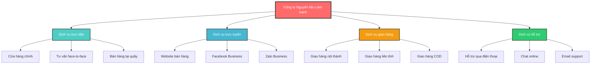
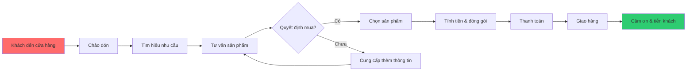
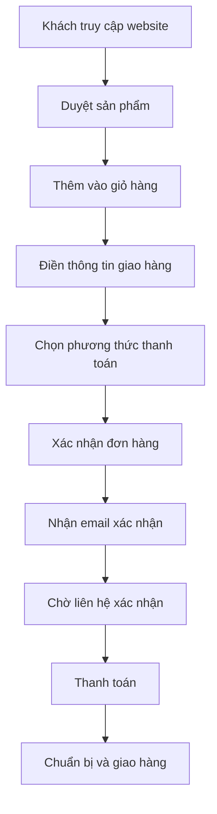
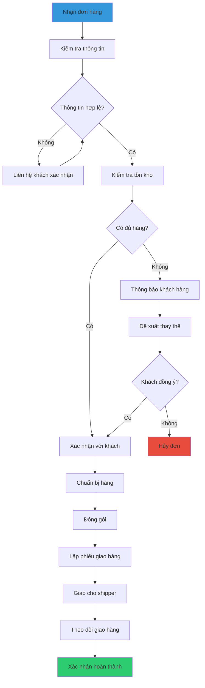
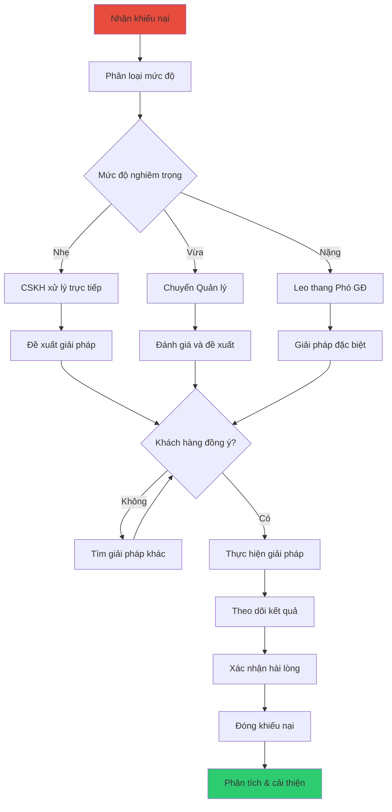

# Thực hiện dịch vụ

## Mô hình dịch vụ hiện tại

### Tổng quan các kênh dịch vụ

## Dịch vụ trực tiếp tại cửa hàng

### Thông tin cơ bản

| Thông tin     | Chi tiết                              |
| ------------- | ------------------------------------- |
| **Địa chỉ**   | 123 Đường ABC, Quận XYZ, TP.HCM       |
| **Diện tích** | 150m² (100m² bán hàng + 50m² kho nhỏ) |
| **Thời gian** | 8:00 - 20:00 hàng ngày                |
| **Nhân lực**  | 2-3 nhân viên bán hàng + 1 quản lý    |
| **Công suất** | 30-50 khách/ngày                      |

### Mô hình phục vụ

### Loại hình dịch vụ tại cửa hàng

#### 1. Bán hàng lẻ

**Đặc điểm:**

- Khách hàng cá nhân, mua số lượng nhỏ
- Giá bán lẻ theo niêm yết
- Thanh toán ngay khi mua
- Đóng gói cẩn thận cho từng sản phẩm

**Sản phẩm chính:**

- Nguyên liệu làm bánh (bột, đường, bơ)
- Dụng cụ làm bánh (khuôn, máy đánh trứng)
- Phụ kiện trang trí (nến, giấy bạc)

**Thời gian phục vụ:** 15-30 phút/khách

#### 2. Tư vấn chuyên sâu

**Đặc điểm:**

- Khách hàng cần hỗ trợ kỹ thuật
- Tư vấn công thức và quy trình
- Đề xuất sản phẩm phù hợp
- Hướng dẫn sử dụng dụng cụ

**Dịch vụ cung cấp:**

- Tư vấn công thức bánh
- Hướng dẫn kỹ thuật làm bánh
- Đề xuất thay thế nguyên liệu
- Tính toán định lượng nguyên liệu

**Thời gian phục vụ:** 30-60 phút/khách

#### 3. Bán hàng doanh nghiệp (B2B)

**Đặc điểm:**

- Khách hàng là tiệm bánh, quán café
- Mua số lượng lớn, thường xuyên
- Có thỏa thuận giá ưu đãi
- Giao hàng theo lịch hẹn

**Quy trình:**

1. Tiếp nhận yêu cầu báo giá
2. Thỏa thuận giá và điều kiện
3. Ký hợp đồng (nếu số lượng lớn)
4. Lên lịch giao hàng định kỳ
5. Thanh toán theo thỏa thuận

**Thời gian xử lý:** 1-3 ngày

### Tiêu chuẩn dịch vụ tại cửa hàng

| Tiêu chí               | Tiêu chuẩn | Cách đo lường                                   |
| ---------------------- | ---------- | ----------------------------------------------- |
| **Thời gian chờ**      | ≤ 5 phút   | Thời gian từ khi khách vào đến khi được phục vụ |
| **Thời gian phục vụ**  | ≤ 30 phút  | Thời gian từ tư vấn đến hoàn thành giao dịch    |
| **Độ hài lòng**        | ≥ 4.5/5    | Khảo sát khách hàng hàng tháng                  |
| **Tỷ lệ chuyển đổi**   | ≥ 70%      | Số khách mua / tổng số khách vào cửa hàng       |
| **Chính xác đơn hàng** | ≥ 98%      | Đơn hàng không có lỗi / tổng đơn hàng           |

## Dịch vụ trực tuyến

### Các kênh trực tuyến

#### 1. Website bán hàng (abby.vn)

**Chức năng chính:**

- Catalog sản phẩm đầy đủ với hình ảnh
- Giỏ hàng và thanh toán online
- Tính năng tìm kiếm và lọc sản phẩm
- Blog hướng dẫn và chia sẻ công thức

**Đặc điểm:**

- Hoạt động 24/7
- Thanh toán qua chuyển khoản
- Giao hàng toàn quốc
- Thời gian phản hồi: 1-2h trong giờ hành chính

#### 2. Facebook Business

**Chức năng:**

- Đăng sản phẩm mới và khuyến mãi
- Tương tác với khách hàng qua comment/message
- Live stream giới thiệu sản phẩm
- Nhận đơn hàng qua Messenger

**Đặc điểm:**

- Tương tác trực tiếp với khách hàng
- Chia sẻ hình ảnh và video sản phẩm
- Phản hồi nhanh qua Messenger
- Thích hợp cho khách hàng trẻ tuổi

#### 3. Zalo Business

**Chức năng:**

- Tư vấn 1-1 với khách hàng
- Gửi catalog sản phẩm
- Nhận và xử lý đơn hàng
- Thông báo trạng thái đơn hàng

**Đặc điểm:**

- Ứng dụng phổ biến tại Việt Nam
- Hỗ trợ gọi điện và video call
- Gửi hình ảnh và file dễ dàng
- Thích hợp cho khách hàng B2B

### Quy trình xử lý đơn hàng online

### Hiệu suất dịch vụ trực tuyến

| Kênh          | Lượt truy cập/tháng | Đơn hàng/tháng | Tỷ lệ chuyển đổi | Giá trị TB/đơn |
| ------------- | ------------------- | -------------- | ---------------- | -------------- |
| **Website**   | 2,000               | 150            | 7.5%             | 850,000 VNĐ    |
| **Facebook**  | 5,000               | 80             | 1.6%             | 450,000 VNĐ    |
| **Zalo**      | 1,500               | 120            | 8.0%             | 1,200,000 VNĐ  |
| **Tổng cộng** | 8,500               | 350            | 4.1%             | 780,000 VNĐ    |

## Dịch vụ giao hàng

### Phạm vi và phương thức giao hàng

#### 1. Giao hàng nội thành

**Đặc điểm:**

- Phạm vi: Trong bán kính 15km từ cửa hàng
- Thời gian: 2-4 giờ (giao hàng nhanh) hoặc 1 ngày
- Phương tiện: Xe máy và xe tải nhỏ
- Phí ship: 15,000 - 30,000 VNĐ tùy khoảng cách

**Quy trình:**

1. Nhận đơn hàng từ các kênh
2. Chuẩn bị hàng hóa và đóng gói
3. Phân tuyến và lập kế hoạch giao hàng
4. Giao hàng và thu tiền (nếu COD)
5. Xác nhận giao hàng thành công

#### 2. Giao hàng liên tỉnh

**Đặc điểm:**

- Phạm vi: Toàn quốc qua đối tác vận chuyển
- Thời gian: 2-5 ngày tùy khoảng cách
- Đối tác: J&T Express, GrabExpress, Viettel Post
- Phí ship: 30,000 - 80,000 VNĐ tùy vùng

**Quy trình:**

1. Đóng gói cẩn thận với vật liệu chống sốc
2. Tạo vận đơn qua hệ thống đối tác
3. Bàn giao hàng cho đơn vị vận chuyển
4. Theo dõi hành trình qua tracking code
5. Xác nhận khách hàng nhận hàng

### Tiêu chuẩn đóng gói

#### Nguyên liệu bột, đường

- **Vật liệu**: Túi nhựa dày + hộp carton
- **Chống ẩm**: Bỏ gói hút ẩm silica gel
- **Dán nhãn**: Thông tin sản phẩm và HSD
- **Cảnh báo**: "Dễ vỡ - Cẩn thận vận chuyển"

#### Dụng cụ và thiết bị

- **Vật liệu**: Bubble wrap + hộp carton cứng
- **Đệm lót**: Giấy báo hoặc bọt biển
- **Kiểm tra**: Đảm bảo không bị va đập
- **Bảo hành**: Kèm phiếu bảo hành (nếu có)

### Ma trận phí giao hàng

| Khu vực         | Thời gian | Phí giao hàng   | Đơn miễn phí |
| --------------- | --------- | --------------- | ------------ |
| **Nội thành**   | 2-4h      | 15,000 - 30,000 | ≥ 500,000    |
| **Ngoại thành** | 1 ngày    | 25,000 - 40,000 | ≥ 800,000    |
| **Miền Nam**    | 2-3 ngày  | 35,000 - 50,000 | ≥ 1,000,000  |
| **Miền Trung**  | 3-4 ngày  | 45,000 - 65,000 | ≥ 1,500,000  |
| **Miền Bắc**    | 3-5 ngày  | 50,000 - 80,000 | ≥ 2,000,000  |

## Dịch vụ hỗ trợ khách hàng

### Các kênh hỗ trợ

#### 1. Hỗ trợ qua điện thoại

**Thông tin:**

- **Hotline**: 0123.456.789
- **Thời gian**: 8:00 - 17:30 (Thứ 2-7)
- **Ngôn ngữ**: Tiếng Việt
- **Nhân lực**: 1-2 nhân viên CSKH

**Dịch vụ cung cấp:**

- Tư vấn sản phẩm và kỹ thuật
- Hỗ trợ đặt hàng và thanh toán
- Xử lý khiếu nại và hoàn trả
- Theo dõi trạng thái đơn hàng

#### 2. Chat online

**Nền tảng:**

- Chat widget trên website
- Facebook Messenger
- Zalo Chat

**Đặc điểm:**

- Phản hồi nhanh trong giờ làm việc
- Auto-reply cơ bản ngoài giờ
- Có thể gửi hình ảnh và file
- Lưu trữ lịch sử tương tác

#### 3. Email support

**Thông tin:**

- **Email**: support@nguyenlieulambanh.com
- **Thời gian phản hồi**: 2-6 giờ trong giờ làm việc
- **Định dạng**: Template chuyên nghiệp

**Ứng dụng:**

- Câu hỏi phức tạp cần thời gian xử lý
- Khiếu nại chính thức
- Yêu cầu báo giá cho doanh nghiệp
- Gửi tài liệu và hướng dẫn chi tiết

### Quy trình xử lý khiếu nại

### Tiêu chuẩn dịch vụ hỗ trợ

| Tiêu chí                        | Tiêu chuẩn                    | KPI                 |
| ------------------------------- | ----------------------------- | ------------------- |
| **Thời gian phản hồi**          | ≤ 2 giờ                       | 95% đạt tiêu chuẩn  |
| **Thời gian giải quyết**        | ≤ 24 giờ (khiếu nại đơn giản) | 90% đạt tiêu chuẩn  |
| **Độ hài lòng**                 | ≥ 4.5/5                       | Khảo sát sau xử lý  |
| **Tỷ lệ giải quyết thành công** | ≥ 95%                         | Theo dõi hàng tháng |
| **Tỷ lệ khiếu nại lặp lại**     | ≤ 5%                          | Theo dõi hàng quý   |

## Phân tích hiệu suất dịch vụ

### Thống kê tổng quan (tháng)

| Dịch vụ       | Lượng khách | Doanh thu | Tỷ lệ hài lòng | Thời gian phục vụ TB |
| ------------- | ----------- | --------- | -------------- | -------------------- |
| **Cửa hàng**  | 1,200       | 180M VNĐ  | 4.6/5          | 25 phút              |
| **Online**    | 350         | 85M VNĐ   | 4.3/5          | 2.5 ngày             |
| **B2B**       | 45          | 95M VNĐ   | 4.7/5          | 1.2 ngày             |
| **Tổng cộng** | 1,595       | 360M VNĐ  | 4.5/5          | -                    |

### Phân tích điểm mạnh

1. **Dịch vụ cửa hàng**:

   - Tương tác trực tiếp hiệu quả
   - Tỷ lệ chuyển đổi cao
   - Khách hàng hài lòng với tư vấn

2. **Dịch vụ B2B**:

   - Giá trị đơn hàng lớn
   - Mối quan hệ lâu dài
   - Doanh thu ổn định

3. **Dịch vụ giao hàng**:
   - Phủ sóng toàn quốc
   - Đối tác vận chuyển tin cậy
   - Đóng gói chuyên nghiệp

### Điểm cần cải thiện

1. **Dịch vụ online**:

   - Tỷ lệ chuyển đổi còn thấp
   - Cần cải thiện UX website
   - Tăng cường marketing digital

2. **Hỗ trợ khách hàng**:

   - Mở rộng giờ hỗ trợ
   - Tăng cường đào tạo nhân viên
   - Triển khai chatbot cơ bản

3. **Tự động hóa**:
   - Tích hợp hệ thống quản lý đơn hàng
   - Tự động hóa báo cáo
   - Sync dữ liệu giữa các kênh

## Kế hoạch phát triển dịch vụ

### Ngắn hạn (3-6 tháng)

1. **Cải thiện website**:

   - Tối ưu tốc độ tải trang
   - Bổ sung tính năng so sánh sản phẩm
   - Triển khai live chat

2. **Mở rộng giao hàng**:
   - Tăng tần suất giao hàng nội thành
   - Thêm dịch vụ giao hàng trong ngày
   - Tối ưu tuyến đường giao hàng

### Trung hạn (6-12 tháng)

1. **Ứng dụng mobile**:

   - Phát triển app iOS/Android
   - Tích hợp thanh toán điện tử
   - Push notification cho khuyến mãi

2. **Mở rộng điểm bán**:
   - Thêm 1-2 cửa hàng nhỏ
   - Hệ thống POS tích hợp
   - Quản lý tồn kho real-time

### Dài hạn (1-2 năm)

1. **Nền tảng omnichannel**:

   - Tích hợp tất cả kênh bán hàng
   - Quản lý khách hàng thống nhất
   - Phân tích dữ liệu toàn diện

2. **Dịch vụ giá trị gia tăng**:
   - Lớp học làm bánh online
   - Tư vấn thiết kế tiệm bánh
   - Cung cấp nguyên liệu theo subscription
